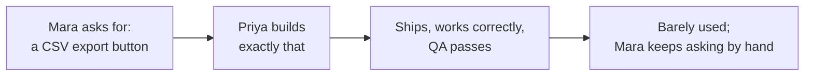

import Scenario from "../../../components/Scenario.astro";
import LevelIntro from "../../../components/LevelIntro.astro";

<Scenario>
  <Fragment slot="facts">
    

      

        
Requested

        "Add a CSV export button"
      

      

        
Actually needed

        Early warning when a metric starts trending the wrong way
      

    

    
What shipped, three weeks out

    

      
✅ Bug-free, fast, exactly as specified

      
📉 Used by under 2% of the team it was built for

      
🔁 Mara is still asking an engineer "is this metric getting worse?" by hand, every week

    

  </Fragment>

Mara, a support-ops lead, files a ticket: "Add a CSV export button to the
ticket dashboard." Priya, the engineer, builds exactly that — a clean
export button, correctly formatted CSV, shipped within a sprint. Three
weeks later, usage data shows almost nobody has clicked it. Mara is still
pinging an engineer in Slack most Fridays asking "is our backlog getting
worse?"

Plain-language map before the lesson starts: a **ticket** is a written
request for work, a **dashboard** is a screen that gathers important
numbers, and a **CSV** is a table-like file you can open in Excel or
Google Sheets. Mara asked for a concrete tool, but what she really needed
was a way to notice trouble early. In this unit, **solution** means the
thing someone asks to build; **problem** means the real difficulty that
thing is supposed to solve.

**Before reading on: what, if anything, was wrong with what Priya built?**
And if the code was correct and the ticket was followed exactly — why did
the feature fail anyway?

</Scenario>

Nothing was wrong with Priya's code. The gap was upstream of any code at
all: "CSV export" was never the actual need — it was Mara's first guess at
how to satisfy a need she never stated out loud, which was noticing a
worsening trend early enough to act on it. A CSV file, opened in a
spreadsheet, was just the only tool Mara had ever used to check that. This
unit is about catching that gap before a single line of implementation
gets written — not diagnosing it three weeks after ship.

<LevelIntro
  items={[
    "Why a well-built feature can still fail",
    "The five whys, from stated request to real need",
    "Jobs to be done, in one sentence",
  ]}
/>

- A feature can be bug-free, fast, and well-designed, and still fail — because those properties only measure **how well it was built**, not whether it **solves a real problem someone actually has**.
- The most common root cause: the team understood the _requested solution_ in detail, but never validated the _underlying problem_ it was meant to solve — so the feature answers a question nobody was actually asking.
- **The five whys** is a simple way to keep pushing past a stated request to the actual underlying need: "I want a CSV export" → why? → "So I can build a report" → why? → "So I can see weekly trends" → why? → "So I know if the metric is getting worse" → the real need is _trend visibility_, and CSV export is just the first solution Mara happened to imagine. It does not mean you must literally ask five questions every time; it means keep asking "what is this for?" until the answer names a need, not another tool.
- **Jobs to be done**: users don't want a product, they "hire" it to make progress on a specific job in a specific context. Here, "job" does not mean employment; it means the progress the person is trying to make in a situation. Understanding the job (not the feature request) is what lets you evaluate whether a _different, better_ solution would serve the same underlying need.
- A request phrased as a solution ("add a CSV export button") smuggles in an implicit, unvalidated problem statement — taking the request literally means inheriting whatever assumptions the requester made about the problem, without ever checking them yourself.
- This isn't about ignoring what users ask for — it's about treating a feature request as a _clue_ about the underlying problem, not the final specification, and validating the problem before committing to build any particular solution.
- The practical discipline this unit builds: before building, be able to state the user's problem in one sentence that contains **no mention of the proposed solution** — if you can't, you don't yet understand the problem well enough to know if the proposed solution is even a good one.

Every arrow in that chain is locally reasonable — the ask was clear, the
build matched it, the tests passed. The failure never shows up at any
single step, because it isn't a build-quality problem at all: it's that
the chain skipped validating whether the requested _solution_ actually
served Mara's underlying _problem_ in the first place.
