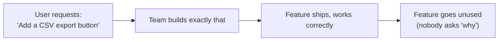

## The shape of the failure



Every arrow in this chain is locally reasonable — the request was clear, the build matched the spec, QA passed. The failure is invisible at every individual step because it isn't a build-quality problem; it's that the chain skipped a validation step entirely: nobody confirmed the requested _solution_ actually addresses the underlying _problem_, or that it's the best available solution to it.

## The five whys, applied

Starting from the stated request, keep asking "why do you need that?" — roughly five times, in practice — checking after each answer whether it's landed on an actual **need** or just another layer of solution. Once an answer stops naming a solution and starts naming a need, stop; pushing much further than five tends to over-abstract into something too generic to act on ("I need to feel secure in my job," five whys deep on a bug report, is no longer useful).

```
"I want a CSV export"
  why? -> "So I can build a report in a spreadsheet"
  why? -> "So I can see how a metric trends week over week"
  why? -> "So I know if it's getting worse before it becomes a crisis"
  ROOT NEED: early visibility into a worsening trend
```

Notice each answer stays closer to a _need_ the deeper you go, and the original request (CSV export) turns out to be just one of many possible ways to satisfy that need — a live trend chart in the product itself might serve "early visibility into a worsening trend" better than a manual CSV-then-spreadsheet workflow, without the user ever having thought to ask for that, because they anchored on the first workaround they could imagine.

## Jobs to be done: the need has a context, not just a description

| Component          | CSV export example                                                      |
| ------------------ | ----------------------------------------------------------------------- |
| The job            | "Help me notice a worsening trend before it's a crisis"                 |
| The context        | Weekly, low-stakes glance — not a deep one-time analysis                |
| What's "hired" now | Manually exporting, opening a spreadsheet, building a chart, every week |
| Why it's a bad fit | High friction for something that needs to happen routinely and quickly  |

Framing the need as a "job" forces the context into the picture — the same underlying need ("see this number over time") calls for a very different solution if the job is "quick weekly glance" versus "one-off deep investigation for a postmortem." A generic CSV export serves the second job reasonably well and the first one badly, which is exactly why validating the job before building matters more than validating the feature request.

## The one-sentence test

Before committing to a build, the problem should be statable with **zero reference to the proposed solution**:

- Fails the test: "Users need a CSV export so they can track trends." (still names the solution)
- Passes the test: "Users need to notice when a metric is trending in the wrong direction, in time to act, without a manual weekly ritual."

The second version can be evaluated against _multiple_ candidate solutions (a live chart, an automated alert threshold, a weekly digest email) — the first version has already foreclosed that comparison by baking the requester's first-imagined solution into the problem statement itself.
