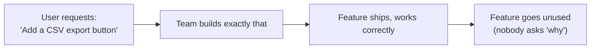
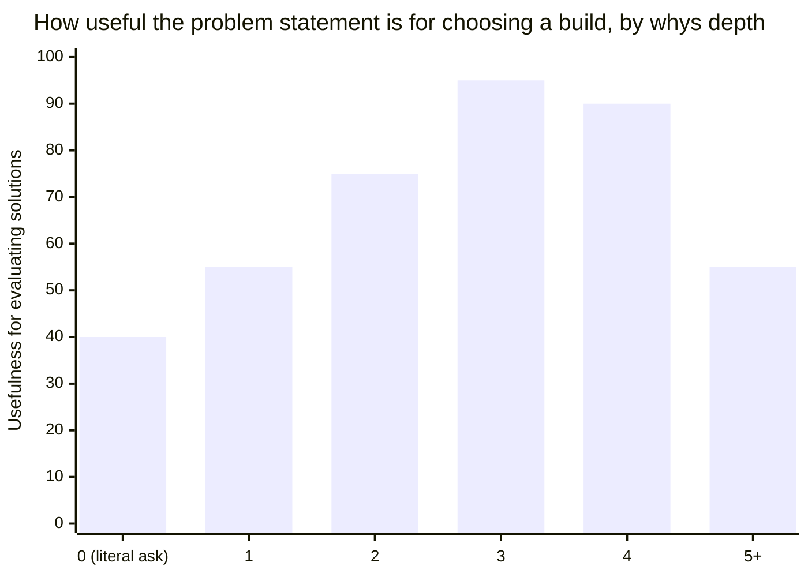

import LevelIntro from "../../../components/LevelIntro.astro";
import Checkpoint from "../../../components/Checkpoint.astro";

L1 showed that Mara's export button failed even though it was built
correctly — the gap was upstream of the code. L2 works out the actual
technique for closing that gap: how to push from a stated request down to
the real need underneath it, and why the same need can still call for
different solutions depending on who's asking and why.

<LevelIntro
  items={[
    "Where in the chain the failure actually happens",
    "The five whys, and how far is far enough",
    "Why the same need can demand different solutions",
  ]}
/>

## Why did a correctly built feature still fail?

Mara's export button (from L1) took Priya about three days to build and
ship. It was correct, tested, and matched the ticket exactly — and it
still didn't solve Mara's problem. If the build wasn't at fault, where did
the actual failure happen, and how far upstream of the code was it?



Every arrow in this chain is locally reasonable — the request was clear,
the build matched the spec, QA passed. The failure is invisible at every
individual step because it isn't a build-quality problem; it's that the
chain skipped a validation step entirely: nobody confirmed the requested
_solution_ actually addresses the underlying _problem_, or that it's the
best available solution to it.

<Checkpoint question="If every individual step in the chain above was reasonable and nothing in the build itself was wrong, where exactly did this feature actually fail?">

It failed at a step that isn't in the diagram at all — the missing
validation between "request received" and "build starts." The team never
checked whether the requested solution (a CSV export) actually served the
underlying problem (noticing a worsening trend early), so a correctly
executed build could still miss the real target. Bug-free code and a
matched spec only prove the team built the thing accurately, not that the
thing was the right one to build.

</Checkpoint>

## How do you get from a stated request to the actual need underneath it?

To **validate** the problem here does not mean running a technical test.
It means checking with the user that you understood the real difficulty
behind the request, before you commit to one solution.

The five whys keeps asking "why do you need that?" — roughly five times,
in practice — checking after each answer whether it's landed on an actual
**need** or just another layer of solution. Once an answer stops naming a
solution and starts naming a need, stop; pushing much further than five
tends to over-abstract into something too generic to act on ("I need to
feel secure in my job," five whys deep on a bug report, is no longer
useful).

```
"I want a CSV export"
  why? -> "So I can build a report in a spreadsheet"
  why? -> "So I can see how a metric trends week over week"
  why? -> "So I know if it's getting worse before it becomes a crisis"
  ROOT NEED: early visibility into a worsening trend
```

Notice each answer stays closer to a _need_ the deeper you go, and the
original request (CSV export) turns out to be just one of many possible
ways to satisfy that need — a live trend chart in the product itself might
serve "early visibility into a worsening trend" better than a manual
CSV-then-spreadsheet workflow, without the user ever having thought to ask
for that, because they anchored on the first workaround they could
imagine.

**How specific a problem statement is doesn't move in a straight line with
how many whys you ask** — it's roughly flat at first (the first "why" is
often still a solution in disguise, like "a report"), climbs fast through
the middle whys, and then the _usefulness_ of the statement for choosing a
build actually starts to fall again if you keep pushing, because it's
gone too abstract to act on:



Depth 0 (the literal request) is fully specific but useless for comparing
alternatives — it's already committed to one solution. Depth 3-4 is the
sweet spot: specific enough to evaluate candidate solutions against, general
enough not to have foreclosed any of them. Depth 5+ risks over-abstracting
into something no longer actionable at all.

Read the chart as examples, not as math to memorize: depth 0 is
"build CSV," so you can only judge CSV. Around depth 3, "notice a trend
getting worse in time to act" lets you compare CSV, a chart, an alert, or
an email. Around depth 5+, "feel in control" may be true, but it is too
broad to decide what to build next.

## Why does the same underlying need call for different solutions in different contexts?

**Jobs to be done**: users don't want a product, they "hire" it to make
progress on a specific job in a specific context. If "see this number over
time" is the need in both of the rows below, why would the best solution
still be different for each one?

Again, "job" means the progress someone is trying to make, not their job
title. The context matters because a five-second weekly check and a
twenty-minute investigation ask the software to play different roles.

| Component                  | Weekly glance (Mara's actual job)                                            | One-off deep investigation (a different job)                             |
| -------------------------- | ---------------------------------------------------------------------------- | ------------------------------------------------------------------------ |
| The job                    | "Notice a worsening trend before it's a crisis"                              | "Understand exactly why last month's numbers dropped"                    |
| The context                | Routine, low-stakes, five seconds of attention                               | Rare, high-stakes, worth twenty minutes of real analysis                 |
| Best-fit solution          | A live trend line already visible on the dashboard                           | A raw data export to slice and filter freely in a tool                   |
| Why the other is a bad fit | A raw export adds friction to something that needs to be instant and routine | A pre-baked chart can't answer an open-ended "why," which needs raw data |

Framing the need as a "job" forces the context into the picture — the same
underlying need ("see this number over time") calls for a very different
solution depending on the job it's serving, which is exactly why
validating the job before building matters more than validating the
feature request. A generic CSV export happens to serve the deep
investigation column reasonably well and the weekly-glance column badly —
which is precisely backwards for Mara, whose actual job was the weekly
glance.

<Checkpoint question="Mara's root need (from the five whys above) and the 'deep investigation' job both eventually touch the same raw numbers. Why isn't a single generic CSV export the right solution for both jobs?">

Because the same underlying data serves two different jobs with opposite
demands on the solution. Mara's job is a five-second, routine glance that
needs the trend already visible with zero extra steps — a raw export adds
friction to something that has to be nearly instant. The deep-investigation
job is rare, high-stakes, and open-ended, so it needs raw, filterable data
rather than a pre-baked chart that can't answer an unanticipated "why." A
solution optimized for one job actively works against the other, which is
why naming the specific job, not just the underlying data, is what
actually determines the right solution.

</Checkpoint>

## How do you know when you've actually found the problem, and not just restated the solution?

Before committing to a build, the problem should be statable with **zero
reference to the proposed solution**. Does the statement below pass that
test?

| Statement                                                                                                               | Passes the test? | Why                                         |
| ----------------------------------------------------------------------------------------------------------------------- | :--------------: | ------------------------------------------- |
| "Users need a CSV export so they can track trends"                                                                      |        No        | Still names the solution (CSV export)       |
| "Users need to notice when a metric is trending in the wrong direction, in time to act, without a manual weekly ritual" |       Yes        | Describes only the need — no solution named |

The second version can be evaluated against _multiple_ candidate solutions
(a live chart, an automated alert threshold, a weekly digest email) — the
first version has already foreclosed that comparison by baking the
requester's first-imagined solution into the problem statement itself.

If you want to see this transfer beyond Mara's CSV example, L3 works
through two other requests — bulk delete and dark mode — where the same
requested feature changes meaning once the underlying problem is named.
