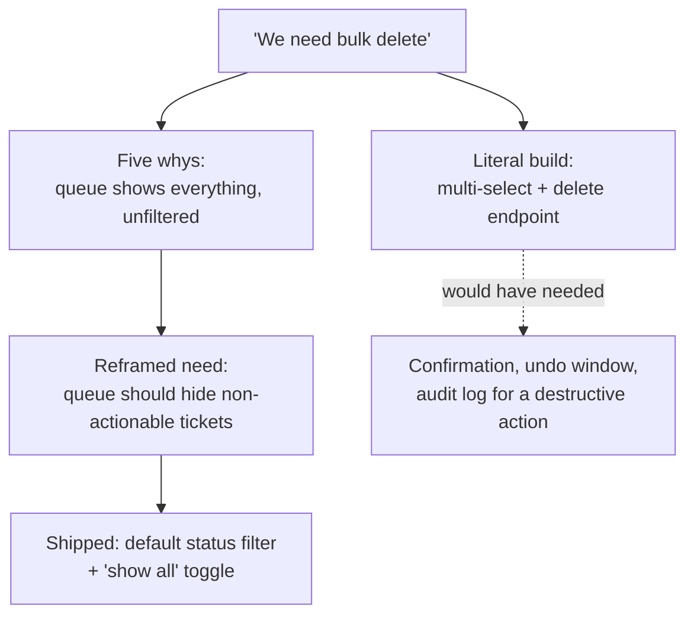

import Scenario from "../../../components/Scenario.astro";

<Scenario label="The scenario">
  <Fragment slot="facts">
    <div class="not-prose flex flex-col gap-1.5 text-sm text-slate-700 dark:text-slate-300">
      <div class="flex items-center gap-1.5"><span>🎫</span> Ticket: "We need bulk delete for tickets"</div>
      <div class="flex items-center gap-1.5"><span>🧑‍💼</span> Support agents: closing tickets one at a time is slow</div>
    </div>

    <p class="not-prose mt-3 mb-1 text-xs font-semibold tracking-wide text-slate-400 uppercase">The whys chain</p>
    <div class="not-prose flex flex-col gap-1 text-sm text-slate-700 dark:text-slate-300">
      <div class="flex items-center gap-1.5"><span>1️⃣</span> Why bulk delete? Closed/spam tickets clutter the queue</div>
      <div class="flex items-center gap-1.5"><span>2️⃣</span> Why does that matter? Queue view shows everything, unfiltered</div>
      <div class="flex items-center gap-1.5"><span>3️⃣</span> Why no filter? Open and closed look identical today</div>
      <div class="flex items-center gap-1.5"><span>🎯</span> Root need: the queue doesn't distinguish actionable from not</div>
    </div>

  </Fragment>

Support agents ask for a "bulk delete" button because clearing out old
tickets one at a time is slow. That's the entire ask as written. **Before
reading on: if you only had the ticket text and built exactly what it
says, what would you ship — and what's the most likely way that turns out
to be the wrong tool for the actual job?**

</Scenario>

## Case 1: "Add a bulk delete button"

**Taking the request at face value would produce:** a multi-select UI plus
a delete-many endpoint. Reasonable-sounding, and it's exactly what was
asked for.

**Applying the five whys:**

```
"We need bulk delete"
  why? -> "Because closed spam/test tickets pile up and clutter the queue view"
  why? -> "Because the queue view shows everything, with no way to filter it out"
  why? -> "Because there's no status filter on the queue — 'closed' and 'open' look the same"
ROOT NEED: the queue view doesn't distinguish tickets that need attention
           from ones that don't
```

**What this reframes the problem into:** not "how do we destroy records
faster" but "how do we keep the queue showing only what's actionable."
That reframe changes the candidate solution space entirely — a status
filter (hide closed tickets from the default view) solves the actual pain
with zero data loss and no new destructive bulk-action surface to build
safety rails around, and ships in a fraction of the time a safe
bulk-delete flow (confirmation, undo window, audit log for a destructive
multi-record action) would take.



**What shipped:** a default queue filter that hides closed/spam tickets,
plus a one-click "show all" toggle for the rare case someone needs the
full view. Bulk delete was never built. Support agent complaints about
queue clutter dropped to near zero; nobody asked for bulk delete again,
because the underlying pain (clutter, not "insufficient deletion
throughput") was gone.

## Case 2: "Add a dark mode toggle" — when one request hides several different needs

**The request, taken literally:** several users in a feedback thread ask
for dark mode. Does "several users asked for the same feature" mean
they're all asking for the same reason — and does that distinction
actually change anything about what gets built or when?

**Applying the five whys, on a sample of the actual requesters (not
assuming a single universal reason):**

| Requester | Their stated reason | Root need (one why deep) | Weight behind it |
| --------- | -------------------- | -------------------------- | ------------------ |
| User A    | "I use it at night and the bright screen hurts my eyes" | Reduced eye strain in low-light conditions | Real usability pain, correlates with a support-ticket pattern |
| User B    | "Every other tool I use has it, this one looks dated without it" | Visual parity with expectations set by other tools | Perception/expectation gap, not a functional blocker |
| User C    | "I just prefer how it looks" | Aesthetic preference, no functional pain behind it | Lowest urgency — no cost to not having it |

This case illustrates something Case 1 doesn't: the five whys can reveal
that a single feature request is actually **several different underlying
needs wearing the same clothing** — a literal reading treats all three as
identical ("they all want dark mode"), but the actual weight behind the
request differs. This matters for prioritization, not just solution
design: a request driven by genuine usability pain (User A) deserves more
urgency than one driven by aesthetic preference alone, even though both
are nominally "the same feature request."

**What shipped:** dark mode, but sequenced ahead of other roadmap items
specifically because the eye-strain complaints (User A's category)
correlated with a real support-ticket pattern ("hard to use at night")
that the team hadn't otherwise connected to this request — the five-whys
process is what surfaced that the request wasn't just aesthetic noise.

## Failure modes

| Failure                                                                 | What it looks like                                                                                                     | The fix                                                                                     |
| ------------------------------------------------------------------------ | -------------------------------------------------------------------------------------------------------------------------- | ----------------------------------------------------------------------------------------------- |
| Doing the five whys once, in a meeting, without talking to actual users | Inventing plausible-sounding whys internally, instead of asking real requesters                                            | Trace the whys with the actual person who filed the request, not a guess at what they meant     |
| Treating the five whys as a way to talk users out of what they asked for | Concluding "actually nobody needs this" as the goal, rather than a better fit                                              | Case 2 didn't kill dark mode — it re-prioritized based on which need was most urgent             |
| Stopping at the first "why" and calling it done                          | "I want a CSV export so I can build a report" — a report is still a solution, not a root need                              | Keep pushing past the first plausible-sounding answer until it names a need, not another solution |
| Applying this so rigorously that trivial, cheap requests get needlessly interrogated | A one-hour UI tweak gets the same five-whys treatment as a destructive, hard-to-reverse feature | Scale the depth of investigation to the cost and risk of building the requested solution         |

## Beyond this example

Case 1 and Case 2 are two cases, not the whole territory — a few questions
to test whether the model actually transferred:

- What changes if the requester in Case 1 were a single power user instead
  of a team of support agents citing the same complaint independently —
  does one voice asking for "bulk delete" carry the same weight as several
  people independently hitting the same clutter problem?
- In Case 2, what if User C's "I just prefer how it looks" turned out to
  represent 80% of the requesters, and User A's eye-strain complaint
  turned out to be rare? Would that change which need gets built first —
  and does "most common" always outrank "most severe" in that trade-off?
- Where in your own backlog is there a request that's really three
  different requesters' needs wearing the same feature name — and would
  tracing the whys per-requester, the way Case 2 does, change how it gets
  prioritized?
