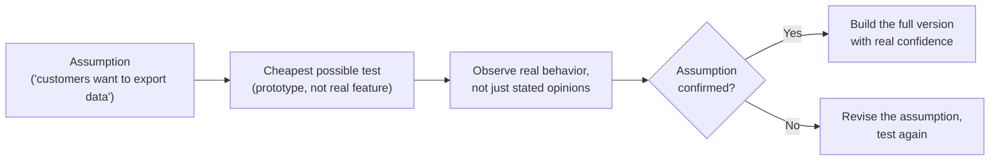

## The validate-before-build loop

**If a team can't be sure customers want a feature until they've built
it, does that mean validation is impossible before shipping?** No —
validation doesn't require the real feature to exist. It requires a
cheap way to observe how people actually respond to the underlying
idea, before the expensive version is built.

The loop never reaches "build the full version" until a cheap test has
already produced real evidence. Skipping straight from assumption to a
full build is what happened in L1 — six weeks of engineering standing
in for a step that should have taken days.

## "Smaller version of the feature" vs. "test of the riskiest assumption"

**Isn't an MVP just a smaller, faster version of the final feature?**
That's a common misreading of the term, and it's a different thing
from what makes an MVP actually useful.

|                                 | Smaller version of the final feature                         | Test of the riskiest assumption                                  |
| ------------------------------- | ------------------------------------------------------------ | ---------------------------------------------------------------- |
| What gets built                 | A real, working (if limited) version of the feature itself   | Whatever's cheapest to build that still produces a real signal   |
| Engineering effort              | Still substantial — it's real, shippable code                | Minimal — often no real backend at all                           |
| What it tests                   | Whether the limited version works technically                | Whether the underlying assumption about what people want is true |
| Risk if the assumption is wrong | Weeks of engineering effort already spent on the wrong thing | Days spent, assumption revised, no real feature effort wasted    |

A "smaller export feature" (fewer file formats, fewer columns) is
still committing engineering time to the same unconfirmed assumption —
just a slightly cheaper commitment. A true MVP might not export
anything at all; it might just be a button that, when clicked, reveals
"coming soon" and asks what the customer actually needed it for.

The everyday version: if someone says "I need an app to print my
recipes," the riskiest assumption might be that printing is the real
need. A cheap test could ask whether they actually want paper copies,
or whether they need to send recipes to a family WhatsApp group. The
MVP is the smallest test that answers that question, not automatically
the smallest printing app.

## Why stated opinions aren't the same as evidence

**If sales already told the team customers want to export data, isn't
that evidence?** It's an assumption reported secondhand, not evidence
of actual behavior — what someone says they'd use and what they
actually do when given a real chance to act can diverge sharply. A
cheap prototype that measures real clicks, real follow-up questions,
or real willingness to wait for a feature produces a much stronger
signal than a stated preference relayed through another team.

That doesn't mean sales did anything wrong. It means "customers said
this to sales" is a useful clue, while "customers clicked, answered,
waited, paid, or changed behavior" is stronger evidence.

## The generalizable lesson

**Does this only apply to export features?** No — it applies to any
feature whose value depends on an unconfirmed assumption about what
people actually want, not just what they say they want. The pattern to
watch for is the same every time: effort about to be committed to a
guess, when a cheaper test of that guess exists and hasn't been tried
yet.
