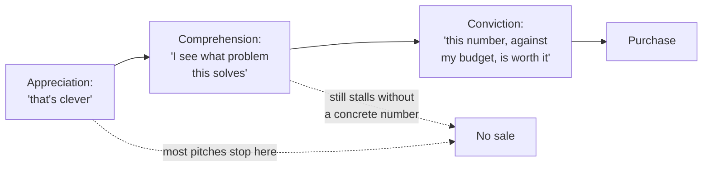
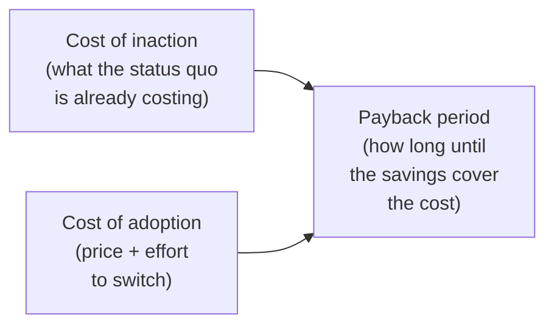

import LevelIntro from "../../../components/LevelIntro.astro";
import Checkpoint from "../../../components/Checkpoint.astro";

L1 showed the same capability producing two very different outcomes
depending on how it was framed. This level builds the model behind
that gap, and the specific numbers a pitch needs to close it.

<LevelIntro
  items={[
    "Why appreciation, comprehension, and conviction are separate states",
    "Cost-of-inaction vs. cost-of-adoption vs. payback period",
    "Why a vague benefit claim stalls where a quantified one doesn't",
  ]}
/>

## Why doesn't understanding lead to buying?

**If a buyer fully understands what a product does and even admires
it, why doesn't that alone produce a purchase?** Because a purchase
decision isn't a judgment about the product at all — it's a judgment
about whether _this specific cost, right now, is worth this specific
outcome_. A buyer can complete the first judgment (the product is
good) without ever being asked to complete the second one (this is
worth paying for, today, out of my budget).

Most pitches are built to produce appreciation — a good demo, a
clean UI, an impressive capability — and treat comprehension and
conviction as if they follow automatically. They don't. Each stage
requires something the previous one doesn't supply: comprehension
requires connecting the capability to a problem the buyer recognizes
as _theirs_; conviction requires a number specific enough that the
buyer can weigh it against what they're already spending or losing.

<Checkpoint question="A prospect says, after a demo, 'I completely understand how this would help us.' Has this buyer reached conviction? What's still missing before a purchase decision is likely?">

No — that sentence describes comprehension, not conviction. The
buyer has connected the capability to a real problem they recognize,
which is real progress past pure appreciation, but they haven't yet
weighed a specific cost against a specific number they're already
accountable for. "This would help us" is a general judgment; a
purchase decision needs a specific one — something closer to "this
would help us by roughly this much, for roughly this cost, over
roughly this timeframe." Until that number exists and holds up, the
buyer has no concrete threshold to clear, so the decision has nothing
firm to attach to and tends to stall as "let me think about it," even
when the buyer is being completely sincere.

</Checkpoint>

## Where the number comes from

**Given that conviction needs a specific number, what number, and
where does it come from?** Value-based selling builds that number
from two sides of the same decision, then derives a third figure
from the relationship between them.

- **Cost of inaction** — what the current, unsolved state of the
  problem is already costing the buyer, in their own units: hours of
  labor per week, dollars lost to errors per month, revenue put at
  risk by downtime. This number often doesn't exist anywhere written
  down — the buyer is usually absorbing it as "just how things are,"
  which is exactly why naming it out loud is persuasive on its own,
  before any product is even mentioned.
- **Cost of adoption** — the full cost of switching: the price of the
  product, plus the real effort of onboarding, training, and any
  temporary disruption while the new approach beds in. Leaving out
  the effort side and quoting only the sticker price is a common way
  an ROI case looks better than it will actually feel to live through.
- **Payback period** — how long it takes for the savings from closing
  the cost-of-inaction gap to exceed the cost of adoption. This is
  usually the single number a buyer remembers from the whole pitch:
  "seven weeks" is concrete in a way "significant savings" never is.

## Why a vague claim stalls and a quantified one doesn't

|                               | Vague value claim                                          | Quantified ROI claim                                                                       |
| ----------------------------- | ---------------------------------------------------------- | ------------------------------------------------------------------------------------------ |
| Example                       | "This will save your team a lot of time"                   | "This saves your team about 14 hours a week, roughly $46,000 a year in labor"              |
| What the buyer has to do next | Estimate the size themselves, against unstated assumptions | Compare a stated number directly to a number they already track                            |
| Effect on urgency             | None — "a lot" doesn't compete against any other line item | Competes directly with the buyer's own budget and other spending priorities                |
| What it invites               | Polite agreement, no next step                             | A specific objection ("where does 14 hours come from?") — which is progress, not a setback |

**Why is a specific objection actually progress, and not just a
harder conversation?** A vague claim is too soft to disagree with —
there's nothing precise enough in it to push back on, so the
conversation has nowhere to go except a noncommittal "sounds good."
A specific number gives the buyer something to test, and testing a
number is exactly the process that leads to trusting it — objection
and skepticism are what a real evaluation looks like, and a claim
that never gets questioned was probably never taken seriously enough
to be evaluated in the first place.

<Checkpoint question="A rep is deciding between two claims: 'this significantly reduces errors' and 'this cuts your error rate from 4% to under 1%, which is roughly $18,000 a month in avoided rework.' Which is more persuasive, and specifically why — not just 'because it's a number'?">

The second is more persuasive, and the reason isn't simply that it
contains digits — it's that it's checkable against something the
buyer already tracks. "Significantly reduces" gives the buyer nothing
to compare against their own situation, so they have to supply their
own guess about what "significant" means, and most buyers won't do
that work unprompted. "From 4% to under 1%, roughly $18,000 a month"
gives a starting point the buyer can verify against their own error
rate, a resulting number they can weigh against their own monthly
spend, and a specific claim they can push back on if their situation
looks different — which is exactly the kind of scrutiny that, once
survived, produces real conviction rather than polite agreement.

</Checkpoint>

The next level works this all the way through with real numbers: a
full cost-of-inaction estimate, a cost-of-adoption comparison, the
payback period that falls out of them, the actual pitch language that
results, and — because an inflated number is worse than no number at
all — a worked contrast between an ROI claim that backfires and one
conservative enough to survive scrutiny.
