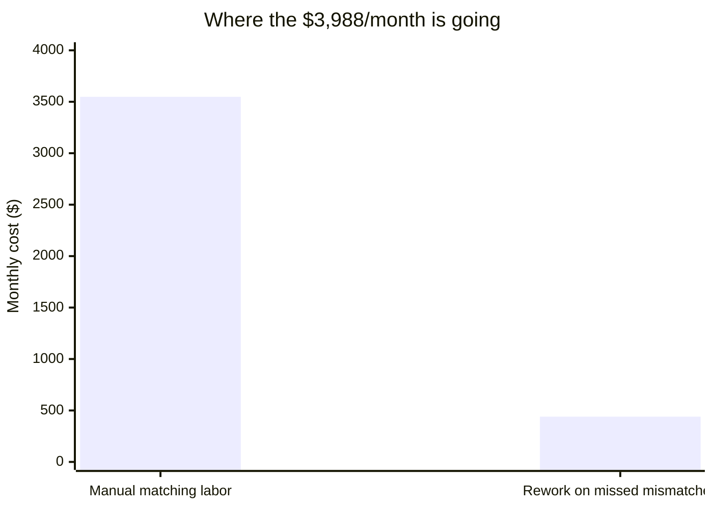

import LevelIntro from "../../../components/LevelIntro.astro";
import Checkpoint from "../../../components/Checkpoint.astro";

L2 built the model — appreciation, comprehension, and conviction as
separate states, and cost-of-inaction, cost-of-adoption, and payback
period as the numbers that produce conviction. This level builds one
full ROI case end to end, with real illustrative numbers, and then
shows what happens when that case is inflated versus when it's
conservative.

<LevelIntro
  items={[
    "Building the cost-of-inaction and cost-of-adoption ledger, line by line",
    "Deriving the payback period and the pitch language it produces",
    "An inflated ROI claim backfiring vs. a conservative one holding up",
  ]}
/>

## The account

Return to the invoice-reconciliation tool from L1. The rep now has a
second call with the finance director, and this time the goal isn't
another demo — it's building the actual case with her, using her own
numbers wherever possible rather than the vendor's assumptions.

**Before working through the numbers: what should the rep ask the
director first, before quoting a single figure?** Not "would this
save you money" — a leading, hypothetical question the director has
no way to answer precisely. Instead: "How many people currently touch
invoice matching, and roughly how much of their week does it take?"
That question asks for a fact the director already has, or can get
quickly, rather than asking her to estimate the size of a benefit she
hasn't experienced yet.

## Cost of inaction, built from her own numbers

The director answers: three people on her team spend about five hours
a week each on manual invoice matching — roughly 15 hours a week
combined. She also mentions, almost as an aside, that mismatched
invoices slip through and get paid incorrectly about twice a month,
each one taking a half-day to unwind with the vendor.

| Line item                     | Basis                                         | Monthly cost  |
| ----------------------------- | --------------------------------------------- | ------------- |
| Manual matching labor         | 15 hrs/week × 4.3 weeks × $55/hr fully loaded | ≈ $3,548      |
| Rework on missed mismatches   | 2 incidents/month × 4 hrs × $55/hr            | ≈ $440        |
| **Cost of inaction, monthly** |                                               | **≈ $3,988**  |
| **Cost of inaction, annual**  | ×12                                           | **≈ $47,850** |

Two things matter about how this ledger was built, not just what it
totals. First, every line item traces back to something the director
said herself, not a number the rep supplied — "$55/hr fully loaded"
was her own team's blended rate, given when asked, not a vendor
assumption dropped in to make the total look bigger. Second, the
rework line was almost left out because the director mentioned it
in passing rather than as a headline complaint — cost of inaction is
often hiding in exactly this kind of aside, not in the thing the
buyer names first when asked "what's your biggest problem."

## Cost of adoption, built the same way

The tool costs $1,200 a month. But the honest cost-of-adoption figure
doesn't stop at the sticker price — it includes what it will actually
cost the director's team to get there.

| Line item                     | Basis                                                                                             | Cost                                                                                                          |
| ----------------------------- | ------------------------------------------------------------------------------------------------- | ------------------------------------------------------------------------------------------------------------- |
| Subscription                  | Vendor price                                                                                      | $1,200/month                                                                                                  |
| Implementation and onboarding | Configuring the integration, migrating a year of historical invoices, training three team members | ≈ $2,900 (one-time)                                                                                           |
| Ramp-up dip                   | First 3 weeks run at roughly half the eventual time savings while the team learns the tool        | Captured in the payback calculation below, not as a separate line — folding it in twice would double-count it |

**Why call out a ramp-up dip at all, when it makes the case look
slightly worse?** Because a buyer who lives through a rockier first
few weeks than they were promised stops trusting every other number
in the pitch, even the ones that were accurate — a case that
pretends switching is frictionless doesn't survive contact with
reality, and the damage isn't contained to the one exaggerated line;
it spreads to the buyer's trust in the whole document.

## Deriving the payback period

Monthly recurring savings once fully ramped: $3,988 (cost of
inaction) minus $1,200 (subscription) = **$2,788 a month**, or about
$644 a week. The one-time implementation cost is **$2,900**.

**If the pitch simply divided the one-time cost by the full weekly
savings rate — $2,900 ÷ $644/week — it would claim payback in about
four and a half weeks.** That number is optimistic, because it
assumes the team saves at full speed starting week one, which isn't
what actually happens: for the first three weeks, the team is still
learning the tool and only realizes about half the eventual savings
(roughly $322 a week instead of $644). Running the real week-by-week
balance — $2,900 owed, three weeks of half-speed savings, then full
speed — the balance doesn't cross zero until partway through week
seven. **Total payback, accounting for the real ramp: just under
seven weeks.**

**This is the number from L1's second pitch.** It wasn't picked
because it sounds good — it's what falls out of running the real
week-by-week balance, ramp-up included, instead of the simpler
division that skips it.

<Checkpoint question="The rep could have quoted the simpler, more impressive-sounding 'pays for itself in about four and a half weeks' by dividing the one-time cost straight into the full weekly savings rate. Why is 'just under seven weeks' the better number to actually say out loud, even though it's less dramatic?">

Because the buyer is going to live through the slower first few
weeks whether or not it's mentioned, and if the pitch promised four
and a half weeks while the real experience takes closer to seven,
the gap between the promise and the lived experience becomes
evidence, in the buyer's mind, that the rest of the numbers were
probably optimistic too — the one shortcut contaminates trust in
every other figure in the case, even the accurate ones. A less
dramatic number that matches what actually happens keeps the case
defensible after the sale, not just persuasive before it, and a
buyer who checks the real experience against the promise and finds
them matching becomes more likely to trust the next number this rep
brings them, on this deal or the next one.

</Checkpoint>

## The pitch language that results

Everything above is the working; the pitch is what the director
actually hears, and it compresses the ledger into a handful of
sentences she can repeat to her own boss without re-deriving it:

> "Right now your team's spending about $3,988 a month between manual
> matching and cleaning up the mismatches that slip through — call it
> $48,000 a year. This tool runs $1,200 a month, plus about $2,900 to
> get set up and a slower first few weeks while the team ramps up.
> Once it's running, you're saving roughly $2,800 a month net, and the
> whole switch pays for itself in just under seven weeks."

Notice what isn't in that sentence: no mention of "real-time
reconciliation engine" or any other feature-level description. The
capability is assumed; the number is what's being sold. This is the
same value-over-feature move from the earlier unit in this track,
now made specific and quantified rather than merely qualitative.

## When the number is wrong: inflated vs. conservative

A second, cautionary version of this same story: a different rep,
selling the same tool to a different finance director, skips the
"ask for her own numbers first" step and instead uses a generic
industry benchmark — "companies typically save 40% of their AP team's
time" — to claim a $92,000 annual saving, nearly double the honest
figure above, without ever confirming this buyer's team spends
anywhere near that much time on the problem in the first place.

**What happens when that director's own team later checks the
number?** Three months in, someone on her team actually tracks the
hours and finds the real savings closer to $30,000 a year — a real,
genuinely positive number, just far short of the $92,000 that was
promised. The tool isn't cancelled, because it's still saving real
money. But the director now discounts every future claim from that
vendor by default, brings a colleague into the next renewal
conversation specifically to sanity-check the numbers, and mentions
the gap, unprompted, when a peer at another company asks for a
reference. **The inflated number didn't just fail to help — it cost
the vendor credibility on every claim that came after it, including
true ones.**

|                                                                 | Inflated claim ($92k, industry benchmark)                    | Conservative claim ($48k, buyer's own numbers)             |
| --------------------------------------------------------------- | ------------------------------------------------------------ | ---------------------------------------------------------- |
| Where the number came from                                      | A generic industry average, never checked against this buyer | The buyer's own stated hours and rates                     |
| First reaction                                                  | Impressive — closes the deal faster                          | Credible — the buyer can defend it internally without help |
| What happens once reality is checked                            | Real savings land well under the promise; trust breaks       | Real savings land close to the promise; trust builds       |
| Effect on the next conversation (renewal, expansion, reference) | Every future number from this vendor is now discounted       | Future numbers are taken closer to at face value           |

A conservative number that the buyer can poke holes in and still find
convincing beats an aggressive one for exactly this reason: the
aggressive number wins the first meeting and loses every meeting
after it, while the conservative number does slightly less work in
the first meeting and keeps paying off in every one that follows.

<Checkpoint question="A director's team confirms the real annual saving is about $30,000, well under the industry-benchmark rep's promised $92,000, but the director stays a customer because $30,000 is still a genuinely good outcome. Was the inflated pitch still a mistake, given that the buyer didn't leave? Why or why not?">

Yes, it was still a mistake — staying a customer isn't the same as
the pitch having worked as intended. The cost of the inflated number
didn't show up as a lost sale; it showed up as lost trust that now
taxes every future interaction with this vendor: the next renewal
conversation, any attempt to expand the account, and any reference
the director might otherwise have given to a peer. A pitch's job
isn't only to close the first deal — it's to build a relationship
that survives being checked, and this one didn't, even though the
underlying product was good enough to keep the account anyway. The
$30,000 real result was a perfectly sellable number on its own; it
never needed the extra $62,000 of benchmark padding to close, and
that padding is the only thing that actually cost the vendor
anything here.

</Checkpoint>

## What changes if the buyer is skeptical of your numbers?

**Try extending the worked example yourself: what if, instead of
accepting the $3,988-a-month figure, the director had pushed back —
"I don't think we're really spending that much time on this"?** The
honest response isn't to defend the number harder; it's to make it
smaller and more verifiable rather than more insistent — offer to
build the estimate from a source she trusts more than the rep's math,
such as a two-week time log her own team fills out, or a lower,
explicitly conservative range ("even if it's half what I estimated,
that's still a five-week payback") that still clears the bar. A buyer
who pressure-tests a number and watches it hold, or watches the rep
willingly shrink it rather than defend it, ends up trusting the final
figure more than a buyer who never questioned it at all — skepticism
handled this way is an opportunity to demonstrate the number is real,
not an obstacle to talk past.

## What changes if the ROI is genuinely marginal?

**What if the honest ledger comes out to a payback period of 14
months instead of seven weeks — not a dramatic case, just a real
one?** The tempting move is to pad the cost-of-inaction side until
the number looks more impressive; the honest move is to say so
directly and reframe what's actually being sold. A marginal
financial ROI can still be a legitimate pitch if there's a second,
non-financial value the buyer cares about — reduced risk of a
compliance miss, one less thing a short-staffed team has to keep
track of by hand — stated as exactly that, a secondary benefit riding
alongside a modest financial case, rather than dressed up as a bigger
financial number than the ledger actually supports. A pitch that
says "the payback here is genuinely 14 months, but it also takes a
manual compliance risk off your plate entirely" is a complete,
honest case a buyer can act on. A pitch that quietly inflates the
14-month case into a fake seven-week one to make it look more urgent
is the same mistake as the industry-benchmark rep made above, just
smaller in scale.

## Failure modes

| Failure mode                                                                      | What it gets wrong                                                                                                                    |
| --------------------------------------------------------------------------------- | ------------------------------------------------------------------------------------------------------------------------------------- |
| Using an industry benchmark instead of the buyer's own numbers                    | Produces a number that looks impressive but isn't actually about this buyer, and collapses the moment their own team checks it        |
| Quoting only the subscription price as "cost of adoption"                         | Hides the real onboarding and ramp-up cost, so the actual payback period ends up longer than promised, damaging trust once discovered |
| Treating a vague claim ("this will help a lot") as equivalent to a quantified one | Gives the buyer nothing to compare against their own budget, so the pitch never produces the conviction a purchase decision requires  |
| Padding a modest, honest ROI case to make it look more dramatic                   | Trades a smaller, defensible win for a larger, unstable one that breaks trust as soon as it's checked                                 |
| Assuming a buyer who says "I understand" has reached a purchase decision          | Confuses comprehension with conviction — understanding a benefit and being ready to commit budget to it are different states          |
