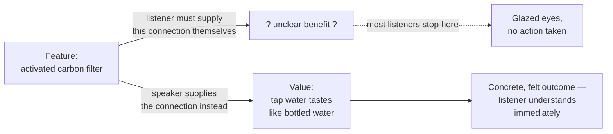

## Why a feature alone doesn't cross the gap

**If "activated carbon filter" is a true, accurate fact about the
pitcher, why doesn't stating it convince anyone?** Because a fact
about the product isn't the same as a reason for the listener to
care — the listener still has to do the work of figuring out what
that fact means for _them_, and most people won't do that work
unprompted, especially without the background to make the connection
easily:

The feature and the value describe the exact same underlying fact —
what changed is who did the work of connecting them, and whether that
work happened at all.

## Climbing the "so what" ladder

**If a feature doesn't automatically reveal its value, how do you
find the value underneath it?** By repeatedly asking "so what does
that mean for the listener?" until the answer stops being a product
fact and starts being something the listener already cares about:

| Step         | Statement                                                                        | Still a feature?                                                                       |
| ------------ | -------------------------------------------------------------------------------- | -------------------------------------------------------------------------------------- |
| 1            | "It has an activated carbon filter."                                             | Yes — a spec                                                                           |
| 2 (so what?) | "The filter removes chlorine and sediment from tap water."                       | Yes — still describes the product, not the listener                                    |
| 3 (so what?) | "The water doesn't taste like chlorine anymore."                                 | Getting closer — a sensory outcome                                                     |
| 4 (so what?) | "It tastes close to bottled water."                                              | Closer — now compared to something familiar                                            |
| 5 (so what?) | "You don't need to buy bottled water anymore — saving about $1,028 in year one." | **Value** — money, a term the listener already cares about, no extra background needed |

Notice each step is still true — nothing was invented climbing the
ladder. What changed is which fact got stated out loud. Stopping at
step 1 or 2 is common precisely because those are the facts the
person selling the product knows best — they don't feel like they
need explaining to someone who already understands them.

A reusable shape is: **it has X -> that causes Y -> so you get Z**.
X is usually the feature, Y is the bridge, and Z is the value. If Z
still sounds like product vocabulary, keep asking "so what?" until it
sounds like money, time, safety, comfort, effort, risk, taste, or
another thing the listener already understands.

## Why this happens: the curse of knowledge

**If steps 3 through 5 are so much more persuasive, why does anyone
stop at step 1?** Because whoever knows a product well enough to
describe its features has usually stopped noticing that those
features aren't self-explanatory to someone without the same
background — a bias called the **curse of knowledge**: once you know
something, it's hard to imagine not knowing it, so you underestimate
how much translation someone else needs. The fix isn't to know less —
it's to deliberately climb the ladder every time, rather than trusting
that the listener will climb it on their own.

A school-simple version: once you know how to divide fractions, it is
easy to forget that another person may still need every step written
out. Product experts do the same thing with specs; they skip the
middle steps because those steps feel obvious to them.

## This generalizes past water filters

The same ladder works for almost any product, because "so what does
that mean for the listener" doesn't depend on what the product is:

| Product        | Feature (step 1)                      | Value (top of ladder)                                                             |
| -------------- | ------------------------------------- | --------------------------------------------------------------------------------- |
| Bicycle helmet | "Multi-density EPS foam liner"        | "Cuts serious head injury risk roughly in half in a crash"                        |
| Umbrella       | "Fiberglass ribs, 210T pongee fabric" | "Won't flip inside-out or snap in strong wind"                                    |
| Standing desk  | "Dual-motor lift, 220 lb capacity"    | "You can switch from sitting to standing in 5 seconds without straining anything" |

In every row, the feature is true and the value is also true — the
value row is just the feature translated into terms the listener
already cares about (safety, reliability, comfort) without needing
any product-specific background.

You do not need to know what EPS foam or pongee fabric are for the
table to work. That is the point: the value side saves the listener
from needing that background before they can understand the benefit.

## Failure modes at this level

- **Assuming the listener will climb the ladder themselves.** Most
  won't — not from laziness, but because they don't have the
  background to know which features matter or why, which is exactly
  why they're listening to a pitch in the first place.
- **Climbing so far the statement stops being true.** "Saves you
  about $1,028 in year one" only holds if the listener's actual
  water-drinking habits resemble the assumption behind that number —
  value framing still has to stay accurate, not just persuasive.
- **Using value language that isn't actually audience-relevant.**
  "Increases hydration compliance metrics" sounds like value language
  but is really just a different feature dressed up — it still
  requires the listener to know why "hydration compliance" should
  matter to them.
