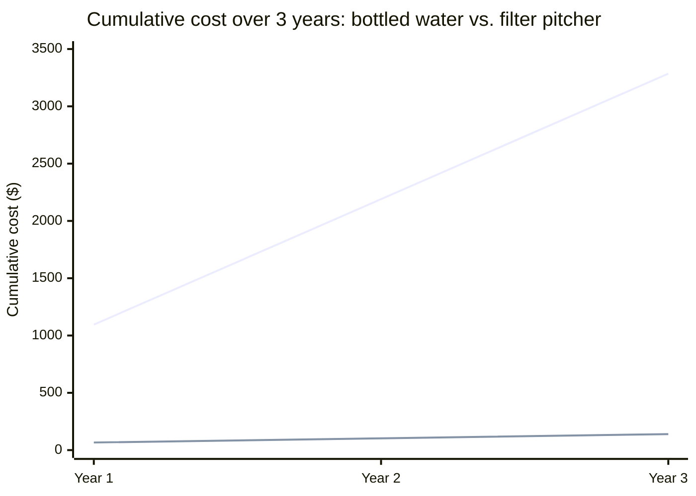

## The raw facts before either pitch is written

Before writing anything, the underlying facts about the pitcher are
fixed and identical for both versions:

| Fact                        | Value                                           |
| --------------------------- | ----------------------------------------------- |
| Filter type                 | Activated carbon, removes chlorine and sediment |
| Capacity                    | 10 cups                                         |
| Material                    | BPA-free plastic                                |
| Pitcher price               | $30 (one-time)                                  |
| Replacement filter price    | $8, lasts 40 gallons                            |
| Assumed household water use | 0.5 gallons/day filtered                        |
| Comparison: bottled water   | $1.50/bottle, 2 bottles/day                     |

**Before reading the two pitches below — using only this table, what
would the top of the "so what" ladder from L2 actually say for this
specific pitcher?** Working the numbers: bottled water costs
$1.50 × 2 × 365 = **$1,095/year**. The filter pitcher costs $30
up front plus roughly 4.56 replacement filters/year at $8 each
(182.5 gallons/year ÷ 40 gallons/filter) — **$66.50 in year one**,
then about **$36.50/year** after that. That's the number the value
pitch should lead with.

## Pitch A: feature-first

> "This pitcher uses an activated carbon filter to remove chlorine
> and sediment from tap water. It holds 10 cups, and the plastic is
> BPA-free. Replacement filters are available and rated for 40
> gallons each."

Every sentence here is accurate. But notice what a listener has to
supply themselves to get from this to a reason to buy it: they have
to already know that chlorine affects taste, that BPA is something to
avoid, that 40 gallons is a meaningful unit relative to their own
household's water use, and that any of this compares favorably to
whatever they're doing now. **The pitch does none of that translation
— it hands the listener four facts and assumes they'll do the "so
what" work on their own.**

## Pitch B: value-first

> "If you're currently buying bottled water, this pitcher will make
> your tap water taste just as good — no more chlorine taste — for
> about $1,028 less this year than what you're spending on bottles.
> After the first year, it costs about $36.50 a year to keep running,
> versus roughly $1,095 a year for bottled water."

Same underlying facts (filter type, capacity, replacement cost) — none
were invented — but every sentence is now expressed in terms the
listener already understands without needing any background about
filtration: taste, and a specific dollar figure compared to what
they're already spending.

By year three, the gap has grown to $3,285 − $139.50 = **$3,145.50**
— a number Pitch A never mentions at all, because Pitch A never
computes it. The value pitch isn't more persuasive because it's more
enthusiastic — it's more persuasive because it did arithmetic the
feature pitch left for the listener to do themselves, and most
listeners simply won't.

## What this comparison does and doesn't prove

**Does value framing mean features never get mentioned?** No — Pitch
B still implicitly relies on the fact that there's a real filter
doing real filtration; a listener who asks "how does it actually
work?" still deserves an accurate feature-level answer. What value
framing changes is _what leads_ — the value comes first because it's
what determines whether the listener keeps listening at all, and the
underlying features can follow once they're actually curious, not
before.

**Try extending it yourself:** suppose the listener is someone who
already makes their own coffee at home and never buys bottled water —
the $1,028/year savings claim doesn't apply to them at all. What
would the top of the "so what" ladder say for that specific listener
instead, using the same underlying product facts?

## Failure modes

| Failure mode                                                                                | What it gets wrong                                                                                                                                                                      |
| ------------------------------------------------------------------------------------------- | --------------------------------------------------------------------------------------------------------------------------------------------------------------------------------------- |
| Leading with value but never answering "how does it actually work" when asked               | A listener who's convinced enough to ask a follow-up deserves accurate feature detail, not just repeated value language                                                                 |
| Computing the value number for a generic listener instead of the actual one in front of you | The $1,028/year figure assumes 2 bottles/day — a listener who drinks less bottled water gets a smaller, still-true number, and using the generic figure on them overstates the value    |
| Treating "removes 99.9% of contaminants" as value language                                  | It's still a feature — a percentage without context still requires the listener to supply the "so what" themselves                                                                      |
| Skipping the arithmetic and asserting "saves you money" with no number                      | An unquantified claim is weaker than a specific, checkable one — "$1,028 less this year" is more convincing precisely because it can be verified                                        |
| Assuming value framing replaces honesty about trade-offs                                    | If the pitcher genuinely tastes worse than bottled water for some users, value framing that omits this isn't more effective persuasion — it's a setup for disappointment and lost trust |
