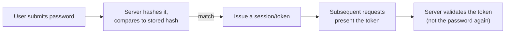

## The chain, end to end



The password itself is only ever involved once — at initial login. Everything after that runs on the token, which is why protecting the token (how it's stored client-side, whether it's sent over plain HTTP, how long it's valid, whether it can be revoked) is a genuinely separate security problem from protecting the password, with its own failure modes covered in later units (`stateless-auth`, `tls-https`).

## Why hashing, specifically, and not encryption

| Storage method         | Reversible?             | Can an attacker who steals the database recover the real password?        |
| ---------------------- | ----------------------- | ------------------------------------------------------------------------- |
| Plain text             | N/A — never transformed | Yes, immediately, for every user                                          |
| Encrypted (reversible) | Yes, with the right key | Yes, if the key is also compromised (and it often is, alongside the data) |
| Hashed (one-way)       | No, by design           | No — not directly; only via guessing (covered below)                      |

Encryption is the wrong primitive here specifically because it's designed to be reversible — that's exactly what makes it right for data you need to get back (a file, a message) and wrong for a password, which the system only ever needs to _verify_, never _retrieve_. A hash is deliberately one-way: there's no key that unlocks a hash back into the original password, because none was ever needed for the system's actual job.

## Salting: defeating precomputed attacks

```python
function register(username, password):
    salt = generate_random_salt()          # unique per user, stored alongside the hash
    hashed = hash(password + salt)
    store(username, hashed, salt)

function login(username, password):
    stored_hash, salt = lookup(username)
    attempt_hash = hash(password + salt)   # re-derive using the SAME salt
    return attempt_hash == stored_hash     # constant-time comparison in practice — see L3
```

Without a salt, two users who happen to choose the same password ("password123") produce the identical hash — and a **rainbow table** (a precomputed table mapping common passwords to their hashes) cracks both instantly, along with every other user in the database using a common password, all from one precomputed lookup. With a unique salt per user, the same password produces a _different_ hash for each user, so a precomputed table has to be redone per salt — which defeats the entire economic advantage of precomputing in the first place.

## What this unit deliberately doesn't cover yet

This is the "why" behind hashing and salting, not the "how exactly" — which specific hash function to use (and why plain `SHA-256` alone is actually a poor choice for passwords, unlike for other hashing use cases), how work-factor tuning defends against brute force, and key-derivation functions like bcrypt/scrypt/Argon2 are the subject of `security/hashing`, the next unit in sequence. This unit's job is the conceptual chain: prove once, hash don't encrypt, salt to defeat precomputation — the mechanics of _how_ to hash well build directly on top of that foundation.
