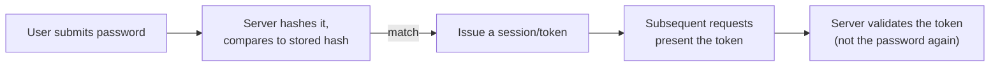

import LevelIntro from "../../../components/LevelIntro.astro";
import Checkpoint from "../../../components/Checkpoint.astro";

L1 established that a password must be hashed, never encrypted or stored
in plain text, and sketched the categories a proof of identity can come
from. L2 works out the actual chain a login runs through end to end, and
the reasoning behind hashing and salting that L1 only named.

<LevelIntro
  items={[
    "The full chain from password to session token",
    "Why hashing beats encryption for passwords",
    "Why salting defeats precomputed rainbow tables",
  ]}
/>

## What happens between "user types a password" and "user is logged in"?



The password itself is only ever involved once — at initial login. Everything after that runs on the token, which is why protecting the token is a genuinely separate security problem from protecting the password. **Client-side** means "stored in the user's browser or device"; **plain HTTP** means "sent without HTTPS protection"; **revoked** means "invalidated before it would naturally expire." Tokens sent over the network connect directly to `/security/tls-https/`.

## If a database gets stolen, what can the attacker actually do with what's stored?

That's the real question a storage decision has to answer — not "does this look secure," but "what does the attacker get if this file leaks." Three answers, from Company A's mistake to the right call:

| Storage method         | Reversible?             | Can an attacker who steals the database recover the real password?        |
| ---------------------- | ----------------------- | ------------------------------------------------------------------------- |
| Plain text             | N/A — never transformed | Yes, immediately, for every user                                          |
| Encrypted (reversible) | Yes, with the right key | Yes, if the key is also compromised (and it often is, alongside the data) |
| Hashed (one-way)       | No, by design           | No — not directly; only via guessing (covered below)                      |

Encryption is the wrong primitive here specifically because it's designed to be reversible — that's exactly what makes it right for data you need to get back (a file, a message) and wrong for a password, which the system only ever needs to _verify_, never _retrieve_. A hash is deliberately one-way: there's no key that unlocks a hash back into the original password, because none was ever needed for the system's actual job.

<Checkpoint question="A teammate proposes 'just AES-encrypt the passwords column, we already have a key management setup for other data.' Using the table above, what's the concrete problem with that plan — not just 'encryption is wrong,' but what an attacker specifically gains that hashing would have denied them?">

If the database leaks, an attacker who also gets (or later obtains) the
encryption key can decrypt every password back to its original plain
text — the same outcome as Company A's plain-text breach in L1, just
delayed by however hard the key is to also steal. That risk exists
precisely because encryption is reversible by construction: the whole
point of having a key is to be able to undo the transformation later.
Hashing removes that risk category entirely, because there's no key to
steal in the first place — a hash was never meant to be reversed, so a
stolen hash alone never yields a real password, only something an
attacker still has to guess and check.

</Checkpoint>

## Two users pick the same password. Should their stored hashes look the same?

No — and the reason why is the entire point of salting. If they did, an attacker only has to crack one hash to instantly know both passwords, and that trick scales to every user in the database who reused a common password.

```
function register(username, password):
    salt = generate_random_salt()          # unique per user, stored alongside the hash
    hashed = hash(password + salt)
    store(username, hashed, salt)

function login(username, password):
    stored_hash, salt = lookup(username)
    attempt_hash = hash(password + salt)   # re-derive using the SAME salt
    return attempt_hash == stored_hash     # constant-time comparison in practice — see L3
```

Without a salt, two users who happen to choose the same password ("password123") produce the identical hash — and a **rainbow table** (a precomputed table mapping common passwords to their hashes) cracks both instantly, along with every other user in the database using a common password, all from one precomputed lookup. With a unique salt per user, the same password produces a _different_ hash for each user, so a precomputed table has to be redone per salt — which defeats the entire economic advantage of precomputing in the first place. "Economic" here means saving work: calculate once, reuse many times.

<Checkpoint question="Two different users both pick 'password' as their password. If the system uses a single shared salt (the same salt value baked into the code for every user, not a per-user random one), does that stop a rainbow-table attack against this database?">

Only partially, and not in the way that matters. A shared salt does stop
a _generic_ precomputed table built for plain, unsalted passwords — the
attacker's off-the-shelf table won't match anymore. But because every
user in the database shares that one salt, an attacker only has to
precompute a single new table keyed to that specific salt value once,
and it then cracks every user who reused a common password, exactly like
the unsalted case in the pseudocode above. The actual protection salting
promises requires the salt to be unique _per user_ — that's what forces
the attacker to redo the precomputation work per account instead of
once for the whole database.

</Checkpoint>

## How much does "one-way" actually protect a password once the hash is stolen?

Not by itself as much as it sounds — an attacker without the original password can still try to _guess_ it, hash each guess, and compare against the stolen hash. Whether that guessing is cheap or expensive depends entirely on one design choice: how fast the hash function is to compute. A **key-derivation function (KDF)** is a password-oriented hash designed to be deliberately slow for exactly this reason; `/security/hashing/` explains the mechanics.

<div class="not-prose my-4 rounded-lg border border-slate-200 p-3 dark:border-slate-700">
  <p class="text-sm font-medium text-slate-700 dark:text-slate-200">
    Fast hash vs. slow key-derivation function
  </p>
  <div class="mt-2 grid grid-cols-2 gap-2 text-xs">
    <div class="rounded border border-amber-300 bg-amber-50 p-1.5 dark:border-amber-800 dark:bg-amber-950">
      <p class="font-semibold text-amber-700 dark:text-amber-400">
        Fast (e.g. raw SHA-256)
      </p>
      Billions of guesses/second on ordinary hardware
    </div>
    <div class="rounded border border-emerald-300 bg-emerald-50 p-1.5 dark:border-emerald-800 dark:bg-emerald-950">
      <p class="font-semibold text-emerald-600 dark:text-emerald-400">
        Slow (scrypt / bcrypt / Argon2)
      </p>
      Tens of guesses/second, tunable slower still
    </div>
  </div>
</div>

Try the actual numbers in "Try it" below — drag the attacker's speed down toward a slow KDF and watch the time-to-crack change by orders of magnitude, for the exact same password.

## What this unit deliberately doesn't cover yet

This is the "why" behind hashing and salting, not the "how exactly" — which specific hash function to use, how work-factor tuning defends against brute force, and key-derivation functions like bcrypt/scrypt/Argon2 in full are the subject of `/security/hashing/`, the next unit in sequence. This unit's job is the conceptual chain: prove once, hash don't encrypt, salt to defeat precomputation — the mechanics of _how_ to hash well build directly on top of that foundation.
