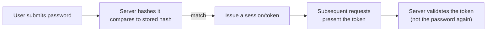

## What happens between "user types a password" and "user is logged in"?



The password itself is only ever involved once — at initial login. Everything after that runs on the token, which is why protecting the token (how it's stored client-side, whether it's sent over plain HTTP, how long it's valid, whether it can be revoked) is a genuinely separate security problem from protecting the password, with its own failure modes covered in later units (`stateless-auth`, `tls-https`).

## If a database gets stolen, what can the attacker actually do with what's stored?

That's the real question a storage decision has to answer — not "does this look secure," but "what does the attacker get if this file leaks." Three answers, from Company A's mistake to the right call:

| Storage method         | Reversible?             | Can an attacker who steals the database recover the real password?        |
| ---------------------- | ----------------------- | ------------------------------------------------------------------------- |
| Plain text             | N/A — never transformed | Yes, immediately, for every user                                          |
| Encrypted (reversible) | Yes, with the right key | Yes, if the key is also compromised (and it often is, alongside the data) |
| Hashed (one-way)       | No, by design           | No — not directly; only via guessing (covered below)                      |

Encryption is the wrong primitive here specifically because it's designed to be reversible — that's exactly what makes it right for data you need to get back (a file, a message) and wrong for a password, which the system only ever needs to _verify_, never _retrieve_. A hash is deliberately one-way: there's no key that unlocks a hash back into the original password, because none was ever needed for the system's actual job.

## Two users pick the same password. Should their stored hashes look the same?

No — and the reason why is the entire point of salting. If they did, an attacker only has to crack one hash to instantly know both passwords, and that trick scales to every user in the database who reused a common password.

```
function register(username, password):
    salt = generate_random_salt()          # unique per user, stored alongside the hash
    hashed = hash(password + salt)
    store(username, hashed, salt)

function login(username, password):
    stored_hash, salt = lookup(username)
    attempt_hash = hash(password + salt)   # re-derive using the SAME salt
    return attempt_hash == stored_hash     # constant-time comparison in practice — see L3
```

Without a salt, two users who happen to choose the same password ("password123") produce the identical hash — and a **rainbow table** (a precomputed table mapping common passwords to their hashes) cracks both instantly, along with every other user in the database using a common password, all from one precomputed lookup. With a unique salt per user, the same password produces a _different_ hash for each user, so a precomputed table has to be redone per salt — which defeats the entire economic advantage of precomputing in the first place.

## How much does "one-way" actually protect a password once the hash is stolen?

Not by itself as much as it sounds — an attacker without the original password can still try to _guess_ it, hash each guess, and compare against the stolen hash. Whether that guessing is cheap or expensive depends entirely on one design choice: how fast the hash function is to compute.

<div class="not-prose my-4 rounded-lg border border-slate-200 p-3 dark:border-slate-700">
  <p class="text-sm font-medium text-slate-700 dark:text-slate-200">
    Fast hash vs. slow key-derivation function
  </p>
  <div class="mt-2 grid grid-cols-2 gap-2 text-xs">
    <div class="rounded border border-amber-300 bg-amber-50 p-1.5 dark:border-amber-800 dark:bg-amber-950">
      <p class="font-semibold text-amber-700 dark:text-amber-400">
        Fast (e.g. raw SHA-256)
      </p>
      Billions of guesses/second on ordinary hardware
    </div>
    <div class="rounded border border-emerald-300 bg-emerald-50 p-1.5 dark:border-emerald-800 dark:bg-emerald-950">
      <p class="font-semibold text-emerald-600 dark:text-emerald-400">
        Slow (scrypt / bcrypt / Argon2)
      </p>
      Tens of guesses/second, tunable slower still
    </div>
  </div>
</div>

Try the actual numbers in "Try it" below — drag the attacker's speed down toward a slow KDF and watch the time-to-crack change by orders of magnitude, for the exact same password.

## What this unit deliberately doesn't cover yet

This is the "why" behind hashing and salting, not the "how exactly" — which specific hash function to use, how work-factor tuning defends against brute force, and key-derivation functions like bcrypt/scrypt/Argon2 in full are the subject of `security/hashing`, the next unit in sequence. This unit's job is the conceptual chain: prove once, hash don't encrypt, salt to defeat precomputation — the mechanics of _how_ to hash well build directly on top of that foundation.
