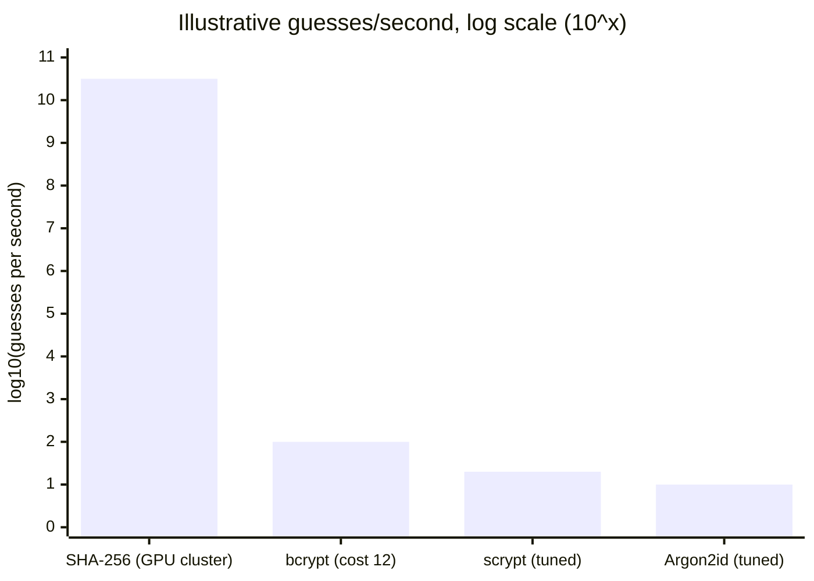

import LevelIntro from "../../../components/LevelIntro.astro";
import Checkpoint from "../../../components/Checkpoint.astro";

L2 walked through the pseudocode for salting and hashing, and named
constant-time comparison and slow key-derivation functions without
showing them in real code. L3 makes all of that concrete: a real,
runnable implementation, a real attack against its absence, and the
failure modes that turn a correct-on-paper mechanism into a real hole.

<LevelIntro
  items={[
    "A real salted-hash implementation with Node's crypto",
    "A working rainbow-table attack, salted vs. unsalted",
    "Four failure modes that silently reintroduce the vulnerability",
  ]}
/>

## A real salted hash, using Node's built-in crypto

Read the first code block as this human workflow:

| Code piece         | Human idea                                                 |
| ------------------ | ---------------------------------------------------------- |
| `randomBytes(16)`  | Make a new unpredictable salt                              |
| `scryptSync(...)`  | Run a slow password hash/KDF                               |
| `toString("hex")`  | Store the bytes as readable text                           |
| `Buffer.from(...)` | Turn stored text back into bytes for comparison            |
| `timingSafeEqual`  | Compare without leaking where the first difference appears |

```js
// auth.mjs — real, runnable salted password hashing with Node's scrypt
// (a real key-derivation function, not a raw fast hash — see the failure
// modes below for why that distinction matters).
import { scryptSync, randomBytes, timingSafeEqual } from "node:crypto";

function register(password) {
  const salt = randomBytes(16).toString("hex");
  const hash = scryptSync(password, salt, 64).toString("hex");
  return { salt, hash }; // store both — the hash alone can't be checked without its salt
}

function verifyLogin(password, storedSalt, storedHash) {
  const attemptHash = scryptSync(password, storedSalt, 64);
  const stored = Buffer.from(storedHash, "hex");
  // timingSafeEqual, not `===` — see "timing attacks" in failure modes
  return (
    attemptHash.length === stored.length && timingSafeEqual(attemptHash, stored)
  );
}

const { salt, hash } = register("correct horse battery staple");
console.log(verifyLogin("correct horse battery staple", salt, hash)); // true
console.log(verifyLogin("wrong guess", salt, hash)); // false
```

Every line here maps directly to L2's pseudocode: `register` generates a real random salt and derives a hash from password+salt; `verifyLogin` re-derives using the _stored_ salt and compares. The one addition L2 didn't cover is `timingSafeEqual` instead of a normal `===` comparison — that's a real, separate vulnerability class, explained below.

<Checkpoint question="`verifyLogin` above uses `timingSafeEqual` instead of writing `attemptHash.toString('hex') === storedHash`. If it used the plain `===` version instead, would `register` and the salting logic still be correct? What exactly would be broken, and for whom?">

Salting and hashing themselves would still be entirely correct — the
stored data and the password-cracking resistance from L2 wouldn't
change at all. What breaks is a different, narrower channel: a plain
`===` (or byte-by-byte) comparison typically stops as soon as it hits
the first mismatched byte, so a wrong guess that happens to share more
leading bytes with the real hash takes microscopically longer to reject
than one that doesn't. An attacker who can send enough login attempts
and measure response time precisely enough can use that timing
difference to reconstruct the hash one byte at a time, without ever
needing the database to leak. `timingSafeEqual` always takes the same
time regardless of where the mismatch falls, so no timing signal
escapes — the fix is about how the comparison is done, not about
salting or hashing at all.

</Checkpoint>

## A real rainbow-table-style attack, demonstrated against unsalted hashes

This is a genuine, runnable demonstration of exactly why salting matters — not a description of the attack, the actual mechanism:

```js
// rainbow-table-demo.mjs
import { createHash, randomBytes, scryptSync } from "node:crypto";

function unsaltedHash(password) {
  return createHash("sha256").update(password).digest("hex");
}

// The attacker precomputes this ONCE, entirely offline: no requests to the
// site, just work against a stolen database copy.
const commonPasswords = [
  "123456",
  "password",
  "qwerty",
  "correct horse battery staple",
];
const rainbowTable = new Map(commonPasswords.map((p) => [unsaltedHash(p), p]));

// Two different users, unsalted, both chose a common password.
const user1Hash = unsaltedHash("password");
const user2Hash = unsaltedHash("password");

console.log(user1Hash === user2Hash); // true — identical hash for identical password
console.log(rainbowTable.get(user1Hash)); // "password" — cracked instantly via lookup
console.log(rainbowTable.get(user2Hash)); // "password" — the SAME precomputed lookup cracks user 2 too

// Now with per-user salts:
const salt1 = randomBytes(16).toString("hex");
const salt2 = randomBytes(16).toString("hex");
const salted1 = scryptSync("password", salt1, 32).toString("hex");
const salted2 = scryptSync("password", salt2, 32).toString("hex");
console.log(salted1 === salted2); // false — same password, different hash, per-user salt
// The precomputed rainbow table above is now useless against either —
// it would have to be redone from scratch per salt, defeating the entire
// economic point of precomputing.
```

The `rainbowTable.get()` lookup succeeding for _both_ users from one precomputed table, unsalted, is the concrete proof of the vulnerability L2 described — and the salted version's `false` on the equality check is the concrete proof of the fix.

<Checkpoint question="In the demo, `salt1` and `salt2` are each generated fresh with `randomBytes(16)` per user. Suppose the code instead reused one hardcoded salt constant for every user, but still ran the password through `scryptSync` (a real, slow KDF) — would the `rainbowTable.get()` lookup above still fail the way the salted version does?">

Not against a rainbow table built specifically for that one hardcoded
salt. `scryptSync` being a slow KDF only raises the cost of guessing
each individual password — it doesn't create per-user uniqueness on its
own. If every user's hash is derived from the same constant salt, two
users who both chose "password" would still produce identical hashes to
each other, exactly like the unsalted case, and an attacker only needs
to precompute one table keyed to that specific salt to crack every
reused password in the database at once. The demo's `salted1 !==
salted2` result depends specifically on `salt1` and `salt2` being
different values — the KDF's slowness and the salt's uniqueness are two
separate protections, and a hardcoded salt loses the second one even
with a strong KDF still in place.

</Checkpoint>

## Failure modes

Four ways every mechanism above can be individually correct on paper and still leave a real hole — which one would you check first in a code review?



The bar heights above are exponents, not guesses — `10^2` means 100, `10^10` means 10,000,000,000, and `10.5` means roughly 3×10^10 guesses/second. That gap, not the algorithm names, is the entire reason "just hash it" isn't good enough advice.

- **Using a fast, general-purpose hash (like raw SHA-256) instead of a real key-derivation function.** `sha256(password)` is cryptographically "one-way" in the abstract sense, but it's designed to be _fast_ — which is exactly wrong for passwords, because it means an attacker can try billions of guesses per second against a stolen hash. `scrypt`/`bcrypt`/`Argon2` are deliberately slow and tunable, trading login-time cost (milliseconds, imperceptible to a real user) for attacker cost (a brute-force attempt now costs the same milliseconds, times however many guesses).
- **Comparing hashes with `===` instead of a constant-time comparison.** A normal string/byte comparison typically returns as soon as it finds the first mismatched byte — like a lock that pauses a little longer when the first part of the key is right. That comparison time leaks _how many leading bytes matched_, a real (if narrow) side channel an attacker can exploit to guess a hash byte-by-byte over many requests. `timingSafeEqual` (or an equivalent) always takes the same time regardless of where the mismatch is, closing that channel.
- **Reusing the same salt across all users ("a pepper," misapplied), or hardcoding it.** A single shared salt still defeats a _generic_ precomputed rainbow table, but it means one precomputation effort (targeting that specific salt) cracks every user in the database at once — the actual protection salting is supposed to provide requires a salt unique _per user_, generated randomly, not a single constant baked into the code.
- **Rolling a custom authentication scheme instead of using audited libraries.** Every mechanism in this unit (salting, slow hashing, constant-time comparison) is individually simple, which is exactly what makes hand-rolling the whole system tempting and risky — a single subtle mistake in any one piece (a salt that isn't actually random, a comparison that isn't actually constant-time) silently reintroduces the vulnerability the mechanism exists to prevent, and it usually isn't discovered until it's exploited.

The `register`/`verifyLogin` pair above is one worked example, not the whole territory. **What would you need to change if the same code had to handle a password reset flow** — where a second, brand-new hash has to replace the old one for a user who's currently locked out and can't supply their old password to re-derive it? (The salt for the new password can simply be freshly generated at reset time, same as at registration — reset never needs to re-derive anything from the old hash.)
