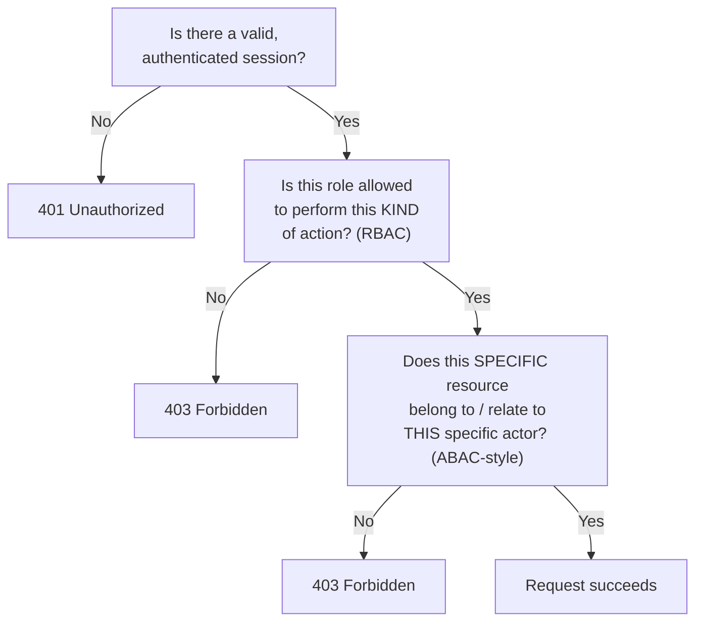
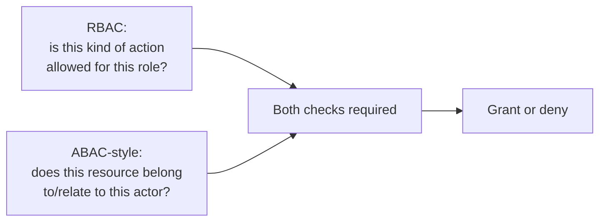

## Three questions, checked in order

**Given a request, what's the actual sequence of checks a well-designed system runs
before granting access?**



The invoice endpoint's bug lived specifically in the gap between B and C: it correctly
confirmed A (a valid session existed) and effectively treated every logged-in customer as
allowed to view _some_ invoice, but never reached C — whether _this_ invoice belonged to
_this_ customer.

Status-code shortcut: `401` means "we do not know who you are"; `403` means "we know who
you are, but you cannot do this." For the HTTP foundation, use
`/web/http-request-response-basics/`.

## RBAC: permissions attached to a role

**How does role-based access control actually decide who can do what?** A role is a named
bucket of permissions; a user is assigned one or more roles; a request is allowed if the
user's role includes the required permission:

```text
Role: billing-viewer
Permissions: [view-invoice, view-billing-history]

Role: billing-admin
Permissions: [view-invoice, view-billing-history, edit-invoice, refund-invoice]

Request: user with role "billing-viewer" wants to view-invoice → ALLOWED (role has the permission)
Request: same user wants to refund-invoice → DENIED (role lacks the permission)
```

RBAC answers **"is this kind of action allowed for this kind of user"** — a clean, simple,
auditable model for permissions that don't depend on which specific resource is involved.
It's exactly the right tool for "can billing-viewers view invoices at all" and exactly the
wrong tool for "can this billing-viewer view this particular invoice."

## ABAC: permissions computed from attributes

**What does it take to express "this specific invoice, this specific user" as a rule?**
ABAC evaluates a rule against attributes of the user, the resource, and sometimes the
context — not just a role name:

```text
Rule: ALLOW view-invoice IF user.id == invoice.ownerId
       OR user.role == "billing-admin"

Request: user id=42 requests invoice with ownerId=42 → ALLOWED (attributes match)
Request: user id=42 requests invoice with ownerId=99 → DENIED (attributes don't match)
Request: user id=7, role="billing-admin" requests invoice with ownerId=99 → ALLOWED (role clause)
```

This is the exact check the vulnerable endpoint was missing — not a role check at all, but
a comparison between an attribute of the requester (`user.id`) and an attribute of the
resource (`invoice.ownerId`). No role-only system, however carefully designed, can express
this comparison, because roles don't carry per-resource identity — a "billing-viewer" role
is the same role regardless of which specific invoice is being requested.

Context is optional in this invoice example, but it matters in other rules: "only during
work hours," "only from the company network," or "only while the account is active" are
context attributes.

## Combining both, correctly

**Does fixing the bug mean abandoning RBAC in favor of ABAC?** No — most real systems use
both together, because they answer different, complementary questions:



The fixed invoice endpoint still needs the RBAC check (only authenticated users with a
billing-capable role can call this endpoint at all) **and** the ABAC-style ownership check
(the specific invoice must belong to the specific requester, unless their role explicitly
grants broader access, like `billing-admin`). Removing either check reopens a hole; RBAC
alone reproduces the original bug, and ABAC alone (with no role gating) would require
re-deriving role-like logic inside every ownership rule.

## The generalizable lesson

**Is the invoice endpoint a one-off mistake, or does it point at a pattern worth checking
for elsewhere?** Any endpoint that takes an ID from the request (a URL parameter, a
request body field) and uses it to fetch a specific resource is a candidate for this exact
class of bug, unless an explicit ownership or relationship check runs before the data is
returned. The practical audit question: **for every endpoint that accepts a resource
identifier, is there a line of code that compares an attribute of the resource against an
attribute of the requester — or is authentication alone silently standing in for that
check?** The identifier might be in the URL, or it might be a field sent inside a form or
request body.
