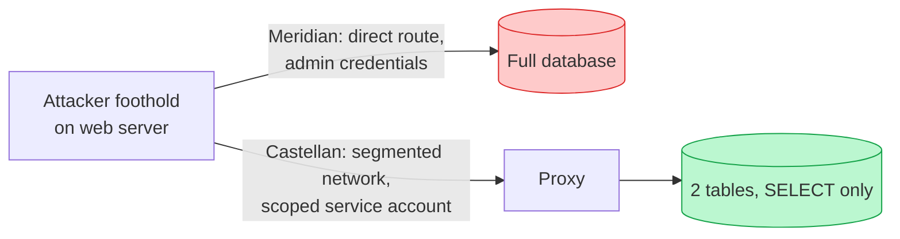

import Scenario from "../../../components/Scenario.astro";
import LevelIntro from "../../../components/LevelIntro.astro";

<Scenario label="Same 0-day, same web server, wildly different Monday morning">
  <Fragment slot="facts">
    

      

        🎯 <strong>The foothold</strong> — a 0-day in an
        image-resizing library gives the attacker code execution on the web
        server, identically, at both companies
      

      

        🏢 <strong>Meridian Retail</strong> — flat trust: web
        server holds full admin DB credentials, no network segmentation
      

      

        🏦 <strong>Castellan Retail</strong> — layered: network
        segmentation + a DB account scoped to `SELECT` on 2 tables only
      

    

    

      

        

          Meridian
        

        14M customer records exfiltrated, full DB dump
      

      

        

          Castellan
        

        2 non-sensitive tables read, no lateral movement possible
      

    

  </Fragment>

Two mid-size retailers get hit by the exact same 0-day, in the exact same
image-resizing library, on the exact same weekend. At Meridian Retail, the
attacker's foothold on the web server can reach the database directly, and
the server's own database credentials happen to be a full admin account —
because "the app needs to read and write a lot of tables, so just give it
admin, it's simpler." Fourteen million customer records are gone by Monday.
At Castellan Retail, the identical foothold on an identically-patched web
server hits a wall two steps later: the network won't route from the web
tier to the database at all except through a proxy, and the one account
that proxy uses can only `SELECT` from two non-sensitive tables. The
attacker has code execution and nowhere useful to go with it.

**Both companies got breached. Only one of them had to notify 14 million
customers. What was actually different, given that the vulnerability
itself — the 0-day — was identical?**

</Scenario>

Nothing about patching speed explains the gap — both were breached via the
same unpatched hole at the same moment. The difference was decided months
earlier, in how each company answered a question neither one was asked
directly by the vulnerability: _if this specific component gets taken
over, what can the attacker actually do next?_ Meridian never asked it.
Castellan built its whole backend around the assumption that the answer
would eventually be tested for real.

<LevelIntro
  items={[
    "Defense in depth: independent, layered controls",
    "Least privilege: scoping access to the minimum needed",
    "Zero trust: verifying every request, not just the network location",
  ]}
/>

## The shape of the problem

Every other unit in this track is about making one specific defense work
correctly — proving identity, checking a permission, hashing a password,
encrypting a channel. This unit starts from a different, harder premise:
**assume one of those defenses eventually fails anyway** — a 0-day, a
misconfigured check, a stolen credential, a malicious dependency — and ask
what stops that single failure from becoming total compromise.

| Question this unit answers                                              | Which sibling unit answers a different question                 |
| ----------------------------------------------------------------------- | --------------------------------------------------------------- |
| A component is breached — what can it reach from there?                 | `authorization-models` — is this one request allowed right now? |
| How many independent controls does an attacker have to defeat in a row? | `owasp-top-10` — what's the specific bug that let them in?      |
| Does "inside the network" mean "trusted"?                               | `authentication-fundamentals` — is this specific login real?    |

- **Defense in depth** — instead of one strong control, several independent
  weaker ones stacked in a row: network segmentation, a WAF, authentication,
  authorization, input validation, encryption at rest, monitoring. Each
  layer is designed on the assumption the layer before it has already been
  bypassed, not as a redundant copy of it.
- **Least privilege** — every component, service account, and process gets
  only the access it needs to do its specific job, nothing more. A web
  server that only ever reads two tables should hold credentials that can
  only read two tables — not a shared admin account that happens to also be
  able to do that.
- **Zero trust** — "never trust, always verify": being on the internal
  network, or behind the firewall, or called by another service inside the
  same cluster, grants no default trust. Every request is authenticated and
  authorized on its own merits, every time, regardless of where it came
  from.
- **The trade-off that makes this a design decision, not a checklist** —
  every layer, every scoping decision, and every extra verification step
  costs latency, operational complexity, and engineering time. A system
  with unlimited layers is unbuildable; a system with none is Meridian.
  The real skill is deciding where the budget for this actually goes.

## Why "it's authenticated" isn't the finish line

If authentication and authorization both worked correctly on the day of
the breach, why does this unit exist at all? Because neither one asks the
question this unit is about: _authentication_ confirms a request is really
from who it claims, and _authorization_ confirms that identity is allowed
to do the specific thing it's asking for — both are checks performed
**at the moment of a request**. Neither one bounds what happens **after**
a component has already been compromised and is no longer making honest
requests on anyone's behalf. That's a different question, asked at
design time, not request time — and it's the one flat-trust architectures
like Meridian's never get asked.

The diagram isn't showing two different vulnerabilities — it's showing the
same vulnerability landing in two architectures that made different
decisions about what a compromised component is allowed to reach. L2
builds the layered model in detail; L3 turns "scoped service account" into
a real, runnable IAM policy and a working blast-radius calculation.
