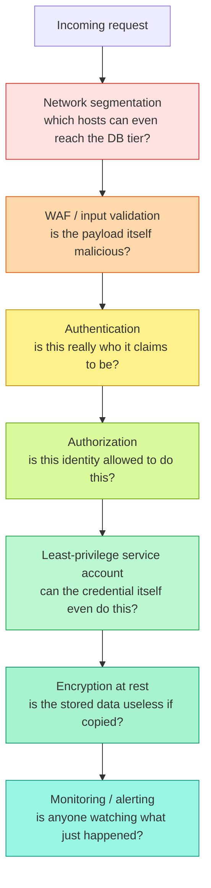
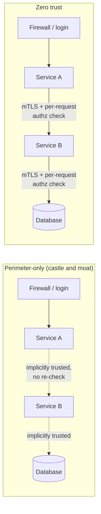

import LevelIntro from "../../../components/LevelIntro.astro";
import Checkpoint from "../../../components/Checkpoint.astro";

L1 showed the outcome — the same 0-day, wildly different blast radius.
This level builds the actual model behind Castellan's architecture: how
independent layers, minimal scope, and per-request verification combine
into a system where one failure doesn't cascade into every other one.

<LevelIntro
  items={[
    "Layers as independent, not redundant, controls",
    "Least privilege as blast-radius containment",
    "Zero trust vs. perimeter-only ('castle and moat') trust",
  ]}
/>

## What makes a set of controls "layers" instead of just "more security"?

Stacking controls only helps if each one is checking something the
others don't already cover — three copies of the same check add
friction without adding safety, since whatever defeats one defeats all
three identically. A layer earns its place by assuming the layer before
it already failed, and asking a genuinely different question at its own
checkpoint.

Each box above is answerable "no" independently of the others. A request
can pass network segmentation and still fail the WAF; it can be
correctly authenticated and still fail authorization; it can pass
authorization and still be blocked by a service account that simply
lacks the underlying permission. That last one — the layer holding even
when every check _above_ it has already been bypassed by a compromised
component acting with stolen or forged credentials — is exactly
Castellan's DB-account layer in L1: the attacker had already defeated
everything upstream of it (they had real code execution, not a forged
request), and the layer that stopped them was the one asking "can this
specific credential even do this," independent of who or what was
holding it.

<Checkpoint question="A company adds a second WAF, from a different vendor, in front of the first one — both scanning for the same categories of malicious payloads. Is this a genuine second layer, in the sense this section means?">

Not really — it's redundancy, not depth. Both WAFs are answering the
same question ("does this payload look like a known attack pattern?")
against the same class of input, so anything sophisticated enough to
evade the first vendor's detection has a real chance of evading the
second one too, since they're looking for overlapping signatures. A
genuine second layer would ask a _different_ question — least-privilege
scoping asks "can this credential even do this, regardless of what the
payload looked like," which stays effective even against an attack the
WAF never recognized as malicious at all. Two WAFs raise the cost of
getting past the first checkpoint, which has some value, but they don't
give the attacker a fundamentally different kind of problem to solve the
way a genuinely independent layer does.

</Checkpoint>

## Least privilege: why "give it admin, it's simpler" is the actual vulnerability

Meridian's web server held full admin database credentials not because
anyone wanted to be breached, but because scoping access down is real,
ongoing work — someone has to figure out exactly which tables and
operations the app actually needs, and keep that list current as the app
changes. "Just use admin" is the path of least _effort_, which is why it
keeps happening, even though it's the opposite of least _privilege_.

The question least privilege actually answers isn't "is this account
convenient" — it's **"if this exact credential is stolen or misused
right now, what's the smallest possible set of things that can go
wrong?"** That smallest possible set is the blast radius.

| Service account design                                | Tables reachable | Operations allowed               | Blast radius if stolen                  |
| ----------------------------------------------------- | ---------------- | -------------------------------- | --------------------------------------- |
| Meridian: shared admin account, "simpler to maintain" | All (47)         | SELECT/INSERT/UPDATE/DELETE/DROP | Entire database, read + write + destroy |
| Castellan: scoped read proxy account for the web tier | 2                | SELECT only                      | 2 non-sensitive tables, read-only       |

Scoping down isn't a one-time setting — it has to be re-derived as a
service's actual needs change, and it has to survive the temptation to
widen it "just for now" under deadline pressure (the same pressure that
produced the hardcoded-secret incident in `secrets-management`). L3
turns this table into a real IAM policy diff and a working calculation
of exactly how many records each design exposes.

## Zero trust: does being "inside the network" mean anything?

A perimeter-only ("castle and moat") architecture puts its serious
checks at the network edge — firewall, VPN, login page — and then treats
everything behind that edge as roughly trusted: service A can call
service B without re-proving anything, because both are "inside." Zero
trust removes that assumption entirely: **no request is trusted by
virtue of where it came from — every request, including
service-to-service calls entirely inside the same network, is
authenticated and authorized on its own merits, every time.**

Why does this matter given the layers already covered above? Because
Meridian's flat trust wasn't really "no security" — it likely had a
firewall and a login page too. What it lacked was _any_ checkpoint
_inside_ the perimeter: once the attacker's foothold on the web server
was itself "inside," nothing asked it to re-prove anything before
talking to the database. Zero trust is the design stance that treats
"inside the network" as meaningless on its own, which is precisely what
makes a single compromised component unable to freely impersonate a
trusted internal caller.

<Checkpoint question="A service-to-service call inside the same Kubernetes cluster, on a private internal IP range, still gets mutual TLS and a per-request authorization check under a zero-trust design. Isn't that redundant, since an external attacker can't even reach that private IP?">

The redundancy assumption is exactly the gap zero trust is closing. It's
true that an _external_ attacker on the public internet can't directly
address a private internal IP — but the threat this unit is built
around isn't an external attacker knocking from outside, it's a
component _already inside_ that perimeter, compromised through some
other route (a 0-day, a malicious dependency, a leaked credential). Once
that's the premise, "on the internal network" describes the attacker's
position just as accurately as it describes a legitimate service's
position — the IP range can no longer distinguish between them. mTLS
and a per-request authz check verify the _caller's identity and
permissions_ specifically, which is a property the network location
never actually established in the first place.

</Checkpoint>

Both ideas — least privilege and zero trust — describe the same
underlying discipline from two different angles: least privilege bounds
what a component _can_ do once trusted; zero trust bounds _how easily_
anything gets treated as trusted at all. L3 makes both real: a scoped
IAM/DB policy you could actually deploy, a Kubernetes `NetworkPolicy`
enforcing the segmentation from L1's diagram, a service-to-service authz
check in code, and a small blast-radius calculator that turns "how
exposed is this design" into an actual number instead of a feeling.
