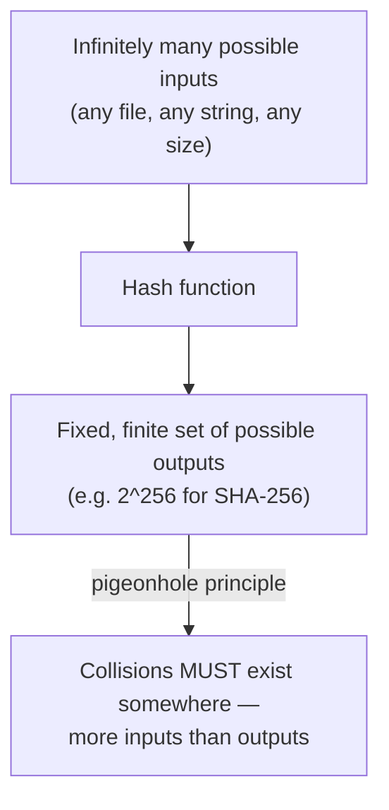

import LevelIntro from "../../../components/LevelIntro.astro";
import Checkpoint from "../../../components/Checkpoint.astro";

L1 named the properties a cryptographic hash needs and drew the line
between a fast everyday hash and a deliberately slow KDF without yet
showing why each property matters or what a KDF actually changes
internally. L2 works through both in order.

<LevelIntro
  items={[
    "The five properties a cryptographic hash must satisfy",
    "Why collisions are guaranteed to exist, and why that's still fine",
    "The two levers a KDF adds that an everyday hash doesn't need",
  ]}
/>

## What actually makes a function a cryptographic hash

**Isn't any function that shrinks data down to a fixed size a "hash"?**
Not a _cryptographic_ one — a checksum like a simple sum-of-bytes also
produces a fixed-length output, but it's trivial to find two inputs that
produce the same checksum, and trivial to construct an input that
produces a chosen checksum. A cryptographic hash function needs to hold
up under adversarial pressure, which means satisfying several properties
at once, not just "compresses the input":

A toy checksum shows the weakness. If `A = 65` and `B = 66`, then
`AB` and `BA` both add to `131`. The output is the same even though the
input order changed, so this is useful for catching accidents at best,
not for resisting someone trying to fool it.

| Property             | What it requires                                                                  |
| -------------------- | --------------------------------------------------------------------------------- |
| Deterministic        | Same input → same output, always, on any machine                                  |
| Fixed-length output  | A one-byte input and a ten-gigabyte input both produce the same-size hash         |
| Avalanche effect     | Flipping one input bit should flip roughly half the output bits, unpredictably    |
| Preimage resistance  | Given a hash, it should be infeasible to find _any_ input that produces it        |
| Collision resistance | It should be infeasible to find _two different_ inputs that produce the same hash |

Preimage means "the thing before the hash." Preimage resistance is the
property that stops someone from seeing a fingerprint and reconstructing
some matching original on purpose.

**Why does the avalanche effect matter for something like file
integrity checking, specifically?** If a hash changed only a little for
a small input change, an attacker tampering with a file could search for
a modification that keeps the hash _close_ to the original and slip a
change past a careless "looks about right" comparison. Avalanche makes
"close" meaningless — any change at all produces a completely unrelated
output, so the only useful comparison is exact equality.

<Checkpoint question="A junior engineer says: 'if a hash only satisfies deterministic output and fixed length, that's basically good enough for tamper-detection, right?' What's missing from that claim?">

No — deterministic and fixed-length alone describe a checksum, not a
cryptographic hash, and a checksum is exactly what the toy `A=65, B=66`
example above breaks: `AB` and `BA` are different inputs that produce
the identical output, so an attacker who understands the algorithm can
often construct a different input that lands on the same checksum on
purpose. Tamper-detection specifically needs the avalanche effect (so a
small change can't be disguised as "close enough") and collision
resistance (so an attacker can't deliberately engineer a different file
that hashes to the same value as the original). Determinism and
fixed-length output are necessary for a hash to be usable at all, but
they say nothing about whether it resists someone actively trying to
fool it — which is the whole reason "cryptographic" is in the name.

</Checkpoint>

## Why collisions are inevitable, and why that's still fine

Start with a small version: if 100 objects must fit into 10 boxes, at
least some objects share a box. Hashes have the same shape: many
possible inputs, fewer possible outputs. Real cryptographic hashes make
the number of boxes astronomically large, so finding a shared box on
purpose is still practically out of reach.

**If collisions are mathematically guaranteed to exist, doesn't that mean
hash functions are broken?** No — collision _resistance_ doesn't claim
collisions don't exist, only that finding one on purpose should take
computationally infeasible effort (for SHA-256, roughly 2^128
operations even accounting for the birthday paradox — a number large
enough that "infeasible" holds in practice for the foreseeable future).
A hash function is "broken" specifically when someone finds a way to
locate collisions _faster_ than that brute-force baseline, the way
MD5 and SHA-1 both eventually were.

## What a key derivation function deliberately breaks

**If speed is normally a hash function's whole point, why does
`security/authentication-fundamentals` use `scrypt` instead of plain
SHA-256 for passwords?** Because a stored password hash isn't being
checked against _legitimate_ traffic at meaningful volume — it's a
target for an attacker running billions of guesses per second against a
stolen database, entirely offline, unrestricted by any rate limit. A
fast general-purpose hash is exactly the wrong shape for that threat
model: the faster the hash, the cheaper each guess is. A key derivation
function deliberately sacrifices speed and adds a second lever an
everyday hash doesn't have:

| Lever               | What it does                                                      | Why an everyday hash doesn't need it                                                                                                                                          |
| ------------------- | ----------------------------------------------------------------- | ----------------------------------------------------------------------------------------------------------------------------------------------------------------------------- |
| Iteration/time cost | Repeats internal work thousands of times                          | File-integrity checks need speed, not slowness                                                                                                                                |
| Memory hardness     | Requires a large block of memory per attempt, not just CPU cycles | Forces attackers into expensive hardware (can't cheaply parallelize on cheap ASICs — specialized chips built to repeat one operation very fast — the way a pure-CPU hash can) |

For the password side of this threat model, connect back to
`/security/authentication-fundamentals/`: that unit explains why a
stolen database turns fast guessing into the real danger.

**Does turning up a KDF's cost parameter forever make it more secure
with no downside?** No — every legitimate login pays that same cost too.
The parameter is a genuine trade-off, tuned to be annoying for an
attacker running billions of attempts but imperceptible for one real
user running exactly one attempt — L3 measures this trade-off directly
rather than just asserting it.

<Checkpoint question="Two systems both call their password storage 'hashed.' System A uses plain SHA-256 with no salt. System B uses scrypt with a tuned cost parameter. If both databases are stolen, why does that shared word 'hashed' hide a huge difference in how much danger each system's users are actually in?">

Because "hashed" only says that a fixed-length, deterministic
fingerprint is stored instead of the plaintext password — it says
nothing about how expensive each guess is for an attacker. System A's
SHA-256 is a fast, general-purpose hash designed for the opposite job
(checking file integrity quickly), so an attacker can attempt billions
of guesses per second against the stolen database with commodity
hardware. System B's scrypt deliberately spends extra time and memory on
every single hash computation — the same billions of guesses now take
orders of magnitude longer and require far more expensive hardware to
parallelize. Both databases got "hashed," but only one of them was
hashed with the actual threat model (offline, unlimited attacker
guessing) in mind. The word describes a mechanism, not a security
guarantee.

</Checkpoint>

## The generalizable lesson

**Is "hash it" ever a complete instruction on its own?** No — "hash it"
only becomes a real design decision once paired with _which_ hash and
_why_: a fast, general-purpose hash for integrity checks and content
addressing, where speed at scale is the goal and there's no secret being
protected; a slow, memory-hard KDF specifically for anything an attacker
would want to brute-force offline, like a password. Picking the wrong
one for the situation — a KDF for checksumming a large file, or a fast
hash for a password — doesn't just underperform, it silently produces
the wrong security properties for what's actually being protected.
