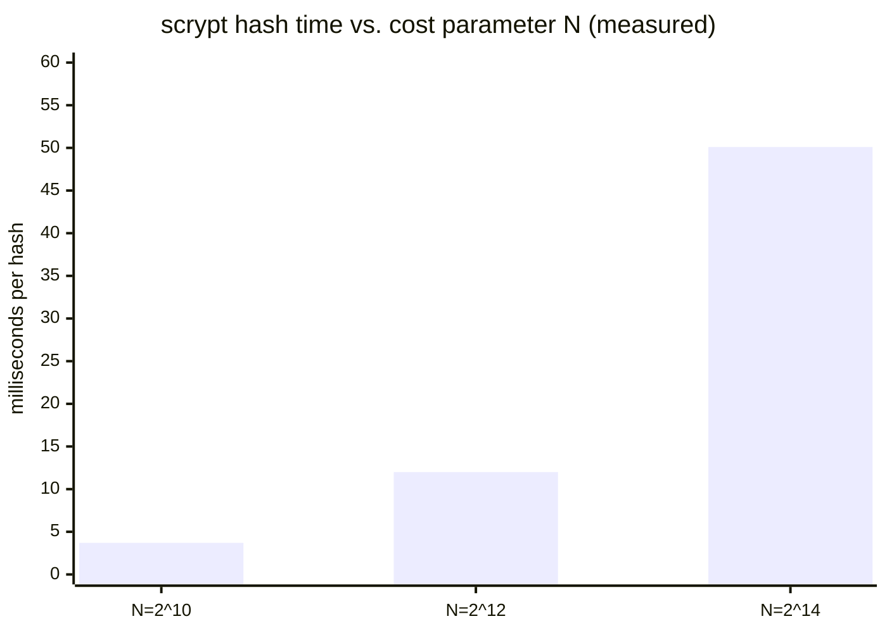

import Scenario from "../../../components/Scenario.astro";
import LevelIntro from "../../../components/LevelIntro.astro";
import Checkpoint from "../../../components/Checkpoint.astro";

<Scenario label="One character, measured in bits">
  <Fragment slot="facts">
    <div class="not-prose flex flex-col gap-2 text-sm text-slate-700 dark:text-slate-300">
      <div class="flex items-center gap-1.5"><span>🔤</span> <strong>Change made</strong> — one character, in a 44-character sentence</div>
      <div class="flex items-center gap-1.5"><span>📊</span> <strong>Bits flipped</strong> — 122 of 256, measured directly (not estimated)</div>
      <div class="flex items-center gap-1.5"><span>🎯</span> <strong>Ideal</strong> — a perfectly random-looking output would flip ~50% (128 of 256)</div>
    </div>
  </Fragment>

L2 claimed the avalanche effect scrambles a hash's output completely for
even a tiny input change. **Is that actually true, or just a
qualitative-sounding claim — and if it's true, how close to "completely
random" does one flipped character actually get, measured in real bits?**

</Scenario>

<LevelIntro
  items={[
    "The avalanche effect measured in real bits, not just described",
    "A real collision search against a deliberately weak hash",
    "Measuring a KDF's login-latency-vs-attacker-cost trade-off directly",
  ]}
/>

## The avalanche effect, measured, not just described

`hex` is a compact way to write long bit strings. The code counts how
many output bits changed by using XOR: XOR marks a `1` wherever two bits
are different, then the loop counts those `1`s. That count is the
Hamming distance: "how many bit positions changed?"

```js
// avalanche-demo.mjs
import { createHash } from "node:crypto";

function sha256hex(input) {
  return createHash("sha256").update(input).digest("hex");
}

function hammingDistanceBits(hexA, hexB) {
  const a = BigInt("0x" + hexA);
  const b = BigInt("0x" + hexB);
  let x = a ^ b;
  let count = 0;
  while (x > 0n) {
    count += Number(x & 1n);
    x >>= 1n;
  }
  return count;
}

const h1 = sha256hex("The quick brown fox jumps over the lazy dog");
const h2 = sha256hex("The quick brown fox jumps over the lazy dof"); // one char changed: g -> f

console.log(h1);
// d7a8fbb307d7809469ca9abcb0082e4f8d5651e46d3cdb762d02d0bf37c9e592
console.log(h2);
// a1cbac0e93075ab66ad59ff54c32c8abcaeb533f0568e109281ed57eb5196855

const dist = hammingDistanceBits(h1, h2);
console.log(dist, "of 256 bits differ"); // 122 of 256 bits differ (~47.7%)
```

Changing exactly one character in a 44-character sentence flips 122 of
256 output bits — close to the theoretical ideal of 50% that a perfectly
random-looking output would produce, and nowhere near "shift the hash a
little." This is what "close doesn't exist" actually looks like measured,
not just claimed.

<Checkpoint question="If an attacker tampered with a downloaded file and only managed to change one byte deep inside it, could they get away with a hash that's 'close' to the published one, hoping a careless comparison would treat it as good enough?">

No — the measured result above is exactly why not. A single flipped
character produced a hash that differs in 122 of 256 bits, nearly half
the entire output, not a hash that's off by a byte or two at the end.
There is no such thing as a "mostly matching" cryptographic hash: the
avalanche effect guarantees that any tampering at all — one byte, one
bit — scrambles the fingerprint into something with no visible
relationship to the original. The only meaningful comparison is exact
equality; a defender doing a "looks close enough" check was never a real
risk to begin with, because "close" simply doesn't exist in the output
space.

</Checkpoint>

## A real collision, found by brute force — against a deliberately weak hash

Finding a SHA-256 collision by brute force is infeasible to demonstrate
(the whole point of L2's collision-resistance property). But the
_mechanism_ of a collision search is easy to demonstrate directly against
a deliberately weak, tiny-output hash built for this purpose only —
**never use anything like this in real code**:

```js
// toy-collision-demo.mjs — NOT a real hash function, demo only
function toyHash8bit(input) {
  let sum = 0;
  for (const ch of input) sum = (sum + ch.charCodeAt(0)) % 256;
  return sum; // only 256 possible outputs — deliberately tiny
}

const seen = new Map();
let attempts = 0;
let collision = null;

for (let i = 0; i < 100000 && !collision; i++) {
  const candidate = "msg" + i;
  const h = toyHash8bit(candidate);
  attempts++;
  if (seen.has(h)) {
    collision = { first: seen.get(h), second: candidate, sharedHash: h };
  } else {
    seen.set(h, candidate);
  }
}

console.log(attempts, collision);
// 21 { first: 'msg11', second: 'msg20', sharedHash: 169 }
```

A collision shows up after only **21 attempts** against a hash with just
256 possible outputs — far fewer than the 256 attempts a naive intuition
might expect, because of the birthday paradox: with `k` possible
outputs, a collision becomes likely after roughly `1.25 * sqrt(k)`
attempts (here, `1.25 * sqrt(256) ≈ 20`), not after `k` attempts. The
square root is the plain-language clue: collisions become likely much
earlier than "try every output." This is
exactly why real hash functions need enormous output spaces — SHA-256's
2^256 possible outputs still only need roughly 2^128 attempts before a
collision becomes likely, but 2^128 is large enough to be genuinely
infeasible, unlike this toy's 256.

<Checkpoint question="A teammate proposes truncating SHA-256's output to 64 bits to save storage space in a system that fingerprints millions of uploaded files for duplicate detection. Using the birthday-paradox math from the toy collision demo, what's wrong with that plan?">

The toy hash's 256 possible outputs needed only about `1.25 * sqrt(256)
≈ 20` attempts before a collision became likely — not the naive-sounding 256. That same square-root relationship applies to any output size:
truncating to 64 bits leaves about 2^64 possible outputs, so a collision
becomes likely after roughly `sqrt(2^64) = 2^32` — about four billion —
inputs, not after 2^64 of them. Four billion fingerprints is a real,
reachable number for a system already hashing millions of files, so two
genuinely different files could end up sharing a truncated hash by
accident, not even by attack, silently corrupting duplicate detection.
The fix is keeping the full output size (or truncating far less
aggressively) specifically because the birthday paradox halves the
effective exponent of security you get to keep.

</Checkpoint>

## Measuring a KDF's cost trade-off directly

L2 claimed that a KDF's cost parameter trades login latency against
attacker cost. Here's that trade-off actually measured, using `scrypt`'s
`N` parameter (the memory/CPU cost factor, required to be a power of 2):

The key comparison: a real user pays this cost once per login; an
attacker pays it once for every guessed password.

```js
// kdf-cost-demo.mjs
import { scryptSync } from "node:crypto";

for (const costLog of [10, 12, 14]) {
  const N = 2 ** costLog;
  const start = performance.now();
  scryptSync("correct horse battery staple", "somesalt", 64, { N, r: 8, p: 1 });
  const elapsed = performance.now() - start;
  console.log(`N=2^${costLog}: ${elapsed.toFixed(1)}ms`);
}
// N=2^10: 3.7ms
// N=2^12: 12.0ms
// N=2^14: 50.1ms
```



Increasing `costLog` by 2 (2^10 → 2^12) roughly tripled the time; the next
step (2^12 → 2^14) was again roughly 4x. Every one of those milliseconds
is invisible to a real user logging in once — but an attacker attempting
a billion guesses against a stolen hash pays that same per-guess cost a
billion times over. Going from `N=2^10` to `N=2^14` turns a brute-force
campaign that might have taken hours into one that takes days, for a
login-time cost still well under a tenth of a second.

## Extend it: what changes if the same account needs to survive a legitimate hardware upgrade?

**Everything above tunes `N` once, at registration time. What happens
years later, when faster hardware makes the original `N` too weak, but
millions of existing users already have hashes stored at the old cost?**
Re-hashing every stored credential at once isn't possible — the system
never has the plaintext password again after registration. The real
fix is storing the cost parameter alongside each hash (not assuming one
fixed value system-wide) and re-hashing a user's password at their next
successful login, transparently, using the plaintext the login flow
already has at that exact moment. Accounts that log in often migrate to
the new cost quickly; accounts that never log in again stay at the old
cost, but they were never receiving new protection either way.

## Failure modes

| Failure mode                                                                   | What it gets wrong                                                                                                                              |
| ------------------------------------------------------------------------------ | ----------------------------------------------------------------------------------------------------------------------------------------------- |
| Assuming "hashed" alone tells you anything about security properties           | A fast, general-purpose hash and a slow KDF are both "hashed" but suit opposite threat models                                                   |
| Treating collision resistance as "collisions can't happen"                     | Collisions always exist (pigeonhole principle) — resistance means finding one on purpose is infeasible, not impossible                          |
| Picking a KDF cost parameter once and never revisiting it                      | Hardware gets faster every year; a cost tuned for today's attackers weakens on its own as time passes                                           |
| Using a weak, small-output hash anywhere collision resistance actually matters | The birthday-paradox math in this unit's toy demo (21 attempts, not 256) applies to any hash with too small an output space                     |
| Confusing an everyday hash's speed with a security weakness in every context   | Speed is exactly right for file integrity and content addressing — it's only wrong specifically for secrets an attacker can brute-force offline |
