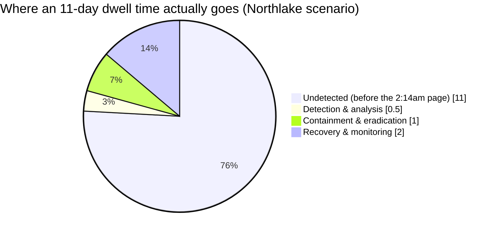

import Scenario from "../../../components/Scenario.astro";
import LevelIntro from "../../../components/LevelIntro.astro";

<Scenario label="2:14am — one decision, made alone, before anyone else even knows there's a breach">
  <Fragment slot="facts">
    

      

        📟 <strong>2:14am page</strong> — Dana (on-call SRE) sees
        a database read-replica pulling unusually large batches overnight
      

      

        🕵️ <strong>What she finds</strong> — an admin service
        account has been quietly exfiltrating records in small nightly
        batches for <strong>11 days</strong>
      

      

        ⚖️ <strong>The fork</strong> — kill the session now
        (stops the bleeding, may tip off the attacker or wipe evidence) vs.
        watch silently first (preserves proof, lets exfiltration continue)
      

    

    

      

        

          Kill it now
        

        Attacker sees the disconnect instantly, may destroy logs or trigger a
        wiper — full scope may never be known
      

      

        

          Watch first
        

        Clean forensic picture, but every extra hour is more records out the
        door — and a 72-hour regulatory clock she doesn't know has started
        yet
      

    

  </Fragment>

Dana is the only person awake. There is no incident commander on the call
yet, no legal team, no prepared statement — just her, a terminal, and a
service account pulling customer records at 2am in batches too small to
have tripped any alert until tonight. She has, at most, a few minutes to
decide something no one trained her to decide alone: cut the session and
stop the bleeding right now, or leave it running long enough to capture
what the attacker is actually doing, who they are, and how they got in.

**Whatever Dana does in the next five minutes — before her manager is
awake, before legal knows a breach might exist, before anyone has decided
whether to tell a single customer — already has legal, forensic, and
financial consequences that can't be undone.** How is one person on a 2am
page supposed to get that right?

</Scenario>

Every other unit in this track is about keeping this moment from
happening. This one starts from the assumption that it just did — the
defenses already failed, someone is already inside, and the question
is no longer "how do we prevent this" but **"what do we do in the next
five minutes, the next five hours, and the next five weeks, and who
gets told what, and when."**

<LevelIntro
  items={[
    "The incident response lifecycle: detection through post-incident review",
    "The containment trade-off — isolate now vs. preserve evidence",
    "Disclosure obligations and the blameless security post-mortem",
  ]}
/>

## The shape of the problem

This unit sits downstream of every other unit in `security/` — it doesn't
prevent or find a vulnerability, it governs what happens once one has
already been exploited for real.

| Question this unit answers                                                         | Which sibling unit answers a different question                                    |
| ---------------------------------------------------------------------------------- | ---------------------------------------------------------------------------------- |
| An attacker is confirmed active right now — what do we do in what order?           | `defense-depth` — how do we limit what a breach can reach, before it happens       |
| Do we isolate the compromised system, or watch it to gather evidence?              | `security-testing` — how do we find this kind of hole before it's exploited        |
| Who legally has to be told, and within what deadline?                              | `owasp-top-10` — what specific bug class let the attacker in                       |
| How do we review the incident without making people afraid to report the next one? | `secrets-management` — how do we stop a credential from leaking in the first place |

- **Incident response lifecycle** — a well-worn sequence (this unit uses
  the NIST SP 800-61 phases as the reference model, since it's the one most
  real IR playbooks and certifications are built on): **Preparation** (before
  anything happens — runbooks, contacts, logging in place), **Detection &
  Analysis** (confirming something real is happening and scoping it),
  **Containment** (stopping it from getting worse — split into short-term
  and long-term), **Eradication** (removing the attacker's actual foothold,
  not just the symptom), **Recovery** (returning to normal operation, with
  monitoring turned up), and **Post-Incident Activity** (the blameless
  review that turns the incident into a permanent improvement).
- **The containment trade-off** — isolating a compromised system
  immediately protects everyone else, but volatile evidence (memory,
  active network connections, exactly what the attacker was mid-doing)
  can vanish the instant power or network access is cut. Preserving that
  evidence buys a clean forensic picture but lets the attacker keep
  acting. You often cannot fully do both.
- **Chain of custody** — once something might end up in a legal or
  regulatory proceeding, how evidence is collected, hashed, and handled
  matters as much as what it contains; a log nobody can prove wasn't
  tampered with is much weaker evidence.
- **Disclosure obligations** — breach notification laws (GDPR's 72-hour
  window to a regulator is the best-known concrete example) run on a
  legal clock that starts at the moment of _awareness_, not the moment
  the breach began — and that clock runs in parallel with, not after,
  containment and eradication.
- **The blameless security post-mortem** — security incidents disproportionately
  involve a human decision made under real pressure (a clicked link, a
  broadened permission, a skipped step). A post-mortem culture that
  punishes the person who reports "I think I clicked something bad"
  guarantees the next person won't report it until it's much worse.

## Key terms

- **Dwell time** — how long an attacker has active, undetected access
  before containment. The single biggest lever on how much damage gets
  done; this unit's own scenario runs on an 11-day dwell time.
- **IoC (indicator of compromise)** — a concrete, observable artifact
  (an IP, a file hash, an anomalous login pattern) that signals an
  intrusion, as opposed to a vague "something feels off."
- **Blast radius** — everything the confirmed compromise could plausibly
  have touched, not just what's been proven touched — scoping starts
  wide and narrows as evidence comes in, never the reverse.
- **Material breach** — a breach significant enough (by scale, sensitivity
  of data, or regulatory definition) to trigger a legal disclosure
  obligation; not every incident clears this bar, but assuming one
  doesn't without checking is how deadlines get missed.

The overwhelming majority of the timeline in a real breach isn't the
dramatic part — it's the attacker sitting quietly, undetected, for far
longer than the response itself takes once someone finally notices.
