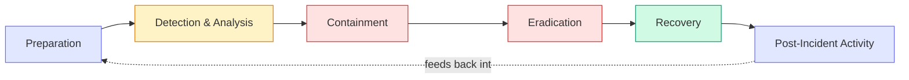
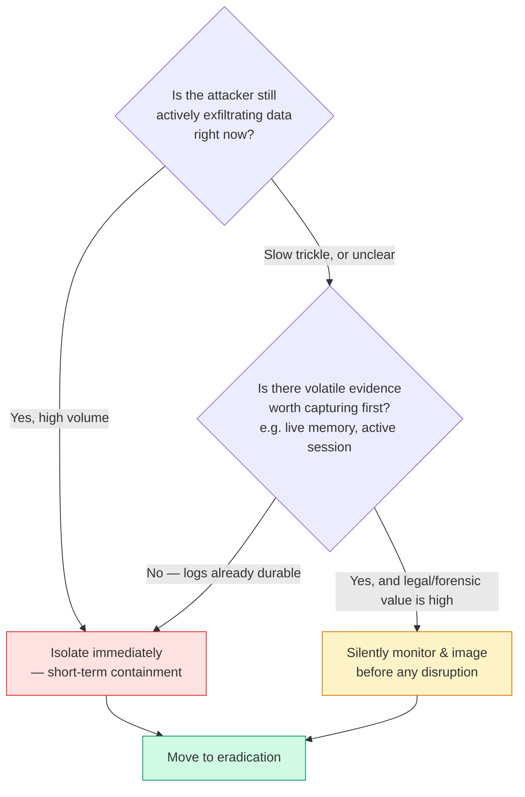

import LevelIntro from "../../../components/LevelIntro.astro";
import Checkpoint from "../../../components/Checkpoint.astro";

L1 left Dana at 2:14am with an active session she could kill or watch.
That single decision is one branch of a larger, repeatable structure —
this level builds the whole lifecycle that decision sits inside, and the
disclosure clock that starts running the moment she's sure it's real.

<LevelIntro
  items={[
    "The six-phase incident response lifecycle",
    "The containment decision tree — isolate vs. preserve",
    "Three audiences, three clocks: internal, regulatory, customer",
  ]}
/>

## What happens, in what order?

An incident isn't one decision, it's a sequence — and skipping a phase
(jumping straight to "clean it up" before anyone has scoped what "it"
even is) is one of the most common ways a response makes things worse.

- **Preparation** happens before any of this — runbooks, an on-call
  rotation with actual decision authority, logging that's already
  turned on (you cannot forensically reconstruct a log you didn't keep).
  Dana's 2:14am page only produced a usable timeline because auth logs
  were already being retained; without that, phase two starts blind.
- **Detection & Analysis** is where Dana actually is at 2:14am: is this
  real, and if so, how big? Under-scoping here (assuming "just this one
  service account" when the attacker actually pivoted further) is a
  common failure — analysis should widen the suspected blast radius
  until evidence narrows it back down, never the reverse.
- **Containment, Eradication, Recovery** are covered in the next two
  sections — containment stops the bleeding, eradication removes the
  actual foothold (not just the symptom that got noticed), recovery
  brings systems back with monitoring turned up, watching specifically
  for the attacker trying to come back the same way.
- **Post-Incident Activity** feeds back into Preparation — the blameless
  review (covered later this level) is what turns "we survived this"
  into "the next one starts from a stronger position."

## The containment trade-off, made concrete

Dana's 2:14am fork wasn't a coin flip — it's a real, recurring decision
with a defensible answer that depends on what's actually at stake.

Northlake's real answer: the exfiltration was a slow, low-volume nightly
trickle (not an active dump in progress), and the session's own request
logs already durably captured what it had touched — so the on-call
runbook called for **short-term containment**: revoke the service
account's credentials and drop its network access immediately, accepting
that a live memory image of the attacker's tooling was lost, because the
marginal forensic value of watching one more night didn't outweigh
another night of confirmed data leaving. A different scenario — an
active, fast, unbounded dump with no durable request log — would have
flipped that answer toward preserving the session briefly to capture
what was actually happening before cutting it off.

<Checkpoint question="A separate incident: an attacker has a foothold on a build server but hasn't touched any customer data yet, and every action they've taken is already captured in a tamper-evident audit log. Does the containment decision tree above point toward isolating immediately, or preserving the session a while longer?">

Isolate immediately. The decision tree's branch for "watch a while longer"
exists specifically to capture volatile evidence that would otherwise be
lost — and here there isn't any: the audit log is already durable and
tamper-evident, so nothing is gained by leaving the attacker connected.
Meanwhile every additional minute of foothold is additional risk (lateral
movement toward something more sensitive than the build server), with no
offsetting forensic benefit. The trade-off only favors waiting when
evidence would genuinely be lost by cutting the connection — not by
default.

</Checkpoint>

## Three audiences, three clocks

The moment Dana's team confirms this is a real, material breach, three
different clocks start running at once, each answering to a different
audience with a different tolerance for delay.

| Audience              | What they need to hear                                                                                    | Typical timing pressure                                                                                        |
| --------------------- | --------------------------------------------------------------------------------------------------------- | -------------------------------------------------------------------------------------------------------------- |
| Internal (exec/legal) | Full technical detail, scope, and uncertainty — including what's _not_ known yet                          | Immediately, as soon as detection confirms something real — this is the first call                             |
| Regulator             | Facts sufficient to meet a legal disclosure standard, even if the investigation is ongoing                | A fixed legal deadline (GDPR: 72 hours from awareness to notify the relevant supervisory authority)            |
| Customers / public    | What happened, what data of theirs was involved, what they should do — no unresolved internal uncertainty | "Without undue delay" once individual risk is confirmed — later than the regulator, but not indefinitely later |

This is the same underlying discipline as `business-communication/audience-awareness`
— the same facts land differently depending on who's hearing them and
what they're going to do with the information — but under incident
response it's sharpened by hard deadlines and real legal exposure: telling
customers too early, before the scope is confirmed, can be as damaging as
telling them too late. **A material fact isn't "ready to disclose" just
because someone knows it — it has to be confirmed enough that disclosing
it won't have to be walked back**, and confirming it takes real time that
the regulatory clock doesn't pause for.

<Checkpoint question="GDPR's 72-hour clock starts at 'awareness' of the breach, not at the moment the breach began. Northlake's compromise started 11 days before Dana's page. When does their 72-hour window actually start?">

At the moment Northlake's team becomes aware a breach has (likely)
occurred and confirms it — realistically, once detection & analysis has
enough signal to call it real, not from 11 days earlier when the
attacker first got in. This is precisely why the 2:14am decision matters
so much: the 72-hour clock hasn't started yet at 2:14am if the team is
still confirming whether this is real, but it starts the moment that
confirmation lands — which means every hour spent in ambiguous analysis
is an hour not yet on the clock, but also an hour the team can't recover
once the clock does start.

</Checkpoint>

## The blameless security post-mortem

A routine engineering post-mortem asks "what broke and how do we stop it
recurring." A security post-mortem asks the same question about an
incident that almost always includes a human decision made under real,
adversarial pressure — someone clicked a link, approved an access
request, or left a service account broader than it needed to be — and
that difference changes how the review has to be run.

- **Blameless means the write-up names decisions and system gaps, not
  people's character.** "The build pipeline could execute a `postinstall`
  script with no review gate" is reviewable and fixable; "Dana should have
  been more careful" is neither — it's also the exact sentence that makes
  the next on-call engineer hesitate before reporting something
  ambiguous at 2am.
- **This matters more here than in most post-mortems, not less** —
  because the attacker is actively exploiting the gap between "what
  people are supposed to do" and "what people, under pressure, actually
  do." A blame culture doesn't stop that gap from existing; it just stops
  anyone from admitting it exists until an attacker finds it first.
- **Chain of custody discipline has to coexist with blamelessness.** The
  factual timeline (who did what, when, from where) still has to be
  precise and defensible — sometimes for legal reasons — but precision
  about facts and blame about a person are two different things, and
  conflating them is how teams end up either omitting facts to protect
  someone, or attacking someone under cover of "just stating what
  happened."

L3 works through a full worked post-mortem for Northlake's incident —
timeline, root cause, action items — written the blameless way.
