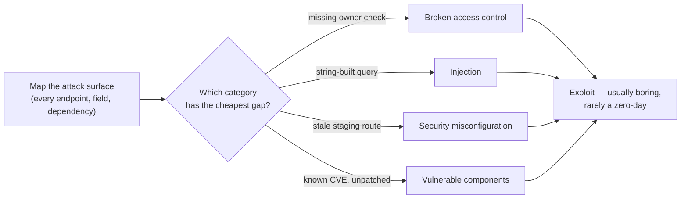

import LevelIntro from "../../../components/LevelIntro.astro";
import Checkpoint from "../../../components/Checkpoint.astro";

L1 named ten categories and the two that the Scenario's company had covered
(crypto, TLS, session tokens) without yet showing how they relate to each
other or how an attacker actually chooses which one to go after. L2 works
through both.

<LevelIntro
  items={[
    "How the ten categories relate to what this track covers elsewhere",
    "Why an attacker targets the cheapest gap, not the strongest lock",
    "Common failure modes in how teams reason about 'secure'",
  ]}
/>

## Why a "top 10" instead of a single definition of "secure"

**If a system has strong crypto, strong auth, and TLS everywhere, is
it secure?** Not necessarily — those cover exactly three of the ten
categories below. A system can max out all three and still be
breached through any of the other seven:

| #   | Category                                   | What it actually means                                                                            | Covered elsewhere in this track                                                |
| --- | ------------------------------------------ | ------------------------------------------------------------------------------------------------- | ------------------------------------------------------------------------------ |
| 1   | Broken access control                      | Right identity, wrong permission check (or none)                                                  | Related to `/security/authorization-models/`, but IDOR is this unit's L3 focus |
| 2   | Cryptographic failures                     | Sensitive data exposed because it wasn't encrypted, or was encrypted badly                        | `/security/hashing/`, `/security/symmetric-asymmetric-encryption-basics/`      |
| 3   | Injection                                  | Untrusted input executed as code by a downstream interpreter                                      | New in this unit — L3 focus                                                    |
| 4   | Insecure design                            | The flaw is in the requirements/architecture, not a single line of code                           | Touched by `secure-by-design` (later unit)                                     |
| 5   | Security misconfiguration                  | Insecure by default setup, not by broken logic                                                    | New in this unit                                                               |
| 6   | Vulnerable and outdated components         | A dependency has a known, unpatched CVE                                                           | Related to `supply-chain-security` (later unit)                                |
| 7   | Identification and authentication failures | Login, session, or credential-recovery logic has a gap                                            | `/security/authentication-fundamentals/`                                       |
| 8   | Software and data integrity failures       | Code or data trusted without verifying where it came from                                         | Related to `supply-chain-security` (later unit)                                |
| 9   | Security logging and monitoring failures   | A breach happens and nobody notices for months, because nothing was logged or watched             | Related to `incident-response` (later unit)                                    |
| 10  | Server-side request forgery (SSRF)         | The server itself is tricked into making a request to somewhere the attacker can't reach directly | New in this unit — L3 focus                                                    |

**Is this list saying the other units in this track don't matter?**
No — getting authentication, hashing, and TLS right closes off three
real categories of attack. The point is that closing three doesn't
close the other seven, and treating "we did auth and crypto" as
"we're secure" is exactly the mistake the Scenario's company made.

<Checkpoint question="A team spends a whole quarter migrating to a stronger encryption algorithm, then gets breached anyway through a leftover staging endpoint with no auth check. Did strengthening the cryptography category do something wrong, or was the actual gap somewhere else on this list?">

Strengthening the cryptography wasn't wrong — it genuinely closed the
cryptographic-failures category. It just didn't touch the category that
was actually weak: security misconfiguration (the stale staging endpoint)
combined with broken access control (no check on who could call it). The
table above shows why this is possible at all — the ten categories are
independent axes, so being strong on one tells you nothing about the
other nine. The mistake isn't the crypto work itself; it's treating
progress on one category as if it were progress on "security" as a
whole.

</Checkpoint>

## How an attacker actually picks a target

**Does an attacker start with the system's strongest defense and try
to break it?** No — that's the least efficient path, and attackers
are economically motivated: they look for whichever category on this
list has the cheapest exploit, not the most impressive one.

Read that as a concrete walk, not as a vague "hack the app" cloud:
first the attacker lists places the app accepts input, then tries cheap
assumptions one by one. Can I change an invoice id? Can I put strange
text in a search box? Is there an old staging route still online? Is a
dependency version tied to a known public flaw, a CVE? A **zero-day**
is a previously unknown flaw; most incidents do not need one.

**Why does this matter for how a team prioritizes security work?**
If the real attack process is "find the cheapest gap across ten
categories," then investing everything into hardening one category
(say, crypto) while leaving another (say, access control) unchecked
doesn't reduce risk proportionally — it just means the breach comes
through whichever category was left weakest, which is exactly what
happened in the Scenario.

<Checkpoint question="If an attacker's actual process is 'find whichever category has the cheapest gap,' what does that imply about hardening one category twice as hard versus making sure all ten have at least a baseline of coverage?">

It implies diminishing, even near-zero, returns on hardening a category
that's already strong, compared to closing a category that currently has
no coverage at all. An attacker who can't find a cheap gap in crypto
simply moves down the list to whichever category is weakest — doubling
down on an already-strong category doesn't remove that next-weakest
option, it just makes the attacker's first choice slightly harder while
leaving every other door exactly as open as before. A baseline pass
across all ten categories closes more real attack paths than making one
category excellent.

</Checkpoint>

## Failure modes at this level

- **Treating "secure" as a single yes/no property.** A system is
  secure against specific categories of attack, to varying degrees —
  not secure in the abstract. "We did a security review" means
  little without knowing which categories it covered.
- **Assuming exotic attacks are the main risk.** Real breaches are
  overwhelmingly boring: a missing ownership check, a leftover debug
  route, a dependency nobody updated — not a novel cryptographic
  break.
- **Fixing the category that's easiest to demo, not the one that's
  actually weakest.** Teams sometimes over-invest in visible controls
  (a security banner, a compliance certificate) while an unglamorous
  category like access control or misconfiguration stays untested.
