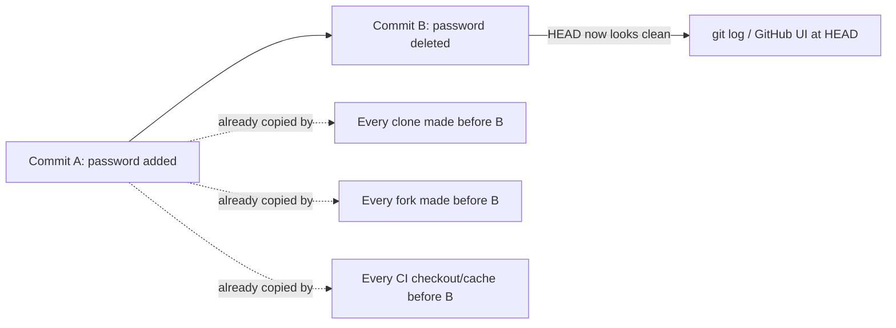
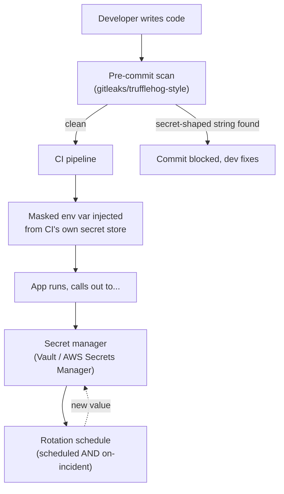

import LevelIntro from "../../../components/LevelIntro.astro";
import Checkpoint from "../../../components/Checkpoint.astro";

L1 named the five places secrets leak and the four-step remediation stack.
L2 goes one level deeper on both: exactly _why_ each leak mechanism keeps a
secret alive even after the obvious fix, and how the four remediation
ideas fit together as one architecture rather than four independent
tools.

<LevelIntro
  items={[
    "Why git history outlives a 'fix' commit",
    "How the remediation stack fits together end to end",
    "Least-privilege scoping: why one secret per purpose",
  ]}
/>

## Why does removing a line of code not remove the secret?

Git is a history of _changes_, not a single mutable file — `commit B`
doesn't overwrite `commit A`, it adds a new state on top of it. `git log
-p` (or GitHub's "history" view) can still show commit A's diff in full,
including the secret, forever — unless the repository's history is
actively rewritten (a separate, disruptive operation covered in L3), and
even then, every clone made _before_ the rewrite still has the original
history sitting on disk somewhere.

This is exactly why Mira's minute-50 "fix" in L1 didn't end anything: the
scanning bot, and anyone else who cloned the repo between minute 0 and
minute 50, already has commit A. Deleting a line is a change going
forward; it says nothing about what already went out.

<Checkpoint question="A teammate proposes: 'Let's just force-push a rewritten history that removes the secret from every commit, then delete the branch protection and move on.' Does rewriting history actually end the exposure, on its own?">

Not on its own. Rewriting history removes the secret from _this_
repository going forward, but it doesn't reach into the disk of anyone
who already cloned, forked, or had a CI runner cache the old history
before the rewrite — those copies still contain the original secret,
completely unaffected by a force-push somewhere else. History rewriting
is good hygiene for the canonical repo, but it's not a substitute for
rotation: the only thing that actually invalidates a leaked value is
changing the value itself at the system that accepts it (the database,
the API provider).

</Checkpoint>

## The other four leak mechanisms, briefly

The same "the value already left the building" logic applies to the
other four vectors from L1, just via a different door:

| Mechanism      | What "removing" it later fails to undo                                                                       |
| -------------- | ------------------------------------------------------------------------------------------------------------ |
| CI logs        | Log retention often runs 30–90+ days; anyone with log-viewer access during that window already saw the value |
| Error trackers | The event was already ingested and stored by a third-party service the moment the crash happened             |
| Client bundles | Every browser that already loaded the page has the value cached locally, indefinitely                        |
| Docker layers  | Anyone who already pulled the image has every layer, including ones "overwritten" by a later layer           |

## The remediation architecture, as a pipeline

L1 listed four ideas — inject, manage, rotate, scan — as a stack. They're
actually a pipeline that runs continuously, not four separate boxes to
check once:

- **Inject, don't embed.** The application source code never contains the literal secret value — it contains a _reference_ (an environment variable name, a secret manager path) that gets resolved at deploy or runtime.
- **A secret manager centralizes what a scattered pile of `.env` files can't**: who fetched which secret and when (an audit trail), one place to revoke access, and — critically — one place to change a value that every consumer picks up without a code change or redeploy.
- **Rotation closes the exposure window.** Scheduled rotation (e.g. every 90 days) limits how long _any_ leak, caught or not, stays useful. On-incident rotation (the moment a leak is suspected) is the actual fix once something has already gone out — not a nice-to-have on top of the other three, the step the other three exist to make fast and low-friction.
- **Scanning is the only step that runs _before_ a leak happens** rather than reacting to one — everything else in the pipeline assumes a secret already exists somewhere; scanning is the chance to catch it before it's committed at all.

<Checkpoint question="Kelvin Metrics adopts a secret manager and env-var injection for all new services. An old service, written before the migration, still has a database password hardcoded in its source — but that service has had zero pre-commit scanning ever run against it. Is it protected by the new secret-manager rollout?">

No. Adopting a secret manager for _new_ code doesn't retroactively find
or remove secrets that are already sitting in old source, and without
scanning having ever run against that repository's history, nobody has
verified whether one is there. The architecture only protects what
actually flows through it — a secret hardcoded before the migration, in
a repo the pipeline never touches, is exactly as exposed as it was
before, and rotation/scanning need to be run retroactively against
existing repos, not just wired into the pipeline going forward.

</Checkpoint>

## Least-privilege scoping: why not one shared secret for everything?

The blast radius of a leak is bounded by what that one secret can do —
which means the design choice that matters most isn't just "is it in a
secret manager," it's "how much can this one credential reach."

| Scoping choice                                                           | Blast radius if this one secret leaks                     |
| ------------------------------------------------------------------------ | --------------------------------------------------------- |
| One admin DB credential shared by every service                          | Every table, every service, full read/write               |
| One credential per service, scoped to that service's own tables          | Only that service's data                                  |
| One credential per service _per environment_ (staging vs. prod separate) | A leaked staging credential can't touch production at all |

A secret manager makes this practical rather than merely theoretical —
minting and rotating twelve narrow credentials by hand is a maintenance
burden no team keeps up with; minting and rotating them through a system
built for it is routine. Least-privilege scoping and a secret manager are
the same underlying idea (limit what one leak can reach) applied at two
different layers: _how many things can read this secret_ and _how much
can this secret itself do_.

## What L3 adds

L2 has been the architecture; L3 makes every piece of it real and
runnable — an actual env-loading pattern with fail-fast validation, a
real regex-based scanner, real secret-manager SDK calls, a real CI
pipeline snippet with masked injection, and the full incident walked
through as Kelvin Metrics's actual response, step by step.
