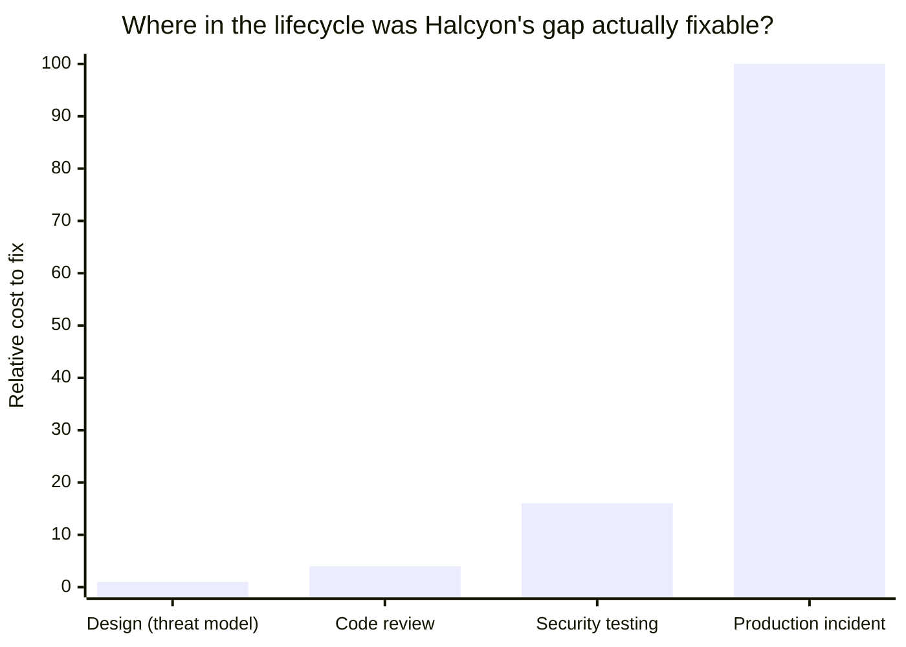

import Scenario from "../../../components/Scenario.astro";
import LevelIntro from "../../../components/LevelIntro.astro";

<Scenario label="Two teams, one feature, one 30-minute difference">
  <Fragment slot="facts">
    

      

        📄 <strong>Same ticket</strong> — both teams build "let
        students upload a PDF assignment" for Fenwick Learning's ed-tech
        platform, same sprint
      

      

        ⏱️ <strong>The only difference</strong> — Meridian
        spends 30 minutes threat-modeling before writing the design doc;
        Halcyon goes straight to the doc and ships
      

      

        📆 <strong>Where the gap shows up</strong> — not on day
        one for either team; on day one they look identical
      

    

    

      

        

          Meridian
        

        Design doc ships with a file-type allowlist, random storage keys, and
        a private bucket by default — one paragraph of "security
        considerations," written before any code existed
      

      

        
Halcyon

        Design doc has no security section at all — ships faster, same
        sprint, nothing visibly wrong for four months
      

    

  </Fragment>

Both design docs get approved the same week. Both features ship on
schedule. For four months, Halcyon's version looks like it made the
better trade — no time "wasted" on a section nobody asked for, one
sprint saved. Then a routine pentest (the kind of check
`security-testing` covers) finds that Halcyon's upload endpoint accepts
any file extension, stores it under the filename the browser sent, and
serves it back from the same origin as the logged-in app — a stored
XSS path an attacker can walk through by uploading a `.html` file
disguised as a PDF.

**Meridian's 30 minutes didn't feel like it bought anything on day
one either.** The only difference between the two teams, four months
later, is which one still has to explain this to a customer.

</Scenario>

Every other unit in this track is about a specific defense — a hash
function, a permission model, a TLS handshake, a scanner that runs
after code exists. This unit is about the 30 minutes _before_ any of
that: the design-time habit that decides which defenses a system
actually needs, and gets them written into the design doc itself
instead of retrofitted after a pentest finds the gap.

<LevelIntro
  items={[
    "Threat modeling as a design-time activity, not a code-review one",
    "STRIDE as a structured way to ask 'what could go wrong here'",
    "Secure by default — making the safe choice the easy one",
  ]}
/>

## The shape of the problem

This unit sits upstream of nearly every other unit in `security/` — it's
where the decision to need them (or not) gets made, before a line of
code exists to test, scan, or patch.

| Question this unit answers                                                              | Which sibling unit answers a different question                                |
| --------------------------------------------------------------------------------------- | ------------------------------------------------------------------------------ |
| What could go wrong with _this specific design_, before it's built?                     | `security-mindset` — the general instinct of thinking like an attacker         |
| Which whole classes of bug does this design rule out structurally?                      | `owasp-top-10` — the catalog of bugs found in systems already built            |
| Does the design doc need a mitigation before review sign-off, or after a scan flags it? | `security-testing` — verification once something already exists to test        |
| Should this API default to permissive or restrictive when no one configures anything?   | `authorization-models` — the mechanism a chosen permission model actually uses |
| What happens once a gap like this actually gets exploited?                              | `incident-response` — response after a breach, not prevention before one       |

- **Threat modeling** — a structured walkthrough of a design, asking
  "what could an attacker do here" _before_ the design is finalized,
  not after it ships. **STRIDE** (Spoofing, Tampering, Repudiation,
  Information disclosure, Denial of service, Elevation of privilege) is
  the most widely used structuring framework for this walkthrough — a
  checklist that turns "did we think of everything" into six concrete
  questions asked against every part of a system.
- **Trust boundary** — any point where data crosses from one level of
  trust to another (a public internet request hitting an internal API,
  an uploaded file crossing from "user-controlled bytes" to "something
  the server stores and later serves back"). Threats cluster at trust
  boundaries far more than they do inside a single trusted zone.
- **Security requirements in the design doc** — the same way a design
  doc justifies its scalability numbers or its cost, it should name its
  threats and mitigations explicitly, reviewed at design-review time —
  not left as an implicit assumption someone has to reverse-engineer
  from the code later (`adr-governance` and `architecture-review` cover
  how that review process works generally; this unit is what a
  _security_ section inside it actually contains).
- **Secure by default** — the design principle that the safe choice
  should require no extra effort: a new file-upload field that starts
  with zero allowed extensions and an explicit allowlist, not one that
  starts wide open and waits for someone to remember to restrict it.
- **The velocity trade-off** — threat modeling competes with shipping
  speed for the same time budget. The staff-level skill isn't
  "always do more security work" — it's making the trade legible to a
  product manager who doesn't have a security background, the same
  translation problem `translating-technical-risk-business-risk`
  covers for engineering trade-offs generally.

## Key terms

- **STRIDE** — Spoofing, Tampering, Repudiation, Information disclosure,
  Denial of service, Elevation of privilege. Six threat categories used
  to systematically walk a design, element by element.
- **Data-flow diagram (DFD)** — a diagram showing how data moves through
  a system (client → API → storage, etc.), with trust boundaries marked;
  the standard artifact a STRIDE pass is actually run against.
- **Attack surface** — everything in a design an attacker could
  potentially interact with; a smaller, more deliberate attack surface
  is itself a design decision, not an accident.
- **Shift-left** — catching a class of problem earlier in the
  lifecycle (design time) instead of later (code review, testing,
  production) — the same idea `security-testing` applies to automated
  scanning, applied here one stage earlier still.

The gap Meridian's 30 minutes closed and Halcyon's pentest eventually
found is the _same_ gap — the only variable that changed is how many
stages it survived before someone caught it. L3 works through exactly
this relationship with the unit's own numbers.
