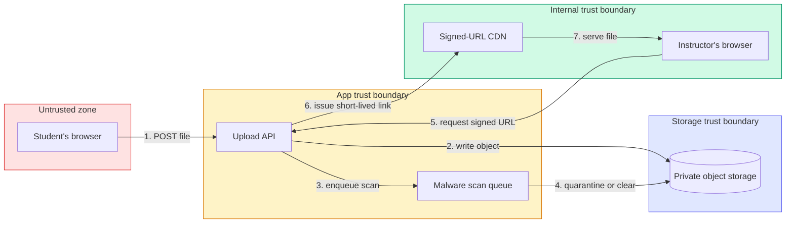
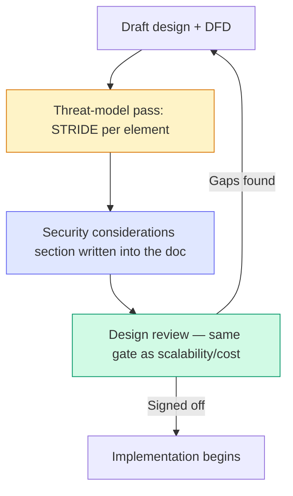

import LevelIntro from "../../../components/LevelIntro.astro";
import Checkpoint from "../../../components/Checkpoint.astro";

L1 left Meridian's 30 minutes as a fact without a method — they didn't
just stare at the design doc and hope threats occurred to them. This
level builds the actual walkthrough: how a data-flow diagram plus six
STRIDE questions turns a design into a concrete, reviewable list of
threats and mitigations, and where that list belongs in the design-doc
process so it isn't optional trivia nobody reads.

<LevelIntro
  items={[
    "Drawing a data-flow diagram with trust boundaries marked",
    "Walking every element through STRIDE's six categories",
    "Where threat modeling sits in the RFC/design-review workflow",
  ]}
/>

## What are we even looking at?

Before asking "what could go wrong," a team needs a shared picture of
what the system actually _is_ — which is why a threat-modeling pass
starts with a diagram, not a bullet list. Here's Meridian's file-upload
feature, drawn as a data-flow diagram with trust boundaries marked:

Every box the diagram crosses _into_ a different-colored zone is a
trust boundary — and threats cluster there, not in the middle of a
single trusted zone. Step 1 (an anonymous student's browser handing
bytes to the app) is the single riskiest edge in this whole diagram,
because it's the only place where the system has to accept something
from someone it doesn't yet fully trust.

## Six questions, asked at every crossing

**Given a diagram like this, how does a team turn it into a concrete
list of threats instead of a vague sense of unease?** STRIDE answers
that by giving six specific questions to ask at each element and each
boundary crossing:

| Category                   | The question it asks                                     | Example against step 1 (student → upload API)                                     |
| -------------------------- | -------------------------------------------------------- | --------------------------------------------------------------------------------- |
| **S**poofing               | Can someone pretend to be a legitimate user or service?  | Could a student upload as if they were a different student, or as the API itself? |
| **T**ampering              | Can data be modified in a way the system doesn't expect? | Can the filename or content-type header be forged to disguise a script as a PDF?  |
| **R**epudiation            | Can an action happen with no way to prove who did it?    | If a malicious file is uploaded, can the team prove which account did it?         |
| **I**nformation disclosure | Can data leak to someone who shouldn't see it?           | Could one student's uploaded file become readable by guessing another's URL?      |
| **D**enial of service      | Can the system be made unusable for legitimate users?    | Can someone upload thousands of huge files and exhaust storage or the scan queue? |
| **E**levation of privilege | Can an action gain more access than it should have?      | Can an uploaded file execute code with the same privileges as the upload service? |

Not every category applies to every element with equal force — the
point of asking all six isn't padding the list, it's making sure a
real threat doesn't get missed just because nobody happened to think
of that particular angle unprompted. A DFD with clearly marked trust
boundaries plus six questions asked at each one is the entire
mechanism; nothing more exotic is required to get most of the value.

<Checkpoint question="Meridian's design already stores every file under a random, unpredictable key rather than the filename the browser sent, and serves files only through short-lived signed URLs. Which STRIDE category does that specific pair of decisions primarily defend against?">

Information disclosure. A predictable or attacker-chosen storage key
(e.g. reusing the original filename) would let someone guess or
enumerate other students' file locations, and a long-lived or
unauthenticated URL would let a leaked link keep working indefinitely.
Random keys plus short-lived signed URLs together close that specific
guessing/leaking path — notice this is a distinct concern from
Tampering (can the _content_ be altered) or Spoofing (can someone
_impersonate_ a user), even though all three questions get asked
against the same upload flow.

</Checkpoint>

## From threat list to design doc

**A team has a filled-in STRIDE table now — where does it actually
go, and who has to look at it before anything ships?** The answer that
makes this durable rather than a one-off exercise: it becomes a
**"Security considerations" section in the design doc itself**, filled
in with the same seriousness as the scalability or cost sections, and
checked at the same design-review gate `adr-governance` and
`architecture-review` already describe for architectural decisions
generally.

This is the mechanical difference between Meridian and Halcyon from
L1: it isn't that Meridian's engineers were individually more careful
people. Their design-doc template _required_ a security-considerations
section before a reviewer could approve it, the same way it required a
rollout plan. Halcyon's template didn't — so nothing enforced the
30-minute habit on a day when the team was in a hurry, which, for any
team, is most days.

## Secure by default: making the safe choice the easy one

A threat model produces a list of mitigations — but a mitigation that
requires every future engineer to remember to opt in is a mitigation
that will eventually get forgotten. **Secure by default** is the
design principle that closes that gap: the version of the API that
requires no configuration at all should already be the restrictive
one.

- **Permissive by default** (the failure mode): a new file-upload field
  accepts any extension unless someone later adds a blocklist; a new
  IAM role starts with broad read access unless someone later narrows
  it; a new API endpoint is public unless someone later adds auth.
  Every one of these requires an engineer, months later, under no
  particular pressure to think about security, to remember to lock
  something down that was never locked in the first place.
- **Restrictive by default** (secure by design): a new file-upload
  field accepts _nothing_ until an explicit allowlist is added; a new
  IAM role starts with zero permissions and gains them one named grant
  at a time; a new endpoint requires an explicit `public: true` flag to
  skip auth, so the _unusual_ case is the one that has to be typed out
  loud, not the safe one.

The pattern is the same in every case: whichever behavior happens when
someone does nothing should be the safe one, because "someone did
nothing" is not a rare event in a real codebase — it's the default
state of most fields, most of the time. L3 shows this as a real code
diff, not just a description.

<Checkpoint question="A teammate argues that secure-by-default just moves the same amount of configuration work from 'add a restriction later' to 'add a permission now' — so it doesn't actually reduce total effort, only shifts when it happens. Is that a fair characterization of what secure-by-default buys?">

It's true that the _total_ configuration work doesn't disappear — but
that's not the claim secure-by-default is making. The claim is about
what happens when nobody does the work at all, which is the realistic
failure mode, not a hypothetical one. Under permissive-by-default, a
forgotten step leaves something open. Under restrictive-by-default, a
forgotten step leaves something closed — annoying, and worth fixing,
but not a breach. Secure-by-default doesn't eliminate the need for
configuration; it changes which direction a missed step fails in, and
"fails closed" is a much cheaper mistake to live with than "fails
open."

</Checkpoint>

## Making the trade-off legible

Threat modeling costs real time, and it competes with feature velocity
for the same sprint — pretending otherwise doesn't help a staff
engineer defend the practice to a product manager who's being measured
on ship dates, not CVE counts. What actually works is translating the
cost into the same terms the business already reasons in, the same
move `translating-technical-risk-business-risk` teaches generally:

- **Time-box it.** Meridian's pass took 30 minutes, not a day — most
  design-time threat modeling for a feature this size should fit in a
  single focused session, not become its own multi-day workstream. A
  process that can't be time-boxed will get skipped under deadline
  pressure, which defeats the entire point.
- **State the alternative cost, not just the up-front cost.** "30
  minutes now" is the wrong comparison to make alone — "30 minutes now
  vs. an emergency fix, a pentest finding, and a customer conversation
  later" is the comparison that's actually true, and L1's chart already
  showed the shape of that gap using this unit's own scenario.
- **Scope the ask.** Not every change needs a full STRIDE pass — a
  copy tweak doesn't cross a trust boundary. Reserve it for designs
  that introduce a new trust boundary, a new data flow, or new
  user-controlled input — which keeps the ask proportionate instead of
  becoming a blanket tax on all work that erodes goodwill for the
  practice itself.
