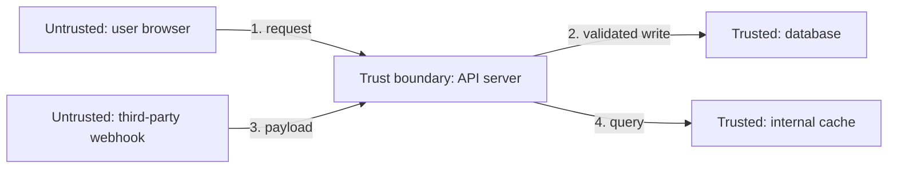

## Trust boundaries: where assumptions have to be re-earned



Every arrow crossing from "untrusted" into "trusted" is a place where the system has to actively decide whether to believe what it's receiving — arrows 1 and 3 cross a trust boundary, arrows 2 and 4 don't (they're internal, already-validated data moving between components you control). A shocking amount of real vulnerabilities come from code that treats an untrusted-side input as if it had already crossed the boundary safely — trusting a client-supplied "isAdmin" field, trusting a webhook payload's claimed sender, trusting a file's declared content-type.

## STRIDE: six categories of "what could go wrong"

| Category                   | The adversary's goal                          | Concrete example                                                           |
| -------------------------- | --------------------------------------------- | -------------------------------------------------------------------------- |
| **S**poofing               | Pretend to be someone/something else          | Forging a request header to look like it came from an internal service     |
| **T**ampering              | Alter data or code in transit or at rest      | Modifying a price value in a request before it hits the server             |
| **R**epudiation            | Deny having done something, with no proof     | An admin action with no audit log, so it can't be attributed later         |
| **I**nformation disclosure | Read data they shouldn't have access to       | An error message that leaks a stack trace with internal file paths         |
| **D**enial of service      | Make the system unavailable to legitimate use | Sending oversized payloads that exhaust server memory                      |
| **E**levation of privilege | Gain access beyond what was granted           | A regular user calling an admin-only endpoint the UI just happened to hide |

STRIDE isn't a checklist of specific bugs to search for — it's a set of _lenses_. For any given component, running through all six ("could someone spoof a caller here? Tamper with this data? Deny they did this?") surfaces categories of risk a purely functional review wouldn't think to ask about, because functional review only asks "does the intended flow work."

## The threat-modeling procedure

```python
function threat_model(component):
    assets = what_is_valuable_here(component)          # data, access, availability
    entry_points = where_does_untrusted_input_enter(component)

    threats = []
    for entry in entry_points:
        for category in [SPOOFING, TAMPERING, REPUDIATION,
                          INFO_DISCLOSURE, DENIAL_OF_SERVICE, ELEVATION]:
            if plausible(category, entry, assets):
                threats.append((entry, category, worst_case_impact(category, assets)))

    ranked = sort_by(threats, key=lambda t: likelihood(t) * impact(t))
    return ranked  # highest-priority risks first, not an exhaustive fix-everything list
```

Threat modeling deliberately produces a _ranked_ list, not an infinite one — the point isn't to eliminate all conceivable risk (impossible), it's to know where the highest-value mitigation effort should go, the same way you'd triage bugs by severity rather than fixing them in file-alphabetical order.

## The mindset shift, stated plainly

A functional reviewer asks: "if a user does X, does the system produce the right result?" A security-minded reviewer asks the same question with one word changed: "if an **adversary** does X — deliberately, with malicious intent, possibly automating it a million times — does the system still behave safely?" Same code, same review, fundamentally different question — and it's the second question that catches the failure modes the first one is structurally blind to.
