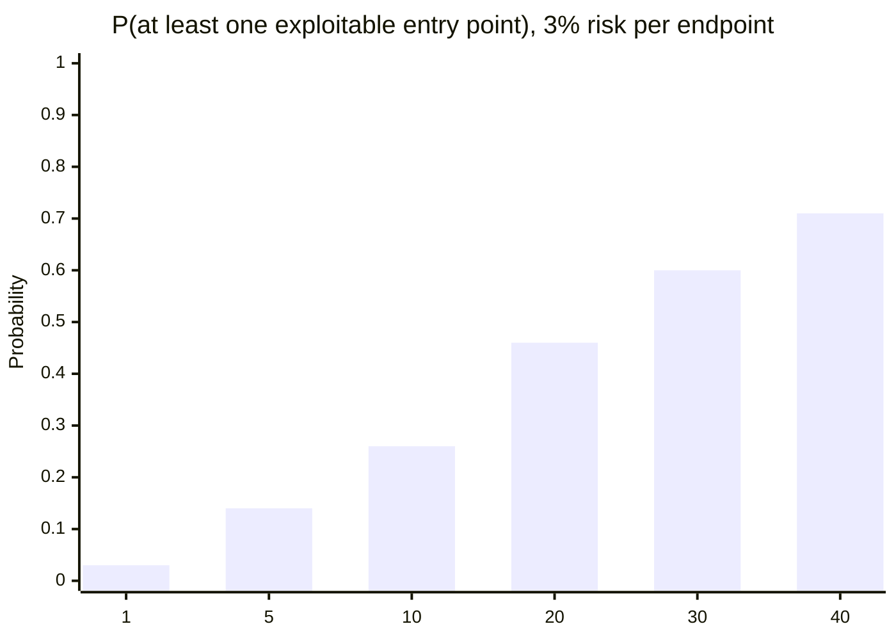

import LevelIntro from "../../../components/LevelIntro.astro";
import Checkpoint from "../../../components/Checkpoint.astro";

L2 turned the security mindset into trust boundaries and the STRIDE
questions — this level applies both to a real bug and a real endpoint,
then quantifies why the number of entry points matters as a system
grows.

<LevelIntro
  items={[
    "A real trust-boundary bug: client-controlled price",
    "Running STRIDE end-to-end on a file-upload endpoint",
    "Why risk compounds non-linearly with entry-point count",
  ]}
/>

## A real tampering bug: trusting client-supplied price

This is the single most common instance of "it works" not meaning "it's safe" — the happy-path test passes because nobody tried sending anything malicious:

In words before code: if the customer's browser sends both "I want two
items" and "each item costs $0.01," the server must not trust the price
just because the number has the right shape. The server should look up
the real price from its own catalog.

```js
// checkout-vulnerable.mjs — trusts the client's stated price
function checkout(cartItem) {
  // cartItem = { productId, quantity, price } — price sent by the client
  const total = cartItem.price * cartItem.quantity;
  chargeCard(total);
  return { charged: total };
}

// Functional test: passes, because it's testing the happy path.
console.log(checkout({ productId: "sku-1", quantity: 2, price: 19.99 }));
// { charged: 39.98 } — looks correct.

// The adversarial test nobody wrote:
console.log(checkout({ productId: "sku-1", quantity: 2, price: 0.01 }));
// { charged: 0.02 } — the server just charged 2 cents for a $40 order,
// because it trusted a number the client fully controls.
```

The fix isn't "validate that price is a positive number" — 0.01 _is_ a valid positive number. The fix is recognizing `price` crossed a trust boundary (client → server) and re-deriving it from something the server actually controls instead of trusting the crossing value at all:

```js
// checkout-fixed.mjs — server is the source of truth for price
function checkout(cartItem, catalog) {
  // catalog is server-side data — the client never gets to set price
  const product = catalog[cartItem.productId];
  const total = product.price * cartItem.quantity;
  chargeCard(total);
  return { charged: total };
}

const catalog = { "sku-1": { price: 19.99 } };
console.log(checkout({ productId: "sku-1", quantity: 2 }, catalog));
// { charged: 39.98 } — correct, and now un-tamperable, because the
// client no longer has any input that determines the charged amount.
```

Nothing about the _functional_ behavior changed for a legitimate request — both versions charge $39.98 for 2 units at $19.99. The difference only shows up under adversarial input, which is exactly why "it passed QA" said nothing about whether it was safe.

| Check type            | What it proves                          | What it does not prove                               |
| --------------------- | --------------------------------------- | ---------------------------------------------------- |
| Validate format       | `price` is a number                     | The client was allowed to choose that number         |
| Check source of truth | Price came from the server-side catalog | The browser cannot lower the charged amount by lying |

<Checkpoint question="A teammate proposes fixing the checkout bug by adding a rule that rejects any price below $1.00. Why doesn't that actually close the hole, even though it would stop the specific $0.01 example above?">

Because the bug was never about the number being too small — it was
about the number coming from the wrong place. A minimum-price rule only
rejects one narrow range of tampered values; an attacker can just send
$18.00 instead of $0.01 and still undercharge by a dollar per unit, and
that request sails right through the new rule looking perfectly
reasonable. The real fix has to remove the client's ability to set the
charged price at all, by re-deriving it from the server's own catalog —
any check that still lets the client supply the number, no matter how
the range is constrained, leaves the same trust-boundary crossing in
place.

</Checkpoint>

## Running STRIDE on a real component: a file-upload endpoint

Component: an endpoint that lets users upload a profile picture.

| STRIDE category        | Plausible here?                                                                                                           | Mitigation                                                                                                                 |
| ---------------------- | ------------------------------------------------------------------------------------------------------------------------- | -------------------------------------------------------------------------------------------------------------------------- |
| Spoofing               | Could someone upload as another user? — yes, if the session/auth check is missing on this specific route                  | Require and verify auth on every route independently, not just "most routes"                                               |
| Tampering              | Could the uploaded file be something other than an image? — yes, if only the filename extension is checked                | Verify actual file content (magic bytes), not just the claimed extension                                                   |
| Repudiation            | Low relevance here — profile pictures aren't typically an accountability-sensitive action                                 | Skip or deprioritize; not every category applies equally to every component                                                |
| Information disclosure | Could the upload path leak internal storage structure or other users' files? — yes, if filenames aren't randomized/scoped | Store under a random, user-scoped key, never the client-supplied filename                                                  |
| Denial of service      | Could someone upload huge files repeatedly to exhaust storage/bandwidth? — yes                                            | Enforce a max file size and per-user rate limit before accepting the upload                                                |
| Elevation of privilege | Could the "image" actually be an executable script that gets served and run?                                              | Serve uploads from a separate domain/bucket with no execute permissions, correct `Content-Type`, and `Content-Disposition` |

Notice this is a genuinely boring feature — "let users upload a picture" — and STRIDE still surfaces six distinct, real risk categories a purely functional spec ("accepts an image, saves it, returns a URL") would never mention, because the functional spec only describes the intended path.

If the file-upload table feels dense, split it across later units:
`/security/authorization-models/` goes deeper on auth and ownership,
`/web/xss/` explains why executable scripts in browsers are dangerous,
and `/security/owasp-top-10/` expands common attack categories.

## How much does adding entry points actually compound risk?



This is the same file-upload endpoint's math scaled up: if each of N independent entry points has even a small, fixed chance of an exploitable flaw, the odds that _at least one_ of them is exploitable grow non-linearly with N. The simpler formula is: chance of at least one failure = `1 - chance that none fail`. A system with 40 loosely-reviewed entry points isn't "a bit riskier" than one with 5 — it's a fundamentally different risk profile, which is exactly why STRIDE is run per-component rather than once for the whole system: the unit of analysis has to match the unit that's actually multiplying. Play with the numbers yourself in the "Try it" demo below.

<Checkpoint question="Going from 5 endpoints to 40 endpoints (each with an independent 3% chance of an exploitable flaw) more than quadruples the system-wide risk, even though the endpoint count only grew 8x. What does that imply about reviewing a system as it grows, versus reviewing it once at launch?">

It means a one-time security pass doesn't scale with the system —
running STRIDE once when there were 5 endpoints and treating the result
as still valid at 40 endpoints badly understates the actual risk,
because the probability of at least one exploitable gap climbs faster
than the endpoint count does. Each new entry point isn't just "one more
thing to maybe check later"; it's another independent chance for the
whole system to fail, multiplying against every chance that came before
it. That's why the STRIDE review has to be a per-component habit applied
as new entry points are added, not a single audit performed once and
assumed to still cover a system that has since grown.

</Checkpoint>

## Failure modes

- **Validating shape, not trust.** Checking that `price` is a number, or that a filename ends in `.jpg`, confirms the _shape_ of the input is well-formed — it says nothing about whether the input's _value_ should be trusted for anything security-sensitive. The checkout bug above passes every reasonable shape check.
- **Security review as a separate late-stage gate.** Treating "think like an adversary" as a checklist run by a different team right before launch means the design itself was never adversarially examined — by then, fixing a trust-boundary mistake often means reworking the architecture, not patching a line.
- **Stopping at "this specific bug is fixed" instead of "this category is covered."** Patching the price-tampering bug in `checkout()` doesn't mean every other client-controlled value elsewhere in the codebase (discount codes, shipping cost, user roles) is safe — STRIDE's value is in making you re-ask the same six questions per component, not treating one fix as proof the mindset was applied everywhere.
- **Assuming "we'd never get attacked, we're small/unknown."** Most real-world exploitation of small or obscure systems is automated and untargeted (scanners probing for a known vulnerable pattern across millions of hosts) — obscurity reduces the odds of a _targeted_ attack, not an automated one, and the checkout bug above would be found by a script, not a person specifically hunting your company.

The checkout bug and the file-upload table are one worked example each, not the whole territory. **Questions to think with:** what changes if the file-upload endpoint were internal-only, used by employees rather than the public? Usually the table shrinks in priority, not to zero: employees can make mistakes, accounts can be stolen, and internal tools still cross boundaries. And what happens to the checkout fix if `catalog` itself is populated from a third-party pricing feed? The trust boundary moves one hop back: now the feed needs verification before its prices become server truth.
