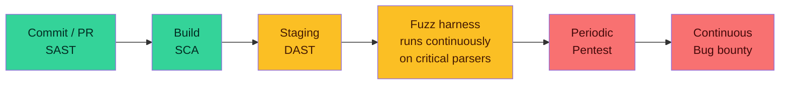

import LevelIntro from "../../../components/LevelIntro.astro";
import Checkpoint from "../../../components/Checkpoint.astro";

L1 named five techniques and showed why none of them alone was enough
for Aegis. The question L2 actually answers: **at what point in a
change's life does each one run, and what does that timing determine
about what it can and can't catch?**

<LevelIntro
  items={[
    "The shift-left pipeline: where each technique sits, commit to production",
    "SAST vs. DAST vs. SCA vs. pentest, side by side",
    "Why cost and speed trade off directly against depth of what's found",
  ]}
/>

## Where each technique actually sits

"Shift left" means: the earlier a check runs in a change's life, the
cheaper the fix, because fewer other things have been built on top of
the bug yet. That's why the fast, automated, pattern-based checks run
first and most often, and the slow, expensive, judgment-based ones run
last and least often — it isn't arbitrary, it's a direct trade of speed
against depth.

Every arrow left-to-right also means "runs more often, costs less per
run, catches less." A SAST scan on a single PR takes seconds and blocks
one bad line. A pentest takes days-to-weeks, costs real money, and
happens a few times a year — but it's the only stage that can catch
something like Aegis's refund logic, because it's the only stage with a
human asking "what would I do if I wanted to abuse this."

<Checkpoint question="A team wants to add exactly one new automated check to catch dependency vulnerabilities before they reach a running deployment. Which technique, and where does it run relative to SAST?">

**SCA, running at build time** — after SAST (which only reads _your_
code, not the packages you pulled in) but before DAST or staging
(nothing has been deployed anywhere yet). SCA doesn't scan your source
for bad patterns; it checks the exact versions of every dependency
you're about to build against public vulnerability databases. A
dependency with no known CVE published yet won't be caught by SCA
either — that gap is what `supply-chain-security` covers in depth.

</Checkpoint>

## Side by side: what each one catches, what each misses

| Technique   | Catches                                                                                                    | Structurally misses                                                                           | Runs                            | Example tooling               |
| ----------- | ---------------------------------------------------------------------------------------------------------- | --------------------------------------------------------------------------------------------- | ------------------------------- | ----------------------------- |
| **SAST**    | Known-dangerous code patterns: string-built SQL, `eval`, hardcoded secrets, unsanitized output             | Runtime config, business logic, anything that "looks fine" as text but behaves badly when run | On every commit / PR            | Semgrep, CodeQL, Bandit       |
| **DAST**    | Runtime behavior: missing security headers, verbose error leaks, live injection against a running endpoint | Anything below the HTTP surface it's attacking; slow to run, needs a deployed target          | On staging, before release      | OWASP ZAP, Burp Suite         |
| **SCA**     | Dependencies with a _publicly known_ vulnerability in the exact version you're using                       | Brand-new/unpublished flaws, and anything about how you're _using_ a safe dependency          | At build time, on every install | `npm audit`, Snyk, Dependabot |
| **Fuzzing** | Crashes, hangs, and memory issues from malformed input a human wouldn't think to try                       | Anything that doesn't crash — a fuzzer has no concept of "wrong but doesn't error"            | Continuously, on parsers/inputs | AFL, libFuzzer, Atheris       |
| **Pentest** | Business-logic abuse, chained exploits across multiple weak points, anything requiring human intent        | Coverage — a pentest only tests what the tester thought to try, in the time they had          | Periodically (quarterly/yearly) | A scoped human engagement     |

Notice the pattern down the "structurally misses" column: every
automated row's blind spot is some version of "requires understanding
what the system was _supposed_ to do, not just what its code or traffic
_looks like_." That's not a maturity gap any of these tools will close
with a better ruleset — it's the actual reason the pentest row exists
at all.

<Checkpoint question="Aegis's SAST and DAST scans were both clean for six months. Does 'DAST found nothing' mean the running application has no exploitable request that could hurt it?">

No — it means DAST found nothing among the request shapes and patterns
it knows to try. DAST attacks a running app the way an automated
scanner attacks it: known injection patterns, known header checks,
known error-leak signatures. It has no model of "this specific business
process shouldn't allow a negative quantity" — that's not a request
_shape_ problem, it's a rule about what the checkout flow is allowed to
do. A clean DAST scan means "no known attack pattern worked," not "this
system is safe," which is exactly why a pentest — a human reasoning
about intent, not patterns — still found the refund bug DAST never
could.

</Checkpoint>

## Cost, speed, and depth are one trade-off, not three

- **Fast + cheap + shallow**: SAST and SCA. Run on every single commit
  because each run costs almost nothing and catches the cheapest bugs to
  fix — the ones that haven't been built on top of yet.
- **Slower + costlier + deeper**: DAST and fuzzing. Need something
  actually running, so they can't fire on every keystroke, but they see
  categories of bug (runtime config, crash conditions) the read-only
  tools structurally cannot.
- **Slowest + costliest + deepest**: pentesting. A real person, days to
  weeks, real budget — the only stage that reasons about what a system
  is _for_, not just what its text or traffic looks like. It's used
  sparingly for exactly the same reason SAST is used constantly: it's
  expensive per finding, but some findings are only reachable this way.

No layer replaces another — a pipeline missing any one of these has a
specific, predictable kind of bug it will never catch. L3 builds a
working (small, but real) version of the automated layers, then walks
through what a real pentest engagement actually looks like from scoping
to remediation.
