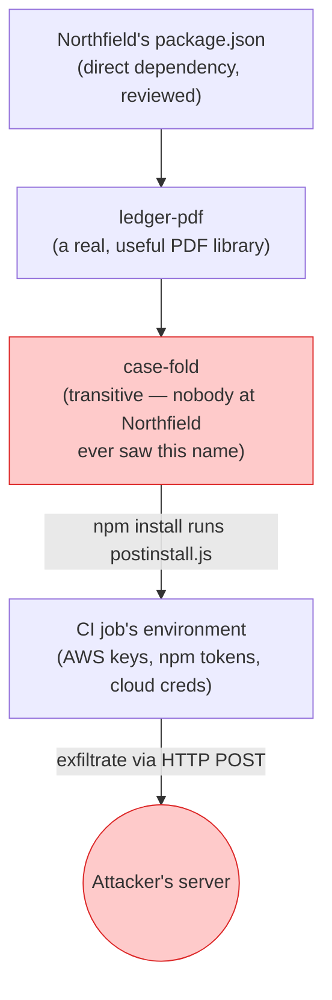
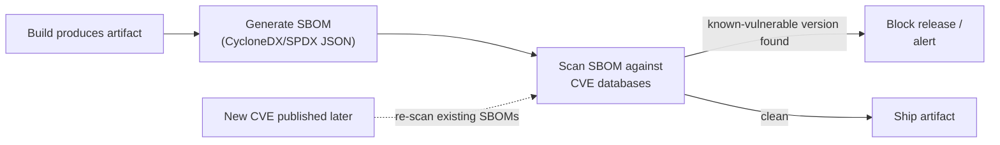

import LevelIntro from "../../../components/LevelIntro.astro";
import Checkpoint from "../../../components/Checkpoint.astro";

L1 established that Northfield Ledger never chose `case-fold` — it
arrived three layers deep, through a library they _did_ choose
deliberately. To defend against that, you first need a precise picture of
how trust actually flows down a dependency tree, and where each defense
in the stack sits inside that flow.

<LevelIntro
  items={[
    "How trust flows transitively through a dependency tree",
    "What a lockfile's integrity hash actually pins down",
    "The SBOM + scanning architecture as one continuous pipeline",
  ]}
/>

## How does a malicious transitive dependency reach production?

Northfield's `package.json` lists a handful of direct dependencies —
say, an invoicing-PDF library called `ledger-pdf`. Nobody at Northfield
looked at what `ledger-pdf` itself depends on, because that's exactly the
point of using a library: you trust it to bring its own tools. One of
those tools is `case-fold`.



Every arrow in that chain is a normal, expected action — `ledger-pdf`
depending on a formatting helper is unremarkable, and npm running an
install script is a documented feature, not a bug. Nothing here trips an
antivirus or a CVE scanner: there's no vulnerable _code path_, just a
maintainer who published something new. The "trust" that reaches
production isn't a decision anyone at Northfield made about `case-fold`
specifically — it's the _sum_ of every decision along the chain: "I
trust `ledger-pdf`" implicitly became "I trust whatever `ledger-pdf`
trusts," all the way down.

<Checkpoint question="Priya's team ran `npm audit` regularly and it stayed clean the entire eleven days. Why didn't a vulnerability scanner catch this?">

`npm audit` (and tools like it) work by matching the versions in your
dependency tree against a database of _already-disclosed_ vulnerabilities
— a CVE has to exist and be published before the scanner can flag
anything. `case-fold` v2.4.1 wasn't a known-vulnerable old version with a
patch available; it was a brand-new release, published by an account with
legitimate publish rights, that had never been flagged by anyone because
nobody had reported it yet. Scanning defends against _known_ bad
versions of packages — it says nothing about a _new_ version of a
package that was fine yesterday. That gap is exactly why pinning and
version-bump review (below) exist as a separate layer.

</Checkpoint>

## Lockfiles: pinning what, exactly?

A `package-lock.json` (or `Pipfile.lock`, `poetry.lock`, `Gemfile.lock`)
does two distinct jobs that are easy to conflate:

1. **Pins the exact version** every install resolves to — so two
   installs of the same lockfile, weeks apart, get the same
   `case-fold@2.3.0`, not "whatever `^2.3.0` currently means on the
   registry."
2. **Records an integrity hash** (npm's `integrity` field, a base64
   SHA-512 of the package's actual tarball bytes) — so if the registry,
   a mirror, or a man-in-the-middle ever serves _different bytes_ under
   the same version number, `npm install` refuses to install it.

```json
"node_modules/case-fold": {
  "version": "2.3.0",
  "resolved": "https://registry.npmjs.org/case-fold/-/case-fold-2.3.0.tgz",
  "integrity": "sha512-9f1c...a04b=="
}
```

What this does **not** protect against: a lockfile faithfully records
whatever was there when it was last regenerated. If a developer runs
`npm install case-fold@latest` and commits the resulting lockfile update,
the lockfile now pins the _malicious_ version just as confidently as it
pinned the clean one — a lockfile locks in whatever you point it at, it
doesn't judge whether that target is safe. That's the gap version-bump
review (L3) exists to close.

## SBOM + scanning as one pipeline, not two separate tools

A **Software Bill of Materials (SBOM)** is a machine-readable inventory
of every component — direct and transitive — in a built artifact:
package name, version, license, and often a cryptographic hash, in a
standard format (CycloneDX or SPDX JSON). The question an SBOM answers
is blunt but, until you have one, often genuinely unanswerable: _"is
`case-fold` anywhere in anything we've shipped, and in which artifacts?"_
Without an SBOM, answering that during an incident means grepping
lockfiles across every repo by hand, under time pressure.



The pipeline view matters because of that dashed arrow: an SBOM generated
once at build time stays useful _after_ release, because a CVE can be
published for a package version you shipped months ago. Scanning isn't a
one-time gate at build — it's a standing query re-run against every SBOM
you've kept, which is exactly why regulators and enterprise customers
increasingly ask vendors "where's your SBOM" as a contract requirement:
it lets _them_ re-run that query independently, without waiting for the
vendor to notice first.

<Checkpoint question="Northfield's security team wants to answer 'which of our production services are affected by a newly-disclosed CVE in a package we've never heard of, published years ago?' What lets them answer that in minutes instead of days?">

An SBOM per released artifact, generated automatically at build time and
kept on file, turns that question into a lookup instead of an
investigation: search every stored SBOM for the vulnerable package
version, and every match names an affected artifact directly. Without
SBOMs, answering the same question means somebody manually walking every
repo's lockfile (and every transitive dependency inside each one) by
hand — for a _transitive_ dependency nobody remembers choosing, that
search is exactly as hard as Priya's original problem in L1. The SBOM is
what makes "we don't know what's in our own software" stop being true.

</Checkpoint>

## Minimal-version-review and pinning as policy

Two related but distinct habits, both aimed at the gap lockfiles leave
open:

- **Pinning** — declaring an exact version (`"case-fold": "2.3.0"`, not
  `"^2.3.0"`) in `package.json` itself, not just the lockfile, so an
  upgrade requires an explicit, visible diff to that file rather than
  happening silently on the next `npm install` in a fresh environment
  that doesn't yet have a lockfile.
- **Minimal-version-review policy** — before merging a lockfile update
  that bumps a dependency, actually looking at _what changed_: does the
  diff match the changelog, did the maintainer or publishing account
  change, does the new version add anything unexpected (a new
  `postinstall` script is the loudest possible red flag, since it means
  new code that runs _automatically_, before your own code ever executes).

Neither is exotic tooling — both are policy decisions about how casually
a version bump gets treated. The technical stack (lockfiles, SBOMs,
scanners) makes the _information_ available; a team still has to decide
to look at it before merging, which is exactly the discipline `case-fold`
v2.4.1 slipped past at Northfield.

L3 makes every piece of this concrete and runnable: a script that
detects an integrity-hash mismatch, a dependency-tree walker that flags
loose version ranges, a minimal SBOM parser, and a typosquat-distance
detector.
