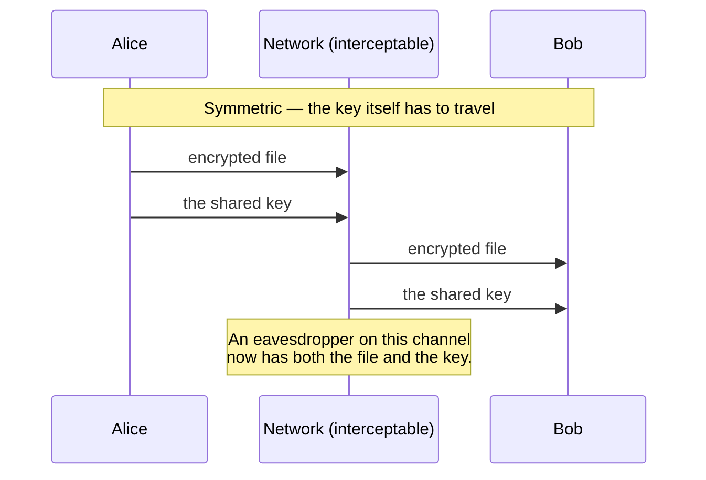
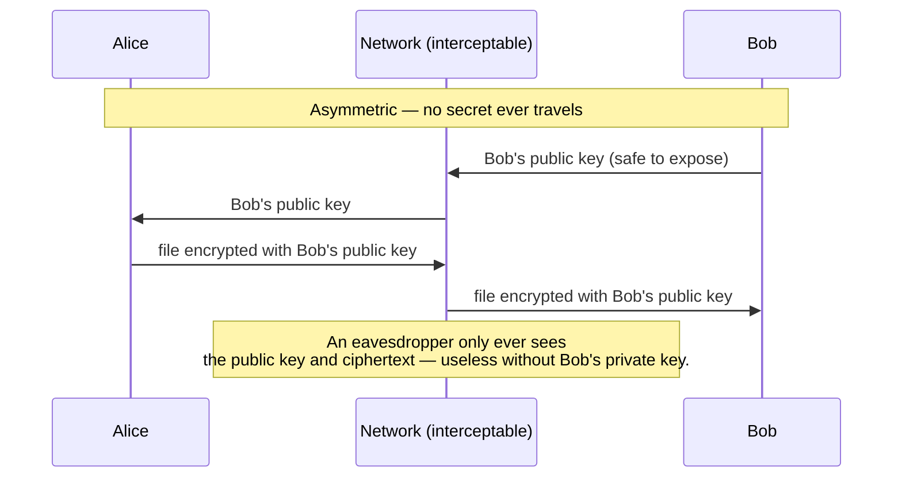

import LevelIntro from "../../../components/LevelIntro.astro";
import Checkpoint from "../../../components/Checkpoint.astro";

L1 named the key distribution problem: a shared secret key is only safe once
it's already reached the other party, which is the exact thing encryption
was supposed to make unnecessary. L2 works out the mechanism that actually
solves it, what that mechanism costs, and why real systems don't pick one
approach and stop there.

<LevelIntro
  items={[
    "How a public/private key pair avoids sending a secret",
    "What asymmetric encryption costs compared to symmetric",
    "Why hybrid encryption combines both",
  ]}
/>

## Two keys instead of one

**If a single shared key has to travel over an interceptable channel,
what would actually fix that?** Not sending a secret at all. Asymmetric
encryption gives each party a mathematically related pair of keys: a
public key, safe to hand to literally anyone, and a private key that
never leaves its owner. Anything encrypted with the public key can
only be decrypted with the matching private key — so Alice can
encrypt something for Bob using a key he already published openly,
with no secret ever crossing the network.

In the second diagram, the only thing that travels besides ciphertext
is Bob's _public_ key — which is safe to expose by design. Bob's
private key, the only thing that can decrypt the message, never
touches the network at all. A useful image: the public key is like a
lock Bob gives everyone so they can close a box for him; the private
key is the one key that opens boxes closed with that lock.

<Checkpoint question="An eavesdropper captures every packet in the second diagram above — Bob's public key and the encrypted file. Can they recover the original file?">

No. The eavesdropper now holds exactly the two things that were always
meant to be public or unreadable: the public key, which by design does
nothing to help decrypt (it can only encrypt), and the ciphertext, which
is useless without Bob's private key. That private key never appeared on
the network at any point in the exchange, so there is nothing the
eavesdropper intercepted that lets them reverse the encryption — the
scheme's whole point is that capturing everything sent over the wire
still isn't enough.

</Checkpoint>

## What asymmetric encryption costs to get that benefit

|                  | Symmetric encryption                       | Asymmetric encryption                                                |
| ---------------- | ------------------------------------------ | -------------------------------------------------------------------- |
| Keys involved    | One shared secret key                      | A public/private key pair                                            |
| Key distribution | Requires a secure channel to share the key | No secret ever needs to be transmitted                               |
| Speed            | Fast, even for large amounts of data       | Much slower — measured in L3, tens of times slower for the same data |
| Typical use      | Encrypting the actual bulk data            | Encrypting a small secret (like a symmetric key), or signing         |

Asymmetric encryption solves the key distribution problem, but it does
so at a real computational cost — it's not simply a strictly better
version of symmetric encryption.

## Why real systems use both together

**If asymmetric encryption solves the hard problem, why not just use
it for everything?** Because its slowness makes it impractical for
encrypting large amounts of data directly. The practical answer,
called **hybrid encryption**, combines both: encrypt the actual data
with a fast, randomly generated symmetric key, then encrypt that small
key with the recipient's public key. The recipient uses their private
key to unwrap the small symmetric key, then uses that key to decrypt
the actual data quickly. This is exactly the pattern behind HTTPS,
covered in `/security/tls-https/` — a brief asymmetric handshake,
followed by fast symmetric encryption for the rest of the connection.

<Checkpoint question="A team wants to encrypt a 2GB database backup before uploading it, and considers encrypting the whole file directly with RSA. Based on the table above, what's wrong with that plan, and what should they do instead?">

Encrypting 2GB directly with RSA runs straight into the cost row of the
table: asymmetric encryption is tens of times slower than symmetric for
the same data, so applying it to the entire backup would be dramatically
slower than necessary — and RSA also has a hard per-operation size limit
far smaller than 2GB, so it cannot even be applied directly to a file this
large. The fix is the hybrid pattern from this section: generate a random
symmetric key, encrypt the full 2GB backup with that fast symmetric key,
then encrypt only that small key with RSA. The slow asymmetric operation
touches a few dozen bytes instead of two billion.

</Checkpoint>

## The generalizable lesson

**Is this only about encrypting emails?** No — the same shape shows up
anywhere two parties who haven't already shared a secret need to
communicate confidentially: signing software updates, securing a web
connection, verifying a message really came from who it claims to.
Those last two examples add a second question, identity, on top of the
confidentiality question in this unit; `/security/authentication-fundamentals/`
and `/security/tls-https/` pick up that boundary from different angles.
The underlying question is always the same: does a secret need to
travel to make this work, and if so, is there a way to avoid that
using a key pair instead?
