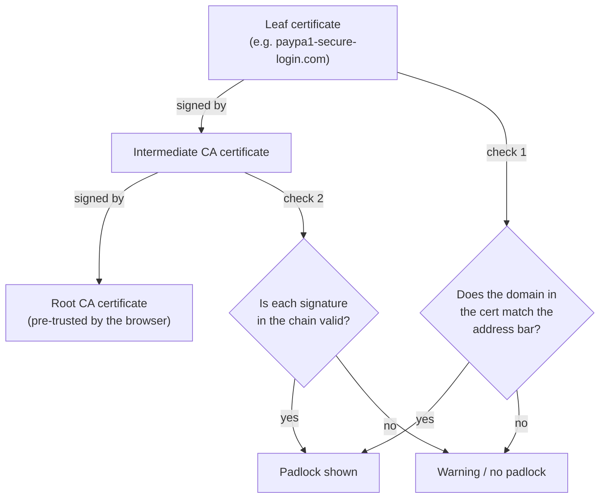

## Verifying a chain, link by link

**When a browser shows a padlock, what exactly did it just check?**
Not whether the site is trustworthy — it checked whether a chain of
digital signatures, starting at the site's own certificate, leads
back to a root certificate the browser already trusts:

Two checks, and only two: does the certificate's domain match what's
in the address bar, and does every signature in the chain verify
correctly up to a trusted root. **Neither check asks "is this
organization who it claims to be" in any deeper sense than "do they
control this specific domain name."**

## What the padlock proves versus what people assume it proves

**If both checks pass for a phishing site, what did the padlock
actually guarantee, and what did it never claim to guarantee?**

| The padlock proves                                                | The padlock does NOT prove                                                                                    |
| ----------------------------------------------------------------- | ------------------------------------------------------------------------------------------------------------- |
| The connection between browser and server is encrypted in transit | The site's content is honest, safe, or non-malicious                                                          |
| The certificate's domain matches the address bar exactly          | The domain is operated by the company or person the user assumes                                              |
| A trusted certificate authority verified control of that domain   | The certificate authority verified the requester's real-world identity (for the most common certificate type) |
| Data can't be silently read or modified by a network eavesdropper | The server itself won't misuse the data once it arrives                                                       |

The gap between these two columns is exactly where phishing over
HTTPS lives — a phishing site can satisfy every item in the left
column while doing real harm through the right column, because the
two columns are answering completely different questions.

## Why domain validation is deliberately lightweight

**If a CA could just refuse to certify any domain that looks
suspicious, wouldn't that close the gap?** Domain validation (DV) —
the most common certificate type — was deliberately designed to be
fast, automated, and cheap: prove you control the domain (respond to
a challenge sent to an email address at that domain, or publish a
specific DNS record) and a certificate is issued within minutes, no
human review involved. This scale is what made HTTPS practical for
the entire web to adopt — but it also means DV certificates say
nothing about who's actually behind the domain. Extended Validation
(EV) certificates exist specifically to add real organizational
identity checks, but they're far less common and browsers no longer
visually distinguish them from DV certificates the way they used to,
so most users never see the difference even when it exists.

## Failure modes at this level

- **Treating "HTTPS" as a synonym for "trustworthy."** HTTPS answers
  "is this connection private," not "should I trust what's on the
  other end" — conflating the two is exactly the gap phishing exploits.
- **Assuming a CA vetted the organization's identity.** For the
  overwhelming majority of certificates in use (domain-validated),
  the CA checked domain control only — not a business registration,
  not a physical address, not who's actually operating the site.
- **Ignoring the actual domain string because a padlock is present.**
  The padlock's domain-match check is strict about the _exact_ string
  in the address bar — but it can't tell a human that
  `paypa1-secure-login.com` isn't `paypal.com`; that comparison is
  still the user's job.
