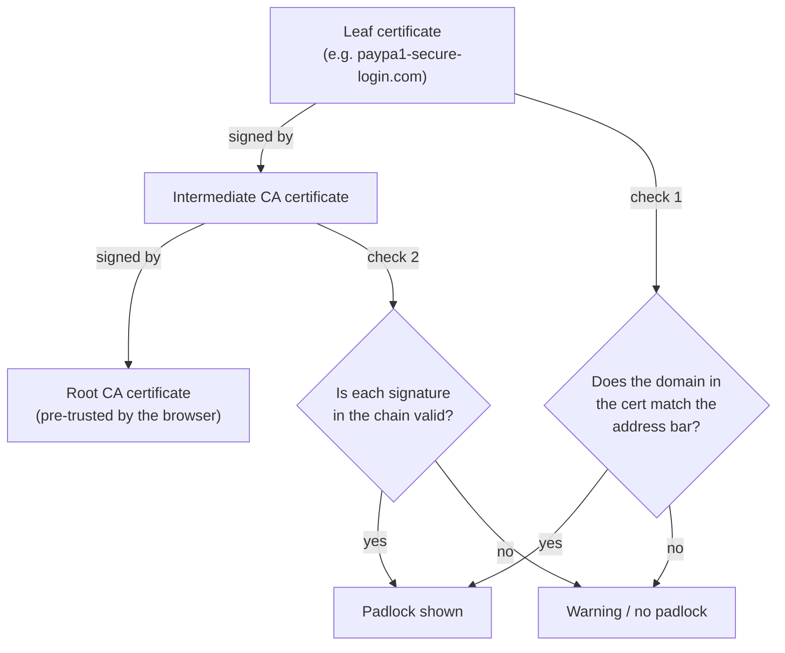
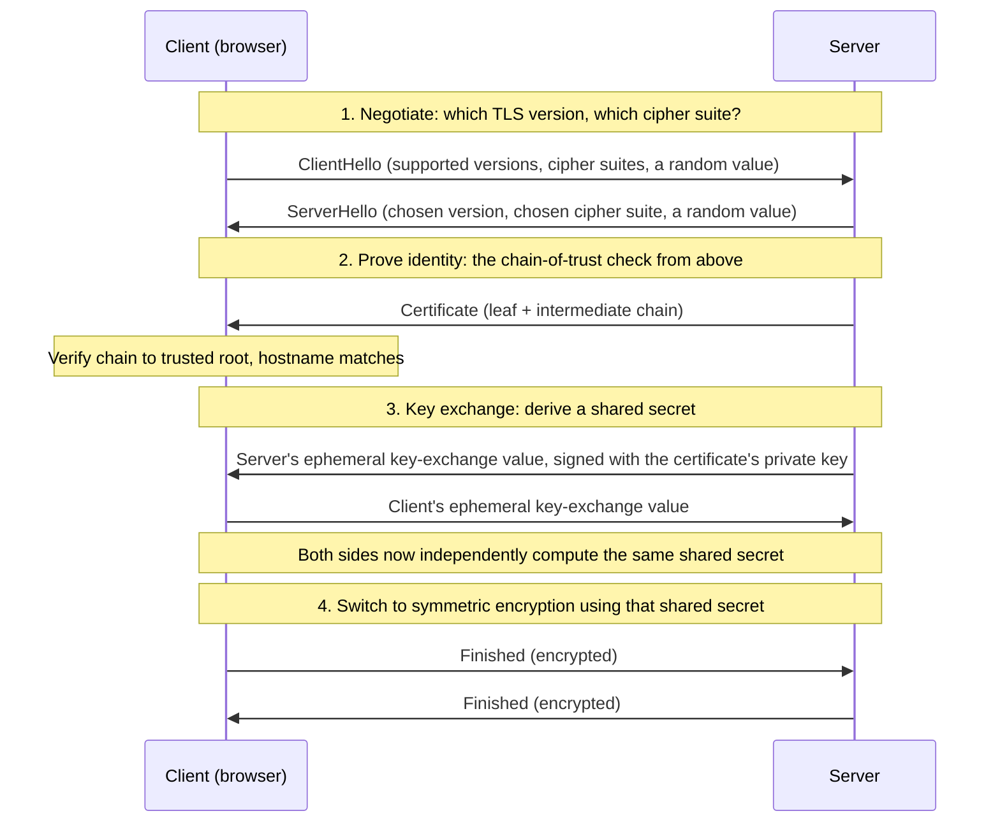

import LevelIntro from "../../../components/LevelIntro.astro";
import Checkpoint from "../../../components/Checkpoint.astro";

L1 established that a padlock only proves a certificate chains to a
trusted CA for the exact domain in the address bar — not that the
domain belongs to whoever the user thinks it does. L2 works through
exactly how that chain of signatures gets verified, and pins down
precisely what each check does and doesn't confirm.

<LevelIntro
  items={[
    "How chain-of-trust verification works, step by step",
    "How the handshake turns a certificate into a shared key",
    "Why ECDHE gives you forward secrecy and RSA key exchange doesn't",
  ]}
/>

## Verifying a chain, link by link

**When a browser shows a padlock, what exactly did it just check?**
Not whether the site is trustworthy — it checked whether a chain of
digital signatures, starting at the site's own certificate, leads
back to a root certificate the browser already trusts:

For the point this unit is isolating, focus on two checks: does the
certificate's domain match what's in the address bar, and does every
signature in the chain verify correctly up to a trusted root. **Neither
check asks "is this organization who it claims to be" in any deeper
sense than "do they control this specific domain name."** Real browsers
also check dates, revocation signals, policy rules, and more, but those
extra checks still do not turn a lookalike domain into the real brand.

<Checkpoint question="A certificate has a perfectly valid signature chain all the way up to a trusted root, but its domain field says paypa1-secure-login.com while the address bar also says paypa1-secure-login.com (the user typed the lookalike domain themselves, from a phishing email). Do both checks pass, and does that outcome mean the verification logic made a mistake?">

Both checks pass — the domain in the certificate genuinely matches the
domain in the address bar, and the signature chain genuinely resolves to
a trusted root. That's not a mistake in the verification logic; it's the
verifier correctly answering the only question it was ever asked, which
is "does this exact domain string have a certificate that chains to a
trusted CA." It was never asked, and structurally cannot answer, whether
`paypa1-secure-login.com` is a legitimate business or a trap — that
question depends on facts about the real world (who registered the
domain, what they intend to do with it) that no signature chain encodes.

</Checkpoint>

## What the padlock proves versus what people assume it proves

**If both checks pass for a phishing site, what did the padlock
actually guarantee, and what did it never claim to guarantee?**

| The padlock proves                                                | The padlock does NOT prove                                                                                    |
| ----------------------------------------------------------------- | ------------------------------------------------------------------------------------------------------------- |
| The connection between browser and server is encrypted in transit | The site's content is honest, safe, or non-malicious                                                          |
| The certificate's domain matches the address bar exactly          | The domain is operated by the company or person the user assumes                                              |
| A trusted certificate authority verified control of that domain   | The certificate authority verified the requester's real-world identity (for the most common certificate type) |
| Data can't be silently read or modified by a network eavesdropper | The server itself won't misuse the data once it arrives                                                       |

The gap between these two columns is exactly where phishing over
HTTPS lives — a phishing site can satisfy every item in the left
column while doing real harm through the right column, because the
two columns are answering completely different questions.

## Why domain validation is deliberately lightweight

**If a CA could just refuse to certify any domain that looks
suspicious, wouldn't that close the gap?** Domain validation (DV) —
the most common certificate type — was deliberately designed to be
fast, automated, and cheap: prove you control the domain (respond to
a challenge sent to an email address at that domain, or publish a
specific DNS record, a public configuration entry for that domain) and
a certificate is issued within minutes, no human review involved. This
scale is what made HTTPS practical for the entire web to adopt — but it
also means DV certificates say nothing about who's actually behind the
domain. Extended Validation (EV) certificates exist specifically to add
real organizational identity checks, but they're far less common and
browsers no longer visually distinguish them from DV certificates the
way they used to, so most users never see the difference even when it
exists.

<Checkpoint question="A CA issues paypa1-secure-login.com a domain-validated certificate in minutes, with no human reviewing whether the domain sounds like PayPal. Was this the CA failing to do its job correctly?">

No — this is domain validation working exactly as designed, not a
lapse. DV's whole contract is "prove you control this domain," checked
by an automated challenge, with no promise anywhere in that contract to
evaluate whether the domain name resembles a well-known brand. Expecting
the CA to catch lookalike domains would be holding it to a job it was
never scoped to do; that scoping is precisely why DV can issue
certificates in minutes at the scale the entire web relies on, and it's
also precisely why the burden of noticing a lookalike domain falls
somewhere else — on the user reading the address bar, or on a separate,
dedicated anti-phishing system, not on the certificate chain itself.

</Checkpoint>

## How the handshake actually establishes trust and a key

Everything so far verified that a certificate is genuine and names the
right domain. **But a certificate only ever contains a _public_ key —
and a public key alone is too slow to encrypt an entire page load of
traffic. So where does the actual key that encrypts your traffic come
from, and how does the certificate stop an attacker from substituting
their own key in that process?** That's the job of the **TLS
handshake**, a short negotiation that runs before any page data moves:

The certificate's job in this diagram is narrow but critical: the
server signs its key-exchange value with the private key matching its
certificate's public key. Because only the real certificate holder has
that private key, a network attacker can swap bytes on the wire but
can't forge a signature that verifies against the certificate — which
is exactly the chain-of-trust check from earlier in this level, now
put to use inside the handshake itself rather than just at page load.

**Why negotiate a "cipher suite" at all — why not just hard-code one
algorithm forever?** A **cipher suite** names the specific bundle of
algorithms this connection will use: which key-exchange method, which
symmetric cipher for the actual traffic, and which integrity check
detects tampering. Negotiating it lets TLS keep working as old
algorithms are found weak and new ones replace them, without breaking
every server and client that hasn't upgraded yet — both sides simply
offer the suites they support, and agree on the strongest one both
understand.

<Checkpoint question="The handshake diagram shows the server's key-exchange value as 'ephemeral' — generated fresh for this connection, then discarded. Why does it matter whether that value is ephemeral (thrown away after the session) versus derived directly and permanently from the server's long-term certificate private key?">

It matters because of what happens if the server's long-term private
key is ever stolen later — say, a year from now. If every past
session's shared key had been derived straight from that same
long-term private key, an attacker who later steals the key could
retroactively decrypt every session ever recorded, including ones from
before the theft. An ephemeral key-exchange value exists only for the
lifetime of one handshake and is never written down or reused — so
even total compromise of the long-term private key later on reveals
nothing about a shared key that was only ever computed in memory,
once, years earlier. This property is called **forward secrecy**, and
it's the reason modern TLS treats "ephemeral" as a requirement, not an
optimization.

</Checkpoint>

**Why does the key-exchange method matter for forward secrecy, and not
just the cipher used afterward?** Older TLS configurations used plain
**RSA key exchange**: the client picked a random secret, encrypted it
directly with the server's long-term public key from its certificate,
and sent it over. That secret can only be decrypted with the server's
long-term private key — meaning anyone who later obtains that private
key (theft, subpoena, a future cryptographic break) can decrypt a
recording of that exact handshake, no matter how long ago it happened.
**ECDHE** (Elliptic-Curve Diffie-Hellman, Ephemeral) instead has both
sides generate a fresh, temporary key pair for that one handshake,
exchange only the public halves, and each independently compute the
same shared secret from their own ephemeral private value plus the
other side's ephemeral public value — the shared secret itself is
never transmitted, and the ephemeral private values are discarded the
moment the handshake ends. That's forward secrecy: compromising the
server's long-term certificate key later tells an attacker nothing
about a shared secret that no longer exists anywhere to compromise.
This is why essentially all modern TLS deployments require ECDHE (or
its variants) and treat plain RSA key exchange as deprecated.

## Failure modes at this level

- **Treating "HTTPS" as a synonym for "trustworthy."** HTTPS answers
  "is this connection private," not "should I trust what's on the
  other end" — conflating the two is exactly the gap phishing exploits.
- **Assuming a CA vetted the organization's identity.** For the
  overwhelming majority of certificates in use (domain-validated),
  the CA checked domain control only — not a business registration,
  not a physical address, not who's actually operating the site.
- **Ignoring the actual domain string because a padlock is present.**
  The padlock's domain-match check is strict about the _exact_ string
  in the address bar — but it can't tell a human that
  `paypa1-secure-login.com` isn't `paypal.com`; that comparison is
  still the user's job.
- **Thinking the certificate itself is the encryption key.** The
  certificate only carries a public key used to authenticate the
  handshake; the actual symmetric key that encrypts traffic is derived
  fresh, during key exchange, and (with ECDHE) never exists anywhere
  the certificate's long-term private key could later expose it.
