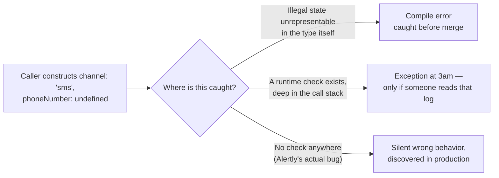

import LevelIntro from "../../../components/LevelIntro.astro";
import Checkpoint from "../../../components/Checkpoint.astro";

L1 named Alertly's bug: `sendAlert()` accepted `channel: "sms"` with no
`phoneNumber` and ran anyway. This level builds the mental model for
_why_ that's a design failure, not a documentation gap, and gives you
the tools to shape a signature so the same mistake becomes impossible
to write.

<LevelIntro
  items={[
    "How parsing at the boundary replaces scattered validation",
    "A checklist of defensive-design moves and what each one prevents",
    "Where a bad call actually gets caught, and why that location matters",
  ]}
/>

## Why doesn't a runtime check just fix this?

Alertly's real code, underneath the missing-phone-number bug, almost
certainly _did_ have a check somewhere: an `if (channel === "sms" &&
!phoneNumber)` guard, buried a few calls deep inside the SMS provider
client. **If the check existed, why didn't it save Maya's page?**

Because the check ran inside a `try/catch` written for a different
purpose — swallowing transient network errors from the SMS provider so
one flaky send doesn't crash the whole alerting pipeline — and the
missing-phone-number error got caught by the same broad `catch`,
logged at `debug` level, and dropped. The check was real. Its
_placement_ made it powerless: by the time the invalid state reached
that check, it had already traveled through several layers of code
that all treated it as valid data.

This is the general problem with runtime validation deep inside a
call stack: **every layer between the caller and the check has to
either re-validate or blindly trust that someone upstream already
did** — and "blindly trust" is exactly what happened here.

## The fix: parse at the boundary, not validate throughout



**Parse, don't validate** means: instead of passing a loosely-shaped
bag of optional fields (`channel`, `emailAddress?`, `phoneNumber?`,
`deviceToken?`) all the way through the system and hoping every layer
re-checks it correctly, write **one** function at the boundary —
right where external input enters — that converts that loose shape
into a new type that _cannot_ represent an invalid combination. Every
function after that parse step takes the new type, not the loose one,
so there is nothing left to re-validate: the type itself is the proof
that the data is already good.

- **Validating** asks "is this data okay?" and returns a
  yes/no (or throws), but the original loosely-typed data is what
  continues downstream — its "okay-ness" isn't remembered by anything
  the type system can see.
- **Parsing** asks "can I build a `ValidatedAlertChannel` out of this?"
  and either succeeds (producing a value only that constructor can
  produce) or fails loudly, right there, before anything downstream
  ever sees the loose shape at all.

<Checkpoint question="Alertly's SMS check existed but got swallowed by an unrelated try/catch three layers deep. If that same check had instead lived in a parse step at the very boundary where sendAlert() first receives its arguments, would the try/catch three layers deep still have been able to swallow it?">

No — and that's the actual mechanism, not a coincidence. A parse
step at the boundary runs (and can throw or reject) _before_ the data
is ever handed to the SMS-sending code that contains the broad
`try/catch`. Moving the check earlier doesn't just make it "more
likely to run" — it removes the swallowing catch block from being
anywhere in the code path between the invalid input and the failure.
The check's power came from being un-bypassable at the boundary, not
from being more thorough than the deep check was.

</Checkpoint>

## A checklist of defensive-design moves

Each move below targets a specific way a permissive signature invites
misuse. **What breaks if you skip it?** — asked for each one, because
that's the actual test of whether it applies to a given API, not
whether it's on a list.

| Move                          | What it prevents                                              | Skip it, and...                                                                               |
| ----------------------------- | ------------------------------------------------------------- | --------------------------------------------------------------------------------------------- |
| **Fail fast at the boundary** | A bad input traveling inward before anyone notices            | The failure surfaces far from its cause, or never, like Alertly's swallowed check             |
| **Minimal surface area**      | Combinatorial misuse from too many optional knobs             | Every added optional parameter roughly doubles the number of combinations a caller could pass |
| **Least astonishment**        | A call doing something other than what its name/shape implies | Callers guess at behavior instead of reading a signature that already tells them              |
| **Sensible defaults**         | An unsafe behavior being the path of least resistance         | The convenient call (fewest arguments) becomes the dangerous one                              |
| **Avoid the boolean trap**    | Ambiguous, unlabeled flags at the call site                   | `sendAlert(id, msg, true, false)` — which flag is which, six months later?                    |
| **Avoid stringly-typing**     | Typos and unsupported values compiling cleanly                | `channel: "sm"` (typo) is accepted exactly as happily as `channel: "sms"`                     |

## Illegal states unrepresentable, mechanically

**How does a type system actually make an invalid combination
_impossible_ to construct, not just harder?** The tool is a
**discriminated union** (also called a tagged union or sum type): a
type that can only be _one_ of a fixed set of shapes, each carrying
exactly the data that shape needs, with a tag field the type checker
uses to know which shape it's looking at.

Instead of one type with every field optional —

```
{ channel: string, emailAddress?: string, phoneNumber?: string, deviceToken?: string }
```

— a discriminated union says: this value is _either_ an email alert
(and therefore definitely has an `emailAddress`), _or_ an SMS alert
(and therefore definitely has a `phoneNumber`), _or_ a push alert (and
therefore definitely has a `deviceToken`) — never a mix, never a
mismatch, never a channel with none of them set. A value that claims
to be `"sms"` and carries a `phoneNumber` is the _only_ shape the
`"sms"` tag can have. There is no field slot left for a phone number
to be missing from, because a value tagged `"sms"` was never
constructable without one.

This is the same idea as an `enum` restricting a variable to a fixed
set of values, extended one step further: each branch of the union
doesn't just restrict _which value_ is allowed, it restricts _which
other fields exist at all_.

## The trade-off this unit doesn't get to skip

A stricter, parsed, union-typed API is safer — and it is also more
work to define, and mildly more ceremony to call correctly for the
first time (a caller now has to pick a specific shape up front, rather
than filling in whatever fields they have and hoping). **Is that
trade always worth making?** Not automatically — an internal helper
called from three places you control has a different risk profile
than a public library called from code you'll never see. L3 works the
full redesign in real code, including where this trade genuinely
starts to cost more than it's worth.

## Key terms

- **Discriminated union** — a type that can only be one of a fixed set
  of shapes, each identified by a tag field, each carrying only the
  data that shape needs.
- **Boundary** — the point where external or loosely-typed input first
  enters a system (a function's outermost signature, an API's request
  parser) — where a parse step belongs.
- **Combinatorial misuse** — the way the number of possible (mostly
  invalid) argument combinations grows with each additional optional
  or boolean parameter.
