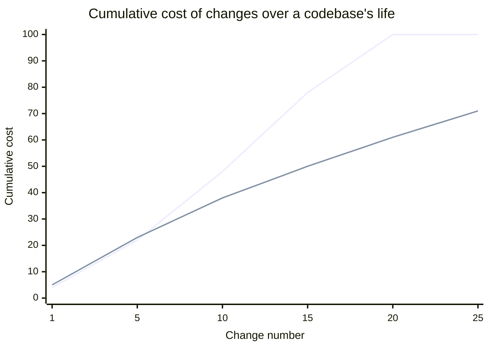

## The cost curve design quality is trying to bend



Both lines start at roughly the same place — early changes cost about the same regardless of design quality, which is exactly why the cost of bad design is easy to miss at first. The poorly-designed line curves upward (each change gets more expensive than the last, because it has to work around all the entanglement left by previous changes); the well-designed line stays closer to linear (each change costs roughly what the last one did, because the code's structure isn't actively fighting the next person).

## Coupling: how entangled two pieces of code are

```python
# High coupling — OrderService reaches directly into EmailService's
# internals and assumes a specific implementation detail (the exact
# SMTP client shape) rather than a stable interface.
class OrderService:
    def complete_order(self, order):
        email_service = EmailService()
        smtp_client = email_service.smtp_client  # reaching into internals
        smtp_client.send_raw(build_mime_message(order))
        # Any change to EmailService's internal structure now
        # potentially breaks OrderService too.

# Low coupling — OrderService depends only on a stable, narrow interface
class OrderService:
    def __init__(self, notifier):
        self.notifier = notifier  # any object with a .notify(order) method

    def complete_order(self, order):
        self.notifier.notify(order)
        # EmailService's internals can change freely — OrderService
        # only ever depended on the shape of `.notify()`.
```

The second version isn't "better" because it's shorter — it's better because the set of changes to `EmailService` that could break `OrderService` shrank from "almost anything" to "changing the meaning of `.notify()` itself," which is a much smaller, much more deliberate surface.

## Cohesion: whether a module's responsibilities actually belong together

```python
# Low cohesion — one class doing three unrelated jobs. Any of the three
# reasons to change it (billing logic changes, email copy changes,
# logging format changes) forces touching THIS file.
class OrderProcessor:
    def calculate_total(self, order): ...
    def send_confirmation_email(self, order): ...
    def log_analytics_event(self, order): ...

# High cohesion — split by reason to change, not just by "related enough"
class PricingCalculator:
    def calculate_total(self, order): ...

class OrderNotifier:
    def send_confirmation_email(self, order): ...

class AnalyticsLogger:
    def log_analytics_event(self, order): ...
```

The test for cohesion isn't "do these methods all touch `order` somehow" (they do, in both versions) — it's "do these methods change for the same reason." Pricing logic, email copy, and analytics schema are three genuinely independent reasons to change code, and bundling them means a change to any one risks introducing a bug in the other two, purely because they happen to live in the same file.

## Why these two properties determine the cost curve

Every future change to a codebase has to (1) figure out what else might be affected (harder under high coupling) and (2) touch only what's actually relevant to the change (harder under low cohesion, since unrelated logic is tangled into the same unit). High coupling and low cohesion don't cause bugs directly — they multiply the _cost and risk_ of every subsequent change, which is exactly the mechanism behind the diverging cost curve above.
