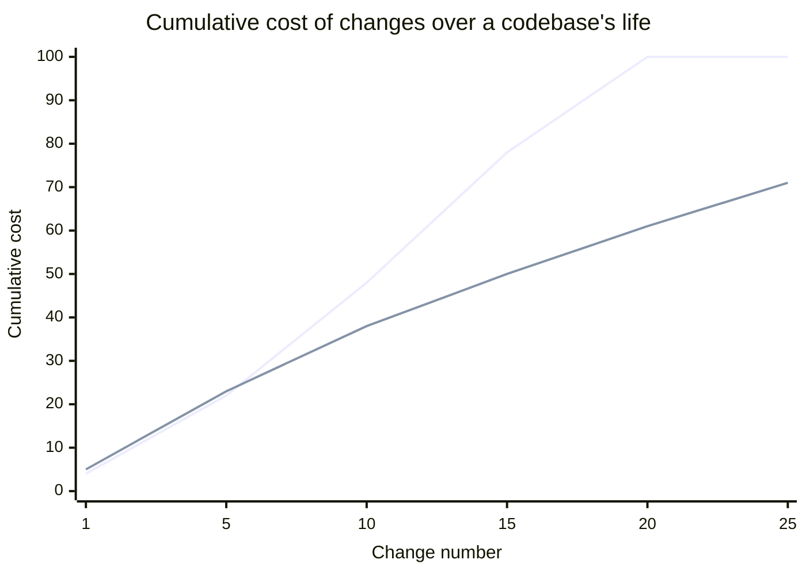

import Scenario from "../../../components/Scenario.astro";

<Scenario label="Two teams, same requirement">
  <Fragment slot="facts">
    <div class="not-prose flex flex-col gap-1.5 text-sm text-slate-700 dark:text-slate-300">
      <div class="flex items-center gap-1.5"><span>🔗</span> <strong>Team A</strong> — reaches into <code>EmailService</code>'s internals directly</div>
      <div class="flex items-center gap-1.5"><span>🧩</span> <strong>Team B</strong> — depends only on a stable <code>.notify()</code> interface</div>
    </div>
    <div class="not-prose mt-3 rounded border border-amber-300 bg-amber-50 p-1.5 text-xs dark:border-amber-800 dark:bg-amber-950">
      Both versions ship the identical feature today. The difference is invisible until something else has to change.
    </div>
  </Fragment>

Two teams independently build the same order-confirmation feature. Team A's
`OrderService` reaches directly into `EmailService`'s internal SMTP client
to send the confirmation. Team B's `OrderService` just calls
`notifier.notify(order)` on whatever object it was given. Both pass code
review. Both pass every test. Both ship this week.

**If both versions do the same thing today and both pass every test, what
question would actually tell you which one is the better design — and why
can't "does it work" answer it?**

</Scenario>

## The cost curve design quality is trying to bend



Both lines start at roughly the same place — early changes cost about the same regardless of design quality, which is exactly why the cost of bad design is easy to miss at first. The poorly-designed line curves upward (each change gets more expensive than the last, because it has to work around all the entanglement left by previous changes); the well-designed line stays closer to linear (each change costs roughly what the last one did, because the code's structure isn't actively fighting the next person).

## Coupling: how entangled two pieces of code are

**What actually makes Team A's version riskier than Team B's, if neither has a bug today?** It's the size of the surface that a future, unrelated change to `EmailService` could break.

```python
# High coupling — OrderService reaches directly into EmailService's
# internals and assumes a specific implementation detail (the exact
# SMTP client shape) rather than a stable interface.
class OrderService:
    def complete_order(self, order):
        email_service = EmailService()
        smtp_client = email_service.smtp_client  # reaching into internals
        smtp_client.send_raw(build_mime_message(order))
        # Any change to EmailService's internal structure now
        # potentially breaks OrderService too.

# Low coupling — OrderService depends only on a stable, narrow interface
class OrderService:
    def __init__(self, notifier):
        self.notifier = notifier  # any object with a .notify(order) method

    def complete_order(self, order):
        self.notifier.notify(order)
        # EmailService's internals can change freely — OrderService
        # only ever depended on the shape of `.notify()`.
```

The second version isn't "better" because it's shorter — it's better because the set of changes to `EmailService` that could break `OrderService` shrank from "almost anything" to "changing the meaning of `.notify()` itself," which is a much smaller, much more deliberate surface.

## Cohesion: whether a module's responsibilities actually belong together

**Two methods both touch the same `order` object — does that make them cohesive?** Not necessarily. The real test is whether they'd ever need to change for the same reason.

```python
# Low cohesion — one class doing three unrelated jobs. Any of the three
# reasons to change it (billing logic changes, email copy changes,
# logging format changes) forces touching THIS file.
class OrderProcessor:
    def calculate_total(self, order): ...
    def send_confirmation_email(self, order): ...
    def log_analytics_event(self, order): ...

# High cohesion — split by reason to change, not just by "related enough"
class PricingCalculator:
    def calculate_total(self, order): ...

class OrderNotifier:
    def send_confirmation_email(self, order): ...

class AnalyticsLogger:
    def log_analytics_event(self, order): ...
```

The test for cohesion isn't "do these methods all touch `order` somehow" (they do, in both versions) — it's "do these methods change for the same reason." Pricing logic, email copy, and analytics schema are three genuinely independent reasons to change code, and bundling them means a change to any one risks introducing a bug in the other two, purely because they happen to live in the same file.

## Why these two properties determine the cost curve

| Future change has to…                    | Harder under… | Because…                                                  |
| ---------------------------------------- | ------------- | --------------------------------------------------------- |
| Figure out what else might be affected   | High coupling | Dependents reach past the stable interface into internals |
| Touch only what's relevant to the change | Low cohesion  | Unrelated logic is tangled into the same unit             |

Every future change to a codebase has to (1) figure out what else might be affected (harder under high coupling) and (2) touch only what's actually relevant to the change (harder under low cohesion, since unrelated logic is tangled into the same unit). High coupling and low cohesion don't cause bugs directly — they multiply the _cost and risk_ of every subsequent change, which is exactly the mechanism behind the diverging cost curve above. **Team A and Team B's code both work today — the cost curve is what tells you, months from now, which team chose well.**
