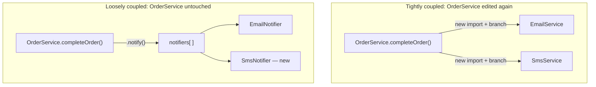

## The task: add a second notification channel

Both versions from L2 currently only send email. A new requirement arrives: also send an SMS notification for high-value orders. **Both versions can obviously implement this — so what's actually being measured here?** Not whether the feature ships (it will, either way), but how much of the existing class each version has to touch to make it happen. That's the moment the design cost becomes concrete and measurable, not theoretical.



In the coupled diagram, `OrderService` grows an edge to every new channel. In the decoupled diagram, `OrderService` only ever talks to the array — the new edge (`SmsNotifier`) attaches to `notifiers[ ]`, not to `OrderService` itself.

## Tightly coupled version: the change ripples

```js
// order-service-coupled.mjs
class OrderService {
  completeOrder(order) {
    const emailService = new EmailService();
    const smtpClient = emailService.smtpClient;
    smtpClient.sendRaw(buildMimeMessage(order));

    // Adding SMS means OrderService now has to know about a second
    // concrete service AND branch on business logic (order value) that
    // has nothing to do with "completing an order":
    if (order.total > 500) {
      const smsService = new SmsService();
      smsService.send(order.customerPhone, `Order ${order.id} confirmed`);
    }
  }
}
```

`OrderService` — a class whose job is "complete an order" — now directly imports and instantiates two unrelated concrete services, and contains a business rule about _when_ SMS applies that has nothing to do with order completion. Every future notification channel (push notification, Slack alert for internal orders, a new SMS provider after switching vendors) means editing this same method again, and the method's cyclomatic complexity (branches to reason about) grows every time.

## Loosely coupled version: the change is additive, not invasive

```js
// order-service-decoupled.mjs
class OrderService {
  constructor(notifiers) {
    this.notifiers = notifiers; // array of anything with .notify(order)
  }

  completeOrder(order) {
    for (const notifier of this.notifiers) {
      notifier.notify(order);
    }
  }
}

class EmailNotifier {
  notify(order) {
    /* build and send email */
  }
}

class SmsNotifier {
  notify(order) {
    if (order.total > 500) {
      /* send SMS */
    }
  }
}

// Wiring — the only place that changes to add a channel:
const orderService = new OrderService([new EmailNotifier(), new SmsNotifier()]);
```

`OrderService` itself is **unmodified** — zero lines changed in the class whose actual job is completing orders. The new SMS logic, including its own business rule about which orders qualify, lives entirely inside `SmsNotifier`, which is exactly where "does this order qualify for SMS" belongs — it's SMS-specific policy, not order-completion policy. Adding a fourth channel next quarter means writing one more small class and adding it to the array, never touching `OrderService`, `EmailNotifier`, or `SmsNotifier` again.

## What this proves, concretely

The coupled version required editing the core class and increasing its branching complexity for a change that is, conceptually, purely additive ("also notify via SMS"). The decoupled version made the same change without editing the core class at all — this is the cost curve from L2 made literal: the second design's "next change" cost stayed roughly flat, while the first design's grew, and it will keep growing every time a new channel is added, in exactly the same place, compounding.

## Measuring the cost, not just describing it

The `notifiers` interface also makes the cost curve from L2 something you can actually compute, not just eyeball. Here's a small utility that reproduces the compounding math behind that chart — the same one driving this unit's interactive demo below:

```js
// change-cost.mjs
//
// Models the cost of the Nth change to a codebase given a base cost and a
// per-change "coupling penalty" — the percentage by which each change gets
// more expensive than the last because it has to work around whatever the
// previous changes left behind. A penalty of 0 reproduces the decoupled
// OrderService above (every channel costs the same as the first). A
// positive penalty reproduces the coupled version (each channel's branch
// makes the next one harder to reason about).
function cumulativeChangeCost(numChanges, baseCost, couplingPenaltyPercent) {
  const growth = couplingPenaltyPercent / 100;
  let cumulative = 0;
  let costOfChange = baseCost;
  for (let i = 0; i < numChanges; i++) {
    cumulative += costOfChange;
    costOfChange *= 1 + growth;
  }
  return Math.round(cumulative * 100) / 100;
}

// Four notification channels, 2 hours to build the first one.
console.log(cumulativeChangeCost(4, 2, 0)); // 8   — decoupled: flat 2h each
console.log(cumulativeChangeCost(4, 2, 15)); // 10.23 — coupled: compounding 15% per channel
```

At 4 channels the gap is small enough to shrug off (8 hours vs. roughly 10). The reason this matters is what happens as the channel count keeps growing — which is exactly what the slider demo on this page lets you push further than four.

## Failure modes

| Failure mode                          | What it actually costs                                                          |
| ------------------------------------- | ------------------------------------------------------------------------------- |
| Over-engineering ahead of need        | Time spent on an abstraction that never gets used                               |
| "More files" mistaken for cohesion    | Navigation overhead with none of cohesion's benefit                             |
| Technical debt treated as binary      | Either paid down too eagerly, or left to compound past the point of easy repair |
| Refactoring with no change driving it | Real bug risk for a benefit that may never materialize                          |

- **Over-engineering ahead of a real need.** If this system will only ever have one notification channel, ever, building the `notifiers` array abstraction upfront is pure cost with no payoff — three similar lines of code are better than a premature interface, per this curriculum's own standing rule. The decoupled design is worth its added complexity specifically _because_ a second channel was a real, concrete requirement, not a hypothetical one.
- **Confusing "more files" with "better design."** Splitting `OrderProcessor` into three classes in L2 only helped because the three responsibilities genuinely change for different reasons. Splitting code into more files that all still change together for the same reason adds navigation overhead without buying any of cohesion's actual benefit — file count is not the metric, independent reasons to change is.
- **Treating technical debt as always bad, or always fine.** A tightly-coupled quick version shipped deliberately to hit a real deadline, with a plan to revisit it, is a reasonable trade — the same code left untouched for two years while three more channels get bolted onto it the same way is debt that's accrued real interest, and the refactor cost by then is much higher than doing it the second time it needed to change.
- **Refactoring for design purity with no change actually driving it.** Rewriting working, rarely-touched code to be "more decoupled" with no upcoming requirement that needs it spends real time and risk (any refactor can introduce a bug) for a benefit that only materializes if a future change actually arrives — matching design investment to expected future change, not applying it uniformly everywhere, is the actual skill this unit is teaching.

## This was one worked example, not the whole territory

Four notification channels, one `.notify(order)` interface — that's a small, deliberately legible case. **What changes if the new requirement isn't "add a channel" but "make SMS retry three times on failure, with exponential backoff, only for orders over $1,000"?** The decoupled design still doesn't touch `OrderService` — that logic is `SmsNotifier`-internal policy, same as the `order.total > 500` check already is. But it does mean `SmsNotifier` itself is no longer a two-line class; at some point _that_ class's own internal cohesion becomes the next thing worth questioning, using exactly the same test from L2 — do its responsibilities (building the message, deciding retry timing, deciding who qualifies) actually change for the same reason, or would a failure-handling change and an eligibility-rule change now step on each other inside the same file?
