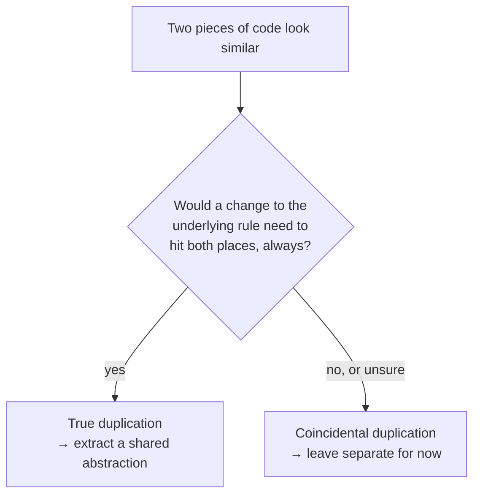

import LevelIntro from "../../../components/LevelIntro.astro";
import Checkpoint from "../../../components/Checkpoint.astro";

L1 named the two kinds of duplication and warned that treating a
coincidental one as if it were true duplication is where the next
problem — a forced, awkward abstraction — comes from. L2 works out the
actual test for telling them apart, and exactly what a forced
abstraction looks like once that distinction gets missed.

<LevelIntro
  items={[
    "The 'same reason to change' test",
    "The rule of three, and why it's evidence-based",
    "The concrete warning sign of a forced abstraction",
  ]}
/>

## The test that actually matters: do they change for the same reason?

**If two pieces of code look identical, isn't that already proof they
should be merged into one?** Not by itself — the real question DRY is
asking isn't "do these look the same," it's "do these represent the
same underlying rule, such that a change to that rule should always
apply to both places at once." Two functions can be byte-for-byte
identical today and still be **coincidental duplication** if they exist
for unrelated reasons — a tax calculation and a discount calculation
that both happen to multiply by a percentage and round to two decimals
aren't the same rule wearing the same shape; they're two different
rules that happen to look alike right now.

**Why does merging coincidental duplication cause a problem, if the
code was identical anyway?** Because "identical today" doesn't mean
"stays identical" — the moment one of the two rules needs to change and
the other doesn't, the shared function has to grow a branch, a flag, or
a parameter just to keep serving both callers. The abstraction didn't
prevent a second change; it just moved the second change _inside_ the
shared function instead of into a second, separate function — often
making that change harder, not easier, because now it has to avoid
breaking the first caller too.

## The rule of three

**So when is it actually safe to extract a shared function?** A common,
practical heuristic: tolerate duplication the first two times it
appears, and only extract a shared abstraction on the third occurrence
— by then there's real evidence of a pattern, not just a guess. Two
occurrences alone aren't enough evidence to know whether it's true or
coincidental duplication; a third occurrence, especially one that
reveals what actually varies between them, is what makes the shape of
the real abstraction visible.

| Occurrences | What to do                               | Why                                                                   |
| ----------- | ---------------------------------------- | --------------------------------------------------------------------- |
| 1           | Nothing — there's nothing to compare yet | A single instance can't be "duplicated"                               |
| 2           | Usually leave it, but take note          | Not enough evidence to know if it's the same rule or a coincidence    |
| 3+          | Extract, once the shared shape is clear  | Enough real instances to see what's actually constant vs. what varies |

<Checkpoint question="Two occurrences of near-identical code exist in the codebase today. Per the rule of three, should they be extracted into a shared function right now, and why or why not?">

No — not yet, even if they look identical. Two occurrences alone don't
give enough evidence to tell true duplication from coincidental
duplication: there's no third data point showing whether the "shape"
that's constant between them is actually the rule, or just a
coincidence of how each was first written. Extracting now means
guessing at the abstraction's boundary before a real third case has
shown what actually varies — exactly the premature-abstraction risk L1
flagged. The right move is to leave them separate but take note, and
extract only once a third occurrence arrives and makes the real shared
shape visible.

</Checkpoint>

## What a forced abstraction looks like

**What's the concrete warning sign that an abstraction was extracted
too early?** A parameter — often a boolean flag — that exists purely to
let the shared function branch internally between two callers that
don't actually share a rule. `calculateDiscount(price, qty, isBulk)`
branching on `isBulk` isn't one rule with a variation; it's two rules
stitched together with an `if`, and every future caller has to
understand both branches to safely use either one. This is the concrete
shape L3 works through in full — not just described, but built,
broken, and fixed.

<Checkpoint question="A function `formatPrice(amount, isRefund)` adds a minus sign when `isRefund` is true, otherwise formats normally. Using the warning sign just described, is this a forced abstraction, and what would you look for to decide?">

It depends on whether "refund" and "normal" formatting represent the
same underlying rule or two different ones, which the flag alone can't
answer — the same test as the discount example. If both cases are
truly just "format this number, optionally negate it" with nothing else
ever varying between them, the flag might be a legitimate, narrow
variation on one rule. But if refunds later need their own currency
symbol, rounding behavior, or display format that regular prices don't,
the flag is the same warning sign as `isBulk`: a sign that two rules
were stitched into one signature before there was evidence they'd
always change together. The flag itself isn't automatically
disqualifying — it's a prompt to check whether the two branches are
really one rule or two, the same question the rule of three is built to
answer with evidence instead of a guess.

</Checkpoint>

## The generalizable lesson

**Does DRY mean "never write similar-looking code twice"?** No — DRY is
about knowledge, not text. Two pieces of code can look completely
different and still violate DRY if they encode the same business rule
in two places (a discount cap defined as `100` in one file and `1.0` as
a fraction in another, both meant to represent "never discount more
than the full price"). Conversely, two pieces of code can look
identical and not violate DRY at all, if they represent genuinely
separate rules that happen to coincide today. The judgment call is
always about the underlying knowledge, not the surface-level text.
