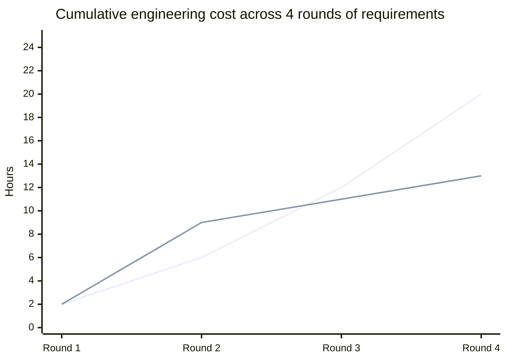

import Scenario from "../../../components/Scenario.astro";
import LevelIntro from "../../../components/LevelIntro.astro";

<Scenario label="Three rounds of new requirements hit the same pricing engine">
  <Fragment slot="facts">
    

      

        🧾 <strong>Round 1</strong> — one if-statement, 10%
        discount over $500. Cheap, no seam needed.
      

      

        🐛 <strong>Round 2</strong> — a coupon rule stacked on
        top produces a silent order-of-operations bug.
      

      

        🔌 <strong>Fix</strong> — extract a `PricingRule` list;
        the function itself never changes again.
      

      

        ✅ <strong>Round 3</strong> — two more rules just get
        appended. Zero lines of existing logic touched.
      

    

  </Fragment>

**A pricing function at a small invoicing startup starts as six honest
lines: subtotal, tax, done. A requirement lands — a 10% discount over $500 —
and one `if` handles it fine. Two months later, two more requirements land
close together: a coupon code, and a fee waiver for large orders. The
engineer bolts on two more `if` blocks, and a real bug slips in: depending
on which `if` runs first, the coupon lands on the pre-discount or
post-discount total, and nobody decided which one was correct.**

The team has two bad options on the table: freeze the design and refuse the
new requirement, or rewrite the pricing engine from scratch "to do it right
this time." Neither is what actually happened. What happened is the third
option this unit is about: the design **evolved** — reshaped just enough,
right when the second real requirement showed up, so the next one slots in
without a fight.

</Scenario>

<LevelIntro
  items={[
    "Evolutionary design vs. big-upfront-design vs. rewrite-every-time",
    "The open-closed principle: open for extension, closed for modification",
    "YAGNI vs. designing for change — and just-in-time seams",
  ]}
/>

## The three postures toward change

| Posture                     | What it assumes                                          | What breaks                                                                  |
| --------------------------- | -------------------------------------------------------- | ---------------------------------------------------------------------------- |
| **Big upfront design**      | You can guess, today, every axis the system will vary on | Guesses wrong about half the time; the unused flexibility still costs upkeep |
| **Rewrite on every change** | Each new requirement is cheap to re-derive from scratch  | Throws away working, tested logic; gets slower to redo as the system grows   |
| **Evolutionary design**     | You can't predict every axis, but you can react cheaply  | Requires noticing _when_ a second real variant justifies a seam              |

**Evolutionary design** is the practice of shaping (and reshaping) a
system's structure incrementally, in response to the requirements that
actually arrive — not the ones you imagine might arrive — so that each new
change is roughly as cheap as the last one, instead of getting more
expensive every round.

## The open-closed principle, in practice

- **Open for extension, closed for modification** — a module should let you
  add new behavior _without editing its existing, already-tested code_.
- In the pricing example: before the fix, every new rule meant opening
  `calculateTotal` and editing its body — modification. After the fix, a
  new rule is a new object appended to a list — extension. `calculateTotal`
  itself hasn't changed since round 2.
- This isn't a rule to apply everywhere on principle. It's a rule to apply
  **exactly where a second real variant has shown up** — not before (see
  below).

## YAGNI vs. designing for change

**You Aren't Gonna Need It** (YAGNI) says: don't build flexibility for a
requirement that hasn't arrived. **Design for change** says: shape the
system so future requirements are cheap. These sound opposed, but the real
skill is picking _which axis_ to protect — the one with actual signal now,
not every hypothetical:

- At round 1, there was exactly **one** discount rule. Building a
  `PricingRule` abstraction for one case would have been speculation — the
  YAGNI call was correct.
- At round 2, a **second, independent** variant arrived, plus a real bug
  caused by the lack of a seam. That's signal, not speculation — the seam
  earned its cost right there, not a moment earlier.

## Just-in-time seams

A **seam** is a point in the code where new behavior can be plugged in
without touching what's already there (an interface, a registered list, an
injected function). Evolutionary design introduces seams **just-in-time** —
when the second variant of something shows up — rather than speculatively,
at round 1, on a guess about what _might_ vary later.

The top line is the pricing engine kept as stacked `if` blocks — every new
rule interacts with every prior one, so cost compounds. The bottom line is
the same engine with the seam introduced right at round 2 (a one-time cost
bump, visible in the chart), after which each new rule is roughly flat.
Both start identical at round 1, because round 1 genuinely didn't need the
seam yet.
