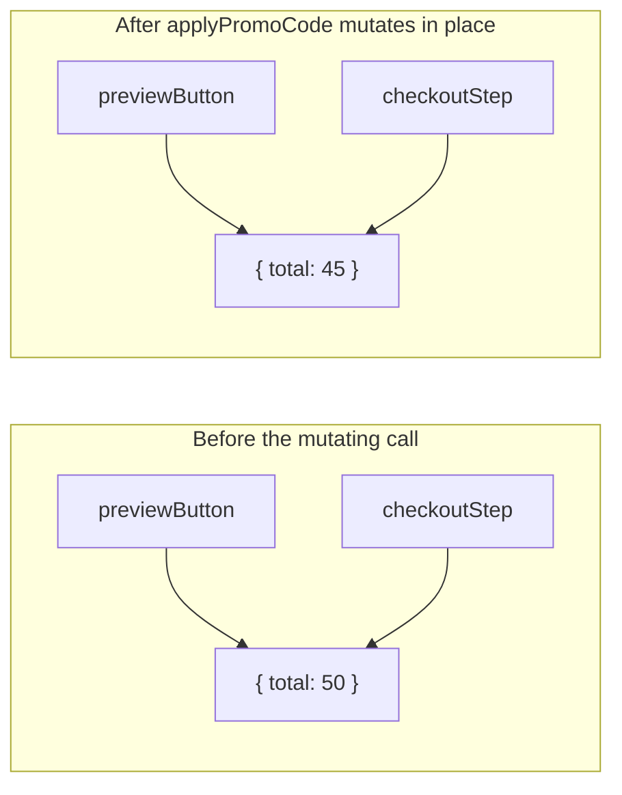
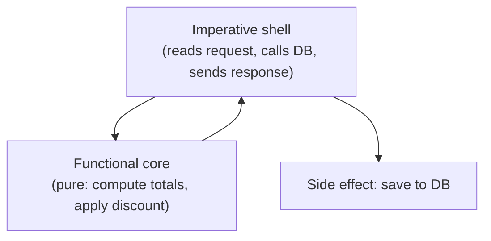

## Why aliasing turns a local change into action at a distance

**The preview button and checkout each call `applyPromoCode`
independently — so why does a change in one show up in the other?**
Because they were never holding two separate carts — they were both
holding a reference to the exact same object in memory. Mutating
"the cart" through one reference mutates the only cart that exists:

Both diagrams show the same underlying shape: `previewButton` and
`checkoutStep` were never two independent copies — they were always
two names for the same object. A function that mutates that object
changes what _every_ holder of that reference sees, whether or not
that holder ever called the function itself.

**Would `applyPromoCode` returning a new object instead of mutating
fix this, and why?**

| Approach                                | What happens on `applyPromoCode(cart, "SAVE10")`                      | Effect on other holders of `cart`                       |
| --------------------------------------- | --------------------------------------------------------------------- | ------------------------------------------------------- |
| Mutating (`cart.total *= 0.9`)          | The one shared object is changed in place                             | Every reference to it sees the change immediately       |
| Pure (`return { ...cart, total: ... }`) | A brand-new object is created and returned; the original is untouched | Other holders of the original `cart` see nothing change |

Returning a new object instead of mutating the shared one means the
preview button gets its own discounted copy to display, while
`checkoutStep`'s reference to the original cart is completely
unaffected until — and unless — something explicitly decides to use
the new, discounted version.

## What "pure function" actually requires

**Is a function pure just because it doesn't use `var` or classes?**
No — purity is about behavior, not syntax. A function is pure only if
both of these hold:

- **Same input, same output, always.** No hidden dependency on
  something that can change between calls (today's date, a random
  number, a database row) — call it twice with the same arguments and
  get the same result both times.
- **No observable side effects.** It doesn't mutate anything it was
  given, write to a file, make a network call, or change any state
  outside itself.

A function using `const` and arrow syntax that still does
`cart.total *= 0.9` is not pure — the syntax changed, the mutation
didn't.

## Managing the side effects a real program can't avoid

**If side effects are the problem, how does a real program ever save
anything to a database?** It can't avoid side effects entirely —
saving data, sending a request, logging, are the whole point of most
programs. The useful move isn't eliminating side effects, it's
**isolating** them: keep the actual calculation (discount math, order
totals) in pure functions, and push every side effect (writing to a
database, calling an API) to the thin outer layer that calls those
pure functions — a pattern often called **functional core, imperative
shell**.

The core never touches the database or the network — it just takes
data in and returns data out, which makes it trivial to test (call it
twice, expect the same result, no mocking required) and impossible
for it to cause the exact bug in this unit's Scenario, since it never
holds onto or mutates anything the caller still needs.

## Failure modes at this level

- **Assuming "functional-looking" code is automatically pure.** Using
  `map`/`filter`/arrow functions doesn't guarantee purity if the
  callback still mutates its argument or reaches out to shared state.
- **Mixing calculation and side effects in one function.** A function
  that both computes a total _and_ saves it to a database is harder
  to test and reuse than two separate functions, one pure and one
  not.
- **Treating immutability as free.** Returning a new object on every
  change has a real cost for large data structures — covered
  honestly in L3, not glossed over here.
