import Scenario from "../../../components/Scenario.astro";
import LevelIntro from "../../../components/LevelIntro.astro";

<Scenario label="A decision she won't be around to explain">
  <Fragment slot="facts">
    

      

        🗓️ <strong>Timeline</strong> — Renata rotates off this
        team in 6 months; the entitlements design has to outlive her.
      

      

        ⚡ <strong>Option A</strong> — a generic rule engine
        with its own mini config DSL. Fast, general, impressive.
      

      

        🧱 <strong>Option B</strong> — plain, named TypeScript
        rule objects. Slightly more boilerplate, no DSL to learn.
      

      

        🔁 <strong>The real question</strong> — not "which is
        cleverer," but which one someone with none of her context can safely
        change in two years.
      

    

  </Fragment>

**Renata is a staff engineer at Northlane, a project-tracking SaaS. She's
been asked to design how the product decides which features a given
workspace can use — plan tier, paid add-ons, and a handful of grandfathered
exceptions from old contracts. She has a working prototype that's genuinely
elegant: a small rule engine that reads entitlement logic from a JSON
config, written in a mini boolean-expression language she designed herself.
It's fast to extend — new entitlement logic ships as a config change, no
redeploy. She also has a second, plainer version: an ordered list of named
TypeScript functions, one per rule, doing the same job with no interpreter
at all. It's a little more code to add a new rule.**

**She also knows something the code review won't ask about: she's rotating
onto a different team in six months. Whoever inherits this file will not
have watched her build it, will not remember why the DSL looks the way it
does, and will be debugging it — if it breaks — with no one around who
designed it to ask.**

Every design decision has a blast radius and a shelf life. Most of the
decisions an engineer makes are cheap to undo and short-lived enough that
this barely matters. This unit is about the other kind: the ones that are
expensive to undo, live long past the person who made them, and get
inherited by someone with none of the context that made the decision feel
obvious at the time.

</Scenario>

<LevelIntro
  items={[
    "Legibility vs. cleverness as a design axis",
    "Why the code alone never shows the 'why'",
    "One-way doors vs. two-way doors as a caution dial",
  ]}
/>

## The vocabulary this unit uses

| Term                                   | What it means here                                                                                                                   |
| -------------------------------------- | ------------------------------------------------------------------------------------------------------------------------------------ |
| **Legibility**                         | How easily an average engineer with no prior context can read the design and correctly predict what it does                          |
| **Cleverness**                         | A design that's more compact, more general, or more impressive to build — but leans on insight only the original author reliably has |
| **ADR (Architecture Decision Record)** | A short written artifact capturing _what_ was decided, _why_, and _what alternatives were rejected and why_                          |
| **One-way door**                       | A decision that's expensive or impossible to reverse once other things depend on it                                                  |
| **Two-way door**                       | A decision that's cheap to reverse if it turns out to be wrong                                                                       |
| **Lock-in**                            | The state where reversing a decision now costs far more than making it did                                                           |

A design decision isn't good or bad in isolation — it's good or bad _for
who has to live with it, and for how long_. Northlane's rule engine isn't
wrong because it's clever; a config-driven DSL is a legitimate, well-known
pattern. It's risky here specifically because of who inherits it and when
Renata stops being available to explain it.

## Why this differs from sizing a shortcut or evolving one module

This isn't about picking the cheapest shortcut for a deadline (that's a
bounded, one-off cost/benefit call), and it isn't about the ongoing
technique of reshaping one module as requirements change while you're still
around to do it (that's a continuous, in-project skill). This is the
judgment call underneath both: choosing a design's fundamental shape
knowing you personally will not be there to defend it, explain it, or fix
it when someone else gets it wrong — which changes what "good design" even
means. A design that's fine as long as its author is reachable is not,
by that fact alone, a fine design.

## The shape of the answer

Four moves this unit builds out in L2 and L3:

- **Prefer legible over clever** when the two are close in cost — optimize
  for the reader who has none of your context, not for your own elegance.
- **Write down the why, not just the what** — an ADR that survives you,
  recording the alternatives you rejected and why, since the code alone
  never explains itself.
- **Spend caution in proportion to reversibility** — treat one-way doors
  (hard to undo once adopted) with far more scrutiny than two-way doors
  (cheap to reverse if wrong).
- **Watch for lock-in creeping in from the edges** — a decision that starts
  reversible can quietly become permanent as more things come to depend on
  it, long after the decision itself was made.

```mermaid
xychart-beta
  title "Two designs, cost over time"
  x-axis ["Ship it", "+6 months", "+1 year", "+2 years"]
  y-axis "Relative cost to the team" 0 --> 10
  bar [3, 4, 4, 4]
  bar [2, 5, 8, 9]
```

The first bar series is the plain, legible design: a little more work up
front, flat afterward. The second is the clever DSL: cheaper to ship, but
its cost climbs every time someone who isn't Renata has to change it
without her there to ask.
