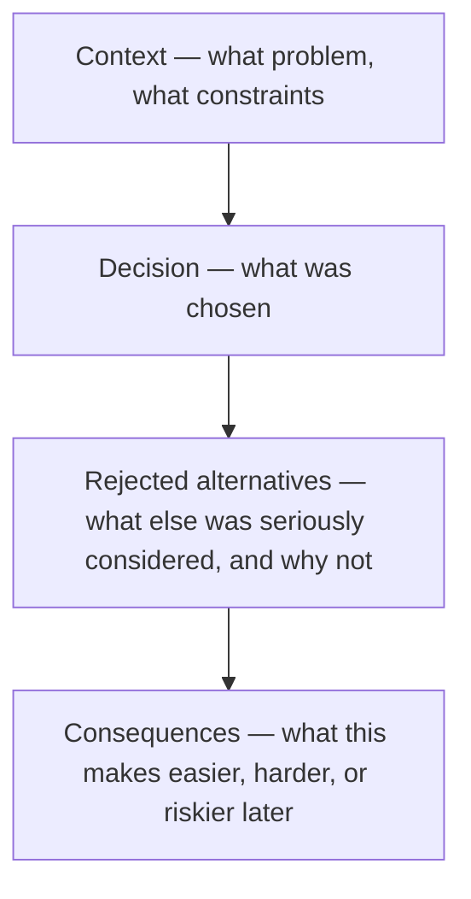

import LevelIntro from "../../../components/LevelIntro.astro";
import Checkpoint from "../../../components/Checkpoint.astro";

L1 named four moves: prefer legible over clever, write down the why,
spend caution in proportion to reversibility, and watch for creeping
lock-in. This level builds the mental model behind each one, in the order
Renata would actually apply them.

<LevelIntro
  items={[
    "Legibility as a design criterion, not a style preference",
    "The one-way-door / two-way-door lens for spending caution",
    "How lock-in creeps in after a decision is already made",
  ]}
/>

## Why does "it works" stop being enough here?

Renata's DSL-based rule engine works. It passes every test. So why isn't
"it works, and it's elegant" a sufficient bar for this decision the way it
would be for a two-week feature?

**Because "works" only measures the present, and this decision's real cost
shows up in the future — specifically, in a future where Renata isn't in
the room.** A design that works today but requires its original author's
memory to safely extend hasn't actually solved the long-term version of the
problem; it's deferred a chunk of the cost onto whoever inherits it, who
will pay it with less context and less help than Renata has right now.

This reframes the design question. It's not "what's the best design I can
build," it's **"what's the best design a stranger, arriving after I'm
gone, can safely operate and extend?"**

## Legibility over cleverness

**What makes the DSL clever, concretely?** It compresses a lot of logic —
tier checks, add-on checks, grandfathered exceptions — into short config
strings like `tier >= "pro" AND (addon("analytics") OR legacy("v1-bundle"))`.
One person, who designed the grammar, can read that fluently. Everyone else
has to first learn a small language that exists nowhere outside this one
codebase, with no IDE support, no type-checking, and error messages that
come from a hand-rolled parser.

**What does the plain version cost instead?** More lines. Each rule is its
own named function:

```ts
const proTierAnalytics: EntitlementRule = {
  name: "pro-tier-analytics",
  applies: (ctx) =>
    ctx.plan.tier === "pro" &&
    (ctx.addons.includes("analytics") ||
      ctx.legacyBundles.includes("v1-bundle")),
};
```

More verbose, yes. But every reader of this codebase already knows how to
read a TypeScript function — nobody has to learn Renata's grammar first,
and a typo produces a compiler error instead of a runtime parse failure in
production.

**The trade Renata is actually making**: cleverness buys compactness and
speed of change _for someone who already understands the design_.
Legibility buys correctness and speed of change _for someone who doesn't_.
The question that decides between them is who, on average, is going to be
doing the changing — and for a design meant to outlive its author, the
honest answer is almost always "someone who doesn't have your context."

<Checkpoint question="Renata's DSL is objectively more powerful — it can express entitlement logic the plain TypeScript version genuinely cannot without more boilerplate. Does that make it the better long-term design?">

Not by itself. Power and legibility are answering different questions —
power asks "what can this design express," legibility asks "who can safely
change what it already expresses." A design that's more powerful than the
team actually needs, at the cost of being readable only by its author,
spends capability the team didn't ask for and will keep paying for after
the author leaves. The right call depends on whether Northlane's
entitlement logic genuinely needs the DSL's extra expressiveness (a real,
current requirement) or whether the plain version already covers every
rule anyone has actually asked for — in which case the DSL's extra power
is speculative, and its legibility cost is being paid for nothing.

</Checkpoint>

## Why the code alone doesn't tell the next person "why"

**Suppose Renata picks the plain, legible design. Two years from now, a new
engineer — who never met her — wants to add a `tier >= "enterprise"` check
and, seeing how tidy a small DSL would be for combining several
conditions, proposes reintroducing one. Nothing in the code stops them.
What's missing?**

The code shows _what_ was built. It has never, in the history of software,
reliably shown _why one alternative was chosen over another that also
would have worked_ — that reasoning lived in Renata's head, a Slack thread,
or a meeting nobody wrote down, and all three evaporate long before the
code does.

This is what an **ADR (Architecture Decision Record)** is for: a short,
durable document, checked in next to the code, that captures the decision,
the alternatives that were seriously considered, and _why they were
rejected_. Not a design doc written for approval before the fact — a
record written to answer a question someone will actually ask after the
fact: _"why didn't we just do the obvious clever thing?"_

A minimal ADR has four parts:



The **rejected alternatives** section is the part teams skip most often,
and the part that matters most here — it's the only place that pre-empts
the exact question a future engineer will ask when they rediscover the
"obvious" clever option Renata already considered and turned down.

## Reversibility: not every decision deserves the same caution

**Renata also has to decide how much process this decision deserves — a
quick Slack message, a full design review, something in between. How
should she decide that, instead of guessing?**

Not every design decision carries the same risk if it turns out wrong.
Some are cheap to reverse — swap the implementation, nobody outside the
module notices. Others get expensive to reverse fast, because things start
depending on them. Amazon's well-known framing calls these **two-way
doors** (walk back through, low cost) and **one-way doors** (a real
commitment, once taken).

| Question                                               | Two-way door           | One-way door                                    |
| ------------------------------------------------------ | ---------------------- | ----------------------------------------------- |
| Can it be changed without touching other teams' code?  | Yes                    | No — others build on top of it                  |
| Does it define a format/protocol others will write to? | No                     | Yes (a config DSL, a wire format, a public API) |
| Cost to reverse in year 1 vs. year 2                   | About the same         | Much higher in year 2                           |
| How much scrutiny does it deserve now?                 | Ship it, learn, adjust | Slow down — get a second opinion                |

Renata's DSL is a one-way door disguised as a two-way one. In isolation, a
rule engine is "just an implementation detail" — swappable, in principle.
But the moment other services start writing entitlement config _in that
DSL's syntax_, the syntax itself has become a contract. Reversing it later
doesn't mean editing one file; it means rewriting every config string
anyone has written since. The plain TypeScript version has no such
syntax to leak — "reversing" it later is just refactoring functions, which
every engineer already knows how to do safely.

**This is the practical use of the door framing: it tells Renata how much
caution to spend, before she's committed.** A two-way door she can decide
alone and adjust later. A one-way door earns a second reviewer, an ADR,
and — per L1 — extra weight toward the legible option, precisely because
getting it wrong is expensive to fix once it's wrong.

<Checkpoint question="A junior engineer on Renata's team argues the DSL is actually a two-way door, since 'we can always just delete the interpreter and rewrite the rules in TypeScript later.' What's wrong with that argument?">

It's true that Renata's own team could delete the interpreter — but
reversibility isn't about whether the _original owner_ could technically
undo their own code, it's about what undoing the decision costs once other
parties have built on top of it. By the time anyone wants to reverse it,
other services will likely have entitlement rules written as DSL config
strings, possibly stored in a database, possibly referenced from
onboarding docs or admin tooling. Deleting the interpreter doesn't delete
those dependents — it breaks them. The door isn't measured by "can the
code be changed," it's measured by "what has come to depend on the
decision by the time someone wants to change it."

</Checkpoint>

## Lock-in: the cost that arrives after the decision, not at it

**If the DSL is risky specifically because other things end up depending
on it, when exactly does that risk materialize — at the moment Renata ships
it, or later?**

Later — and that delay is exactly what makes lock-in dangerous. On day one,
the DSL has zero dependents; reversing it would cost almost nothing. The
risk doesn't live in the decision itself, it lives in the slope: every
week the DSL stays in production, a few more config strings get written
in it, a few more engineers learn its quirks instead of learning nothing
because there was nothing special to learn, and the cost of reversing it
climbs. A decision that looked reversible in month one can be functionally
permanent by month eight — not because anything changed about the
decision, but because everything around it changed instead.

This is why the earlier framings matter _before_ shipping, not after: a
staff engineer's real leverage over a one-way door is at the moment it's
still cheap to walk back, which is always earlier than it feels necessary
to check.

## What L3 does with this

L3 works Renata's actual decision end to end: both interface designs in
real TypeScript, a full worked ADR for the choice she makes, and where
"prefer legible" can be taken too far — plus a look at a one-way door that
looked two-way right up until it wasn't.
