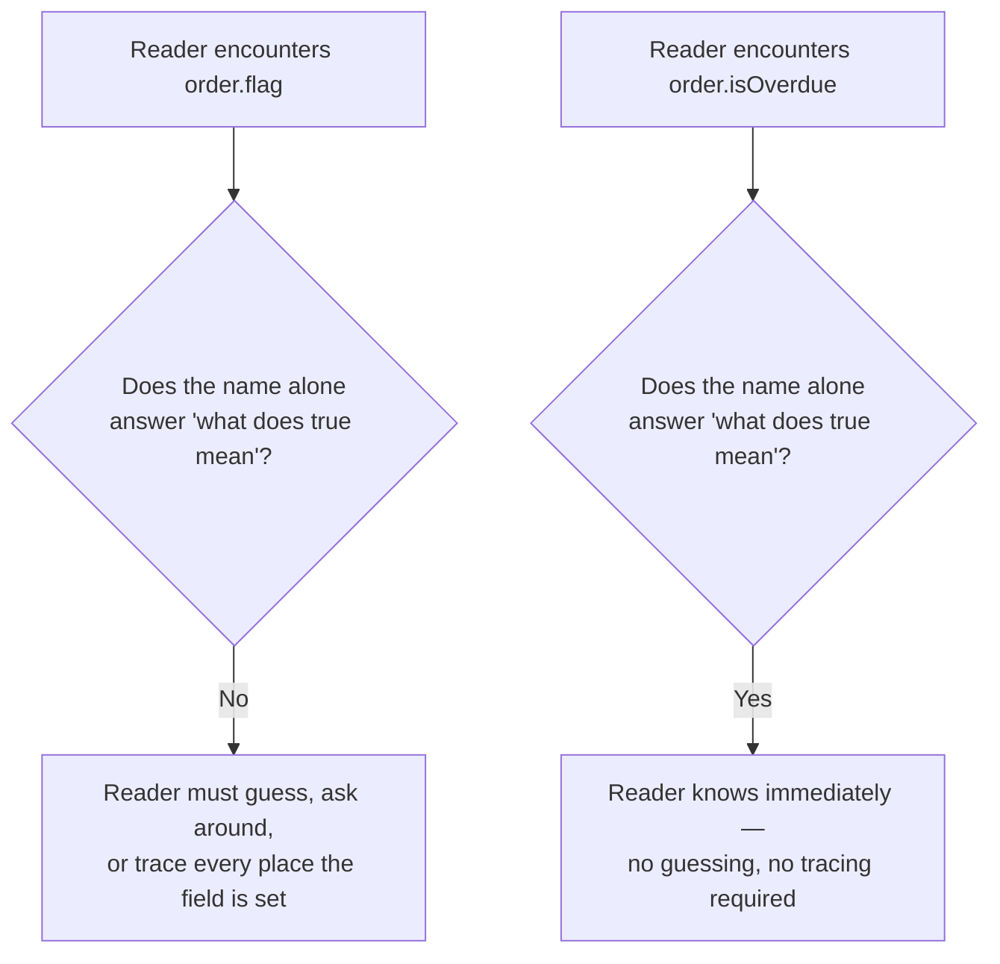

## What makes a name "intention-revealing"?

**`order.flag` and `order.isOverdue` are both valid JavaScript identifiers
— so why does only one of them actually communicate anything?**



An intention-revealing name answers the question a future reader will
actually ask — "what does this represent," "what does `true` mean here,"
"what happens if I call this" — directly in the name itself, without
requiring the reader to open the implementation or ask a colleague.
`flag`, `data`, `temp`, `value`, `handle` all fail this test not because
they're short, but because none of them answer any of those questions.

## Negation compounds ambiguity

**Why is a boolean named `isNotDisabled` harder to use correctly than one
named `isEnabled`?**

```text
if (!order.flag)              // Step 1: what does flag mean?
                               // Step 2: now negate that meaning
                               // Two chances to get it wrong, not one

if (order.isOverdue)          // One question, one answer, no negation
if (!order.notificationsMuted) // Negation of an already-clear name is
                               // still one clear question: "is it muted?"
```

Negation itself isn't the problem — `!order.notificationsMuted` is
perfectly readable because the underlying name is unambiguous. The
problem is negation stacked on top of an _already ambiguous_ name, which
forces a reader to resolve two uncertain things in sequence instead of
one. The practical rule: name booleans so they read as a direct, positive
assertion (`isX`, `hasX`, `canX`) — negating a clear assertion stays
clear; negating an unclear one compounds the confusion.

## Structure as documentation: extraction over comments

**If `calculateOrderTotal` does three distinct things — sum items, apply
a discount, add tax — is a comment above each step the right way to
explain that?**

```text
Comments describing steps in one long function:
  // sum up the items
  ... code ...
  // now apply the discount
  ... code ...
  // finally add tax
  ... code ...

Extracted, named functions:
  subtotal = calculateSubtotal(items)
  afterDiscount = applyDiscount(subtotal, discountPercent)
  total = addTax(afterDiscount, taxRate)
```

A comment describing what a block of code does is a translation layer
that can silently drift out of sync with the code beneath it — nothing
stops the code from changing while the comment stays the same. An
extracted, well-named function _is_ the description, and it can't drift,
because the function's name and its behavior are the same artifact. This
doesn't mean comments are never useful — they're valuable for explaining
_why_ something non-obvious is done a certain way, a fact the code itself
can't express — but "what does this block do" is usually better answered
by giving the block a name than by describing it from the outside.

## The generalizable lesson

**Is the goal to eliminate every short or generic-sounding name from a
codebase?** Not quite — a variable scoped to three lines inside a small,
obviously-named function (`i` in a simple loop) rarely needs a long name,
because its entire meaning is visible in that small scope. The real
question is **how far a name has to travel and how much context surrounds
it** — a name shared across teams, stored in a database, or exposed in a
public interface carries much more risk from ambiguity than a name that
lives and dies within five visible lines, and deserves proportionally more
care.
