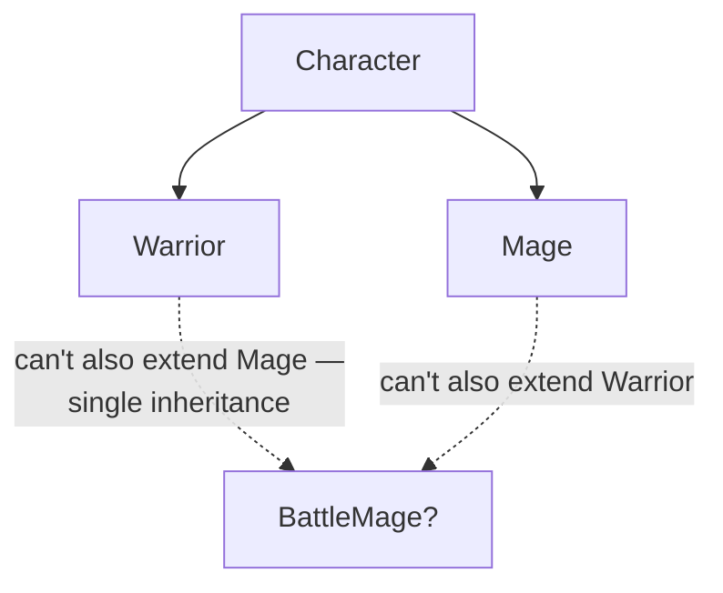
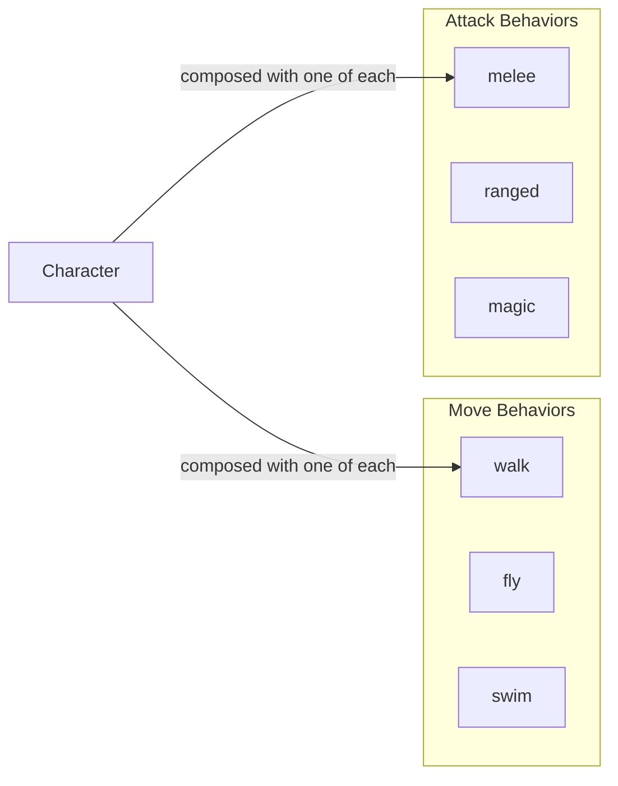
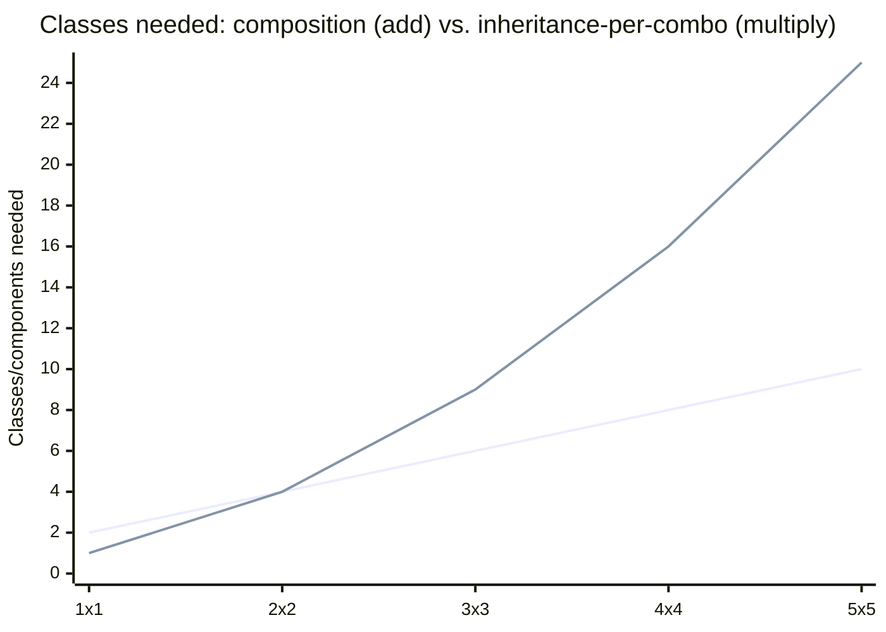

## One axis of variation vs. two

**If `Warrior` and `Mage` each needed only one thing to vary —
attack style — why did adding a second axis (needing melee AND magic
together) break the design?** Single inheritance can cleanly
represent _one_ axis of variation as a tree, because every subclass
picks exactly one branch:

The dotted lines aren't valid inheritance — they represent the two
directions `BattleMage` would need to reach, and single inheritance
only allows reaching in one direction. The tree shape itself is the
constraint: a tree has exactly one path from any node back to the
root, which is exactly wrong for something that needs to combine two
independent capabilities rather than pick one.

## Composition: behaviors as interchangeable parts, not inherited branches

**If the tree shape is the problem, what shape actually fits "needs
both melee and magic"?** Not a tree — a set of independent parts that
get combined per-object, with no shared ancestry required between the
parts themselves:

A `Character` here doesn't inherit a movement style or an attack
style — it's handed one of each at construction time. A "Battle Mage"
isn't a special subclass at all; it's just a `Character` composed
with a melee behavior _and_ a magic behavior — composition doesn't
even require picking just one per axis, since nothing about "has-a"
limits an object to a single instance of a given kind of part.

## The combinatorial cost of modeling two axes as class hierarchies

**If a game eventually needs 3 movement styles and 3 attack styles,
how many classes does each approach need?** This is where the
difference stops being aesthetic and starts being a real maintenance
cost:

With composition, adding a new movement style or attack style costs
exactly one new component — the two lines are `n + m` (composition)
versus `n × m` (a subclass for every combination). At 3 styles each,
that's 6 components versus 9 subclasses; at 5 styles each, it's 10
versus 25. The gap isn't linear — it widens every time a new
independent axis of variation gets added, which is exactly the shape
of cost inheritance-per-combination produces and composition avoids.

## When inheritance is still the right tool

**Does this mean composition should always replace inheritance?** No
— inheritance is still the cleanest fit when there's genuinely one
axis of variation and the "is-a" relationship is stable. A
`SavingsAccount` and `CheckingAccount` both genuinely _are_ `Account`s
that share core behavior (`deposit`, `withdraw`) with small, focused
differences (interest calculation) — there's no second independent
axis threatening to combine with "account type" here, so a small,
shallow inheritance tree is simple and appropriate. The failure mode
isn't "using inheritance" — it's using inheritance for a relationship
that turns out to have more than one independent axis.

## Failure modes at this level

- **Reaching for inheritance as the default OOP tool.** Inheritance
  is one tool for one shape of problem (single, stable axis of
  variation) — treating it as the default for all object relationships
  is what produces the Battle Mage problem.
- **Building deep hierarchies to patch a combinatorial explosion.**
  Adding `FlyingBattleMage`, `SwimmingBattleMage`, and so on to cover
  every new combination is treating the symptom — the real fix is
  recognizing there are two independent axes and switching that part
  of the design to composition.
- **Over-correcting to composition everywhere.** A genuinely single-axis,
  stable "is-a" relationship (like the account example) doesn't need
  composition's extra indirection — reach for it when there's a real
  combinatorial or multi-axis problem to solve, not as a blanket rule.
