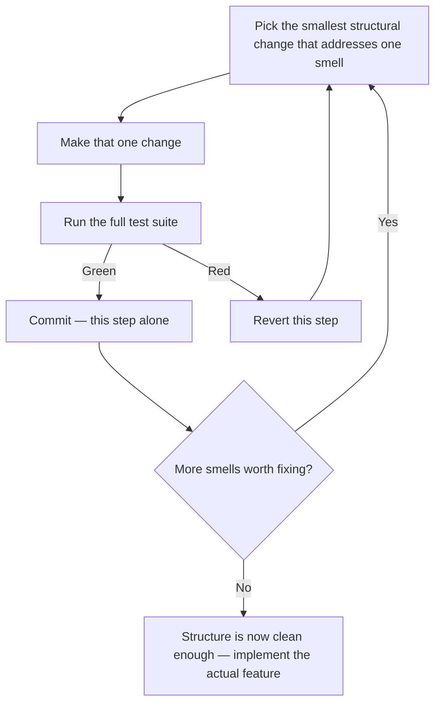

import LevelIntro from "../../../components/LevelIntro.astro";
import Checkpoint from "../../../components/Checkpoint.astro";

L1 named the discipline: refactoring changes structure without changing
behavior, and you need tests to even make that claim. This level works out
the mechanism — what a single safe step looks like, why it has to stay
small, and which specific moves fix which specific smells.

<LevelIntro
  items={[
    "The safe-refactor loop: one step, tests, commit or revert",
    "A catalog of core moves and the smell each one addresses",
    "Why a refactor and a behavior change can never share a commit",
  ]}
/>

## What makes one step "small enough"?

Dana could rewrite the whole `calculateOrderTotal` function in one sitting,
run the tests once at the end, and see if they still pass. Why is that
worse than doing it in six separate steps, each re-run against the tests?

If the one big rewrite fails a test, you know _something_ in 68 lines of
changed code broke it — but not what, and not where. If step 3 of six fails,
you know it's step 3, because steps 1 and 2 were already verified green. The
smaller the step, the smaller the space you have to search when something
breaks — and if it does break, reverting one step costs you minutes, not the
whole session's work.

That loop is the entire discipline. Every named "refactoring move" below is
just a specific answer to "what's the smallest change that fixes this one
smell" — never a license to also change what the code does while you're in
there.

<Checkpoint question="Dana's function has three smells: duplicated logic, deep nesting, and magic numbers. Should Dana fix all three in one commit, since they're all 'just cleanup' and none of them changes behavior?">

No — "none of them individually changes behavior" is exactly why they should
still be three separate commits, not one. Each smell fix is its own
step in the loop above: extract the magic numbers, run tests, commit; then
deduplicate the logic, run tests, commit; then flatten the nesting, run
tests, commit. Bundling all three into one commit throws away the one thing
small steps buy you — if something breaks, "which of these three changes did
it" becomes a search again, instead of already being answered by which
commit it was in. Small steps aren't about how much work happens between
commits; they're about how much has to be re-verified together if one of
them turns out to be wrong.

</Checkpoint>

## A catalog of core moves

These aren't the only refactoring moves that exist, but they cover most of
what a tangled function like Dana's needs, and each one maps to a specific
smell:

| Move                                              | What it does                                                                                   | Smell it addresses                                    |
| ------------------------------------------------- | ---------------------------------------------------------------------------------------------- | ----------------------------------------------------- |
| **Extract Variable**                              | Give a magic number or complex expression a name                                               | Magic numbers, unclear intent                         |
| **Extract Function**                              | Pull a self-contained chunk of logic into its own named function                               | Long function, mixed responsibilities                 |
| **Remove Duplication** (Extract + reuse)          | Replace repeated logic with one shared function, call it everywhere                            | Duplicated logic                                      |
| **Replace Nested Conditional with Guard Clauses** | Return/exit early for edge cases instead of nesting the main path inside them                  | Deep nesting                                          |
| **Replace Conditional with Lookup Table**         | Swap an if/else chain keyed on a value for a map/table keyed the same way                      | Deep nesting, repeated branching on the same variable |
| **Rename**                                        | Change an identifier to say what it actually holds/does                                        | Misleading names                                      |
| **Inline** (the reverse of Extract)               | Fold a function/variable back into its call site when the indirection no longer earns its cost | Needless indirection                                  |

Which of these would help most with Dana's three-times-repeated membership
check — Extract Variable, or Remove Duplication? It's Remove Duplication:
the problem isn't an unnamed value, it's the _same logic_, written three
separate times, that can now silently drift out of sync with itself.

## Why refactor and feature never share a commit

Here's the failure mode this rule exists to prevent: a pull request that
both restructures `calculateOrderTotal` **and** adds the loyalty discount in
one diff. A reviewer opens it and now has to hold two different questions in
their head at once — "is the restructuring behavior-preserving?" and "is the
new discount logic correct?" — with no way to check either one in isolation.
If a test fails, which of the two changes caused it?

Keeping them separate isn't bureaucracy, it's what makes each change
independently checkable: the refactor commits are checked against "did
behavior stay the same" (the existing tests, unchanged, still pass), and the
feature commit is checked against "is the new behavior correct" (new tests,
written for the new discount, now also pass). Mixing them collapses two
different verification questions into one commit that answers neither
cleanly.

<Checkpoint question="Dana's teammate argues: 'the loyalty discount only takes 10 extra minutes once the duplication is already cleaned up — why not just fold it into the same commit as the dedup refactor, to save a review round-trip?'">

Because the 10 minutes isn't the cost being weighed — the mixed diff is. A
reviewer (or Dana, three months later debugging a discount bug) can no
longer trust "the tests are green" as evidence that the refactor was safe,
because the tests are now also covering brand-new behavior that didn't
exist before either commit. If something's wrong with the loyalty discount
math, git blame and bisect both point at a commit that also touched
unrelated structural code, and vice versa if a structural change turns out
to have a subtle behavior leak. Saving one review round-trip isn't worth
losing the ability to independently verify either change — that's the whole
reason the discipline draws the line at the commit boundary, not at how much
total time the work takes.

</Checkpoint>

## When the loop isn't worth running

Small-step refactoring still costs time and attention, so it's worth naming
when _not_ to reach for it:

- **No tests, and no time to write them.** Refactoring without a safety net
  isn't cautious refactoring — it's an unverified rewrite wearing
  refactoring's name. Either invest in characterization tests first, or be
  honest that what's about to happen is riskier than a refactor.
- **The code is about to be deleted.** If the tangled function is scheduled
  to be replaced by a different system next sprint, cleaning it up now is
  effort spent on code with no future to pay it back.
- **Under a hard deadline with no room for a false start.** The loop's
  safety comes from being able to revert a bad step and try again — if there
  isn't slack for that, a smaller, more surgical change (even a slightly
  uglier one) can be the more honest choice than starting a refactor you
  might not have time to finish cleanly.

L3 works through Dana's actual function: the tests written first, six real
small steps with real diffs, and then the feature landing cleanly on top of
the cleaned-up structure.
