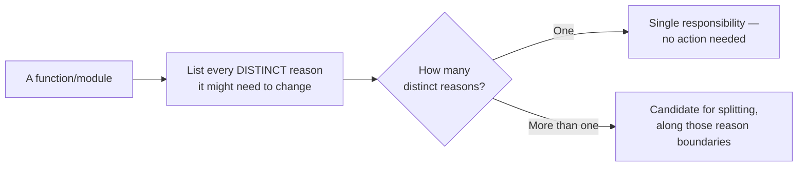

## The test, as a decision procedure



The word "distinct" is doing the real work here — "the validation rules changed" and "the validation _error messages_ changed" might genuinely be the same reason in a small system (one person owns both, they always change together) or genuinely different ones in a larger system (a compliance team owns validation rules, a UX writer owns error message wording, and they change on unrelated schedules) — the same code can have a correct single responsibility in one context and a real violation in another.

## A concrete example: one function, two reasons to change

```js
// BEFORE — one function, two independent reasons to change
function handleSignup(request) {
  // Reason 1: business validation rules
  if (!request.email.includes("@")) {
    throw new Error("Invalid email");
  }
  if (request.password.length < 8) {
    throw new Error("Password too short");
  }

  // Reason 2: response formatting
  return {
    status: "ok",
    data: { email: request.email.toLowerCase() },
    timestamp: new Date().toISOString(),
  };
}
```

A change to the password policy (say, requiring a special character) and a change to the response envelope's shape (say, adding an API version field) are two genuinely unrelated reasons to touch this function — a developer fixing the response format has to read past validation logic to find where to edit, and a developer changing validation logic risks the unrelated response-formatting code purely by proximity, not because the two are actually coupled in any meaningful way.

```js
// AFTER — split along the two independent reasons to change
function validateSignup(request) {
  if (!request.email.includes("@")) throw new Error("Invalid email");
  if (request.password.length < 8) throw new Error("Password too short");
}

function formatSignupResponse(request) {
  return {
    status: "ok",
    data: { email: request.email.toLowerCase() },
    timestamp: new Date().toISOString(),
  };
}

function handleSignup(request) {
  validateSignup(request);
  return formatSignupResponse(request);
}
```

`handleSignup` itself now has a single, different responsibility: orchestrating the two steps in the right order — which is itself a legitimate, single reason to change (if the _sequence_ of signup steps changes, e.g. adding a third step). Each of the three functions can now change independently: a validation rule addition touches only `validateSignup`, a response format change touches only `formatSignupResponse`, and neither risks the other.

## When NOT to split: the overcorrection

```js
// Over-split — three functions with no independent reason to change,
// just extra indirection for its own sake
function getEmailField(request) {
  return request.email;
}
function isValidEmailFormat(email) {
  return email.includes("@");
}
function validateEmail(request) {
  return isValidEmailFormat(getEmailField(request));
}
```

None of these three functions has a reason to change independently of the others — `getEmailField` only ever exists to feed `isValidEmailFormat`, and both only ever exist to implement `validateEmail`. Splitting here doesn't buy independent evolvability, because there's nothing independent about how these pieces actually change; it only adds three names to track and three extra jumps to follow when reading the code, which is real, ongoing cost with no corresponding benefit — precisely the over-engineering failure mode `cost-design` warns about.

## The boundary is about the codebase's actual change patterns, not code shape

The `handleSignup` split was worth it specifically because validation rules and response formatting are plausible candidates for changing independently, for different reasons, potentially owned by different people. The `validateEmail` over-split wasn't worth it because none of its three pieces have any independent existence — the test isn't "can this be split," almost anything can be split further; the test is "would splitting this actually let two different kinds of future change happen without touching each other's code."
