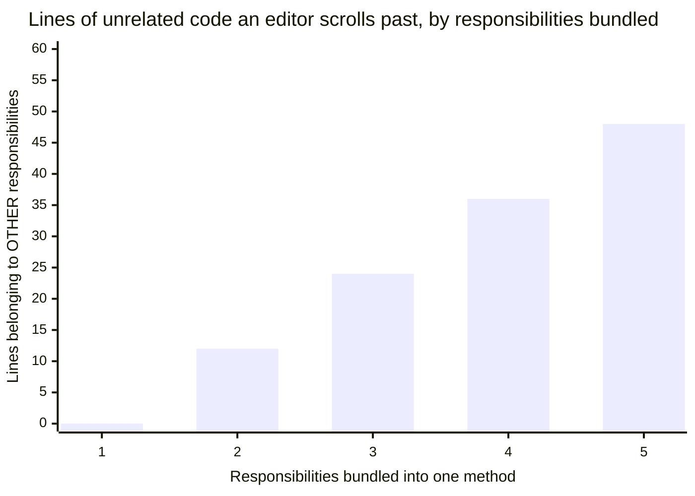
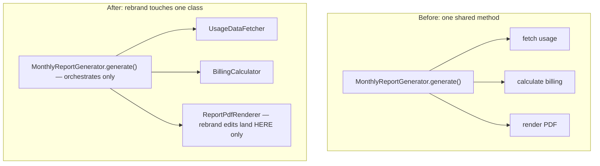

import LevelIntro from "../../../components/LevelIntro.astro";
import Checkpoint from "../../../components/Checkpoint.astro";

## The scenario: one class, three reasons to change, one real bug

A `MonthlyReportGenerator` class fetches usage data, calculates billing totals, and renders a PDF — three steps that all "belong to generating the report" in a surface reading, but represent three genuinely independent reasons to change: the data source might change (a new usage-tracking system), the billing calculation might change (a new pricing tier), and the PDF layout might change (a rebrand). **Before reading the incident, look at the code below and ask: if a rebrand landed tomorrow, which lines would someone actually have to scroll past to make it?**

```js
// BEFORE — three responsibilities, one class
class MonthlyReportGenerator {
  async generate(accountId, month) {
    // Reason 1: how usage data is fetched
    const usage = await db.query(
      "SELECT * FROM usage_events WHERE account_id = ? AND month = ?",
      [accountId, month],
    );

    // Reason 2: how billing is calculated
    const total = usage.reduce((sum, event) => {
      const rate = event.type === "api_call" ? 0.001 : 0.01;
      return sum + event.quantity * rate;
    }, 0);

    // Reason 3: how the PDF is laid out
    const pdf = new PDFDocument();
    pdf.fontSize(18).text("Monthly Report", { align: "center" });
    pdf.fontSize(12).text(`Total: $${total.toFixed(2)}`);
    return pdf;
  }
}
```

Every one of the three reasons above lives inside the same 15-line method, with no boundary between them — the fetch logic, the billing math, and the PDF layout are all just adjacent lines, indistinguishable in risk from one another to whoever is scrolling through to make an edit.

<LevelIntro
  items={[
    "A real incident traced back to a bundled responsibility",
    "How scroll-past risk scales with responsibilities per method",
    "The three-class split, and how it changes future edits",
  ]}
/>

## The incident this shape actually caused

A designer requests a rebrand: new fonts, new header layout, a logo added to the PDF. An engineer makes the change, editing the `generate` method's PDF-layout lines. While doing so, they accidentally also modify the adjacent billing-calculation line (a stray edit while navigating the same large method) — changing `0.001` to `0.01` for `api_call` events. The rebrand ships. Two weeks later, finance flags that API-call billing is 10x too high for every customer that month.

**The root cause isn't the typo itself — mistakes happen.** The root cause is that a rebrand (a PDF-layout-only change, made by someone focused on layout, likely a frontend-leaning engineer or even a designer pairing with one) required editing a method that also contained unrelated, financially-sensitive billing logic, sitting close enough in the same function to be touched by accident with no test isolating it from layout changes.

<Checkpoint question="The engineer who caused the incident never intended to touch billing at all. Given that, would adding a code-review checklist item ('did you mean to change the billing line?') have reliably prevented this bug — why or why not?">

Not reliably — a checklist depends on the reviewer noticing that an
unrelated line changed inside a diff that's mostly about layout, which is
exactly the kind of small, easy-to-miss edit that slips past review when
it's surrounded by dozens of legitimate layout lines in the same method.
A checklist adds a chance of catching it; separating the responsibilities
into different files removes the opportunity for it to happen in the same
diff at all. That's the real difference between a process fix and a
structural fix — the incident's actual root cause is that billing logic
was reachable from a layout-only change, and only a structural boundary
removes that reachability outright.

</Checkpoint>

## How the risk scales with how many reasons share one method



At one responsibility, there's no "other" code to accidentally touch — the risk is structurally zero. Each additional responsibility bundled into the same method adds another block of unrelated code sitting in the same scroll-past zone; `MonthlyReportGenerator` bundled three, meaning roughly two-thirds of the method's lines were irrelevant to any single change someone might come to make.

## The fix: split along the three actual reasons to change

```js
// AFTER — three responsibilities, three units, each independently testable and changeable
class UsageDataFetcher {
  async fetch(accountId, month) {
    return db.query(
      "SELECT * FROM usage_events WHERE account_id = ? AND month = ?",
      [accountId, month],
    );
  }
}

class BillingCalculator {
  calculateTotal(usageEvents) {
    return usageEvents.reduce((sum, event) => {
      const rate = event.type === "api_call" ? 0.001 : 0.01;
      return sum + event.quantity * rate;
    }, 0);
  }
}

class ReportPdfRenderer {
  render(total) {
    const pdf = new PDFDocument();
    pdf.fontSize(18).text("Monthly Report", { align: "center" });
    pdf.fontSize(12).text(`Total: $${total.toFixed(2)}`);
    return pdf;
  }
}

class MonthlyReportGenerator {
  constructor(fetcher, calculator, renderer) {
    this.fetcher = fetcher;
    this.calculator = calculator;
    this.renderer = renderer;
  }
  async generate(accountId, month) {
    const usage = await this.fetcher.fetch(accountId, month);
    const total = this.calculator.calculateTotal(usage);
    return this.renderer.render(total);
  }
}
```



The rebrand now only touches `ReportPdfRenderer` — `BillingCalculator`'s rate logic isn't in the same file, isn't visually adjacent, and can have its own dedicated, protected test suite (`billing-calculator.test.mjs`, testing rates directly) that a layout-focused PR wouldn't even run against unless it actually changed billing code. The bug that shipped in the "before" version becomes structurally much harder to cause by accident in the "after" version — not impossible, but no longer one stray line away in an unrelated part of a shared method.

<Checkpoint question="In the split version, MonthlyReportGenerator.generate() still calls all three classes in sequence. Does that mean it secretly still has all three responsibilities, just spread across method calls instead of inline code?">

No — `generate()`'s one responsibility is now orchestration: calling the
three collaborators in the right order. Its reason to change is different
from any of theirs: it changes only if the _sequence or composition_ of
steps changes (say, adding a fourth step, or caching the fetch), not if a
pricing rate or a font size changes. That's a real, single, distinct
reason to change, which is exactly what makes it a legitimate
responsibility of its own rather than a disguised bundle of the other
three — calling into other classes isn't the same as owning their logic.

</Checkpoint>

## Extend the example: what if the next request isn't a rebrand?

The rebrand is one case, not the whole territory. **What happens to the blast radius if the next request is instead "add a second pricing tier for enterprise accounts" — does the split still hold, and which class absorbs that change?** Trace it through the "after" version: a new pricing tier is a change to the rate lookup, which lives entirely inside `BillingCalculator.calculateTotal` — `UsageDataFetcher` and `ReportPdfRenderer` are untouched, and the engineer making the pricing change never has to scroll past a single line of PDF layout code to do it. The same question is worth asking for "the usage-tracking system migrates to a new event schema" (touches `UsageDataFetcher` only) — the split isn't just a fix for the one incident that happened to occur, it holds for any future change that maps to one of the three original reasons.

## Failure modes

| Failure mode                                                           | What it gets wrong                                                                                                                                                                                                                                                                                  |
| ---------------------------------------------------------------------- | --------------------------------------------------------------------------------------------------------------------------------------------------------------------------------------------------------------------------------------------------------------------------------------------------- |
| Believing the split alone prevents the bug                             | The refactor reduces the _chance_ of an accidental cross-responsibility edit — it doesn't make it impossible. The real protection is separation **plus** a dedicated billing test suite that would catch an incorrect rate regardless of which file it happened in                                  |
| Splitting only reactively, after an incident                           | The reasons-to-change test from L2 could have flagged this violation during the original code review, before any bug shipped, by simply asking "what are the distinct reasons this method might need to change"                                                                                     |
| Over-rotating after one incident into splitting everything defensively | Per L2's overcorrection warning, the lesson is "split along genuinely independent reasons to change," not "always prefer more, smaller classes" — applying that overcorrected lesson to code with no real independent-change pattern reintroduces the over-engineering cost for no matching benefit |
| Assuming this class of bug is rare enough not to worry about           | Editing unrelated code that happens to sit nearby is a common, easy mistake — not a rare, exotic one — which is exactly why responsibility boundaries matter as a structural safeguard, not just an aesthetic preference for how code reads                                                         |
