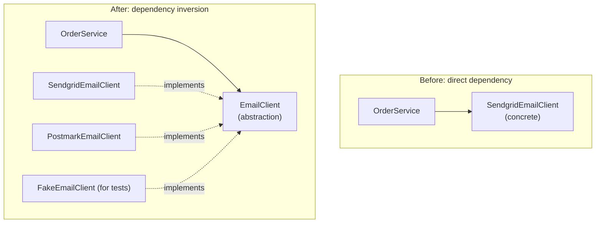

import LevelIntro from "../../../components/LevelIntro.astro";
import Checkpoint from "../../../components/Checkpoint.astro";

L1 named the fix in one sentence — depend on an abstraction, not a
concrete implementation — without yet showing what that changes
structurally. L2 works through exactly what moves, where the other four
SOLID principles fit around this one, and where applying it stops paying
for itself.

<LevelIntro
  items={[
    "The five SOLID principles, one line each",
    "What 'depend on an abstraction' changes structurally",
    "When dependency inversion isn't worth adding",
  ]}
/>

## The five principles, briefly

**Does fixing the ripple problem require mastering all five SOLID
principles at once?** No — the five principles address different
failure modes, and the scenario from L1 is specifically a dependency
inversion problem. Briefly, for context:

| Letter | Principle             | One-line idea                                                               |
| ------ | --------------------- | --------------------------------------------------------------------------- |
| S      | Single responsibility | A class should have one reason to change, not several unrelated ones        |
| O      | Open/closed           | Code should be extendable with new behavior without editing existing code   |
| L      | Liskov substitution   | A subtype should be usable anywhere its parent type is expected, safely     |
| I      | Interface segregation | Don't force something to depend on methods it doesn't actually use          |
| D      | Dependency inversion  | Depend on an abstraction, not a concrete implementation — this unit's focus |

<Checkpoint question="Each of the 12 classes from L1's scenario had exactly one reason to change on its own (a change to how it processes an order), yet the fix wasn't a single-responsibility fix. Why does this specific ripple point at dependency inversion rather than single responsibility?">

Single responsibility is about a class doing too many unrelated jobs
internally — that's not what went wrong here. Each of the 12 classes had
one clear job; the problem was that the job included deciding which
concrete vendor class to construct, and that decision was duplicated
identically in all 12 places. The failure mode is about _what a class
depends on and where that dependency gets decided_, not about how many
responsibilities live inside any single class — which is exactly the
distinction dependency inversion addresses and single responsibility
doesn't.

</Checkpoint>

## What "depend on an abstraction" means structurally

**In the L1 scenario, what specifically was each of those 12 classes
doing wrong?** Each one directly named `SendgridEmailClient` and
constructed it internally — the high-level business logic (place an
order, notify a user) was directly wired to one specific, low-level
vendor detail.

In the "before" version, `OrderService` can only ever work with one
specific vendor's client — the dependency arrow points straight at a
concrete class. In the "after" version, `OrderService` depends only on
the shape of "something that can send a message" — the abstraction —
and any class that satisfies that shape can be handed in from outside.

## Depending on a concrete class vs. depending on an abstraction

|                                  | Depending on a concrete class                              | Depending on an abstraction                                            |
| -------------------------------- | ---------------------------------------------------------- | ---------------------------------------------------------------------- |
| Who decides which implementation | The class itself, hardcoded internally                     | Whoever constructs the class, from outside                             |
| Adding a new implementation      | Requires editing every class that constructs the old one   | Requires zero changes to existing classes — just construct the new one |
| Testing                          | Requires the real dependency, or fragile internal patching | Trivial — inject a fake or mock that satisfies the same abstraction    |
| Where the vendor decision lives  | Scattered across every place the class is constructed      | One place: wherever the object graph gets assembled                    |

## Why this isn't "add an interface to everything"

**Does DIP mean every class should always depend on an interface, even
for things that will never have a second implementation?** No — DIP is
about places where the concrete choice is genuinely likely to vary
(which vendor, which storage backend, which notification channel) or
where testability specifically requires substituting a fake. Applying
it everywhere, including to things with no real reason to vary, adds
indirection without buying anything back — the other SOLID principles,
particularly interface segregation, exist partly to guard against
over-applying this one.

<Checkpoint question="A class computes sales tax using a fixed, well-known formula that has never changed and has no second implementation anywhere in the codebase. Should it depend on a TaxCalculator abstraction 'just in case,' per DIP?">

Not on the strength of DIP alone. DIP earns its cost where a concrete
choice is genuinely likely to vary or where a test genuinely needs to
substitute a fake — neither applies to a fixed formula with no second
implementation in sight. Adding an interface here buys indirection
(an extra file, an extra layer to read through) without buying back
anything: there's no vendor to swap, no variant to inject. If the
formula later needs to vary — a second tax jurisdiction, say — that's
the point to introduce the abstraction, not before there's a concrete
reason for it to exist.

</Checkpoint>

## The generalizable lesson

**Is this only about email providers?** No — the same shape recurs
anywhere a piece of business logic directly constructs a specific
low-level implementation of something that could reasonably change:
which payment processor, which database driver, which logging
destination, which third-party API. The diagnostic question is always
the same: if this concrete choice changed, how many unrelated places
in the codebase would need to know about it?
