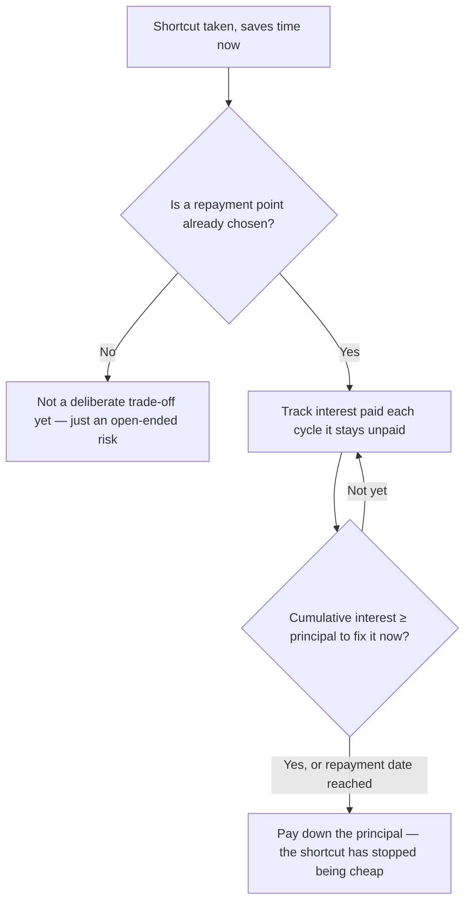

import LevelIntro from "../../../components/LevelIntro.astro";
import Checkpoint from "../../../components/Checkpoint.astro";

L1 named the metaphor: debt is a loan, with a principal and an interest
rate, not a synonym for "bad code." This level works out how to actually
classify a shortcut and size the trade-off — so "is this debt acceptable"
stops being a gut feeling and becomes a question with a real answer.

<LevelIntro
  items={[
    "The debt quadrant — deliberate/inadvertent × prudent/reckless",
    "Sizing a shortcut: interest per cycle vs. principal to repay",
    "Why debt has to be visible to be repaid on purpose",
  ]}
/>

## Not all debt looks the same — the quadrant

Nadia chose the single-tenant shortcut on purpose, knowing multi-tenancy was
coming. Is that the same kind of debt as a junior engineer who's never heard
of tenant isolation writing the exact same code by accident? They produce
identical code — so what actually makes one "acceptable" and the other not?

Two independent questions separate them: was the shortcut **chosen on
purpose** (deliberate) or just **the way it turned out** (inadvertent)? And
was it a **reasonable bet** given what was known at the time (prudent) or
**careless**, taken without weighing the cost at all (reckless)?

  

  

    Deliberate
  

  

    Inadvertent
  

  Prudent

  <strong class="text-emerald-700 dark:text-emerald-300">
    "We know, and we have a plan"
  </strong>
  
    Nadia's shortcut, written down: taken knowingly, for a real deadline, with a
    repayment sprint already picked
  

  <strong class="text-amber-700 dark:text-amber-300">
    "Now we know how we should have done it"
  </strong>
  
    An honest gap discovered in hindsight — the team didn't have the information
    yet to do better at the time
  

  

    Reckless
  

  

    <strong class="text-red-700 dark:text-red-300">
      "We don't have time for the right way"
    </strong>
    
      Cutting the corner on purpose, with no plan, no visibility, and no
      intention of ever repaying it
    
  

  

    <strong class="text-red-700 dark:text-red-300">
      "What's tenant isolation?"
    </strong>
    
      Not knowing the cost was even being incurred — no decision was ever
      actually made
    
  

Only the top-left quadrant — **deliberate and prudent** — is the kind this
unit is defending as an acceptable trade-off. The other three all involve
either not deciding, or deciding badly. Nadia's shortcut sits in that
top-left box **only if** it gets written down with its reasoning and a
repayment plan — the same code, taken the same way, slides into the
bottom-left ("reckless") box the moment nobody ever intends to pay it back.

<Checkpoint question="Nadia takes the exact same single-tenant shortcut, for the exact same deadline reason — but tells no one, and there's no note anywhere that it's temporary. Six months later a new engineer assumes the single-tenant code is just how Lumeo's data model is supposed to work. Which quadrant is this in, and did the code itself change?">

The code is identical to the "acceptable" version — same shortcut, same
underlying reason. What moved it from deliberate-and-prudent into
reckless-and-deliberate is entirely the missing plan and missing visibility.
A trade-off that's chosen on purpose but never surfaced anywhere is
functionally indistinguishable from one nobody ever weighed at all: a future
engineer can't tell "temporary, three-week debt" from "this is just how it
works" without something written down saying which one it is. The quadrant
isn't a property of the code — it's a property of the decision-making
around the code, which is exactly why visibility is treated as part of the
definition, not an optional nice-to-have (more on this below).

</Checkpoint>

## Sizing the trade-off: interest vs. principal

Knowing the shortcut is deliberate and prudent doesn't yet answer "how much
debt is acceptable" — a prudent bet can still be sized wrong. What actually
needs comparing?

Two numbers, on the same footing as any loan:

- **Principal** — what it costs to build the proper version, whenever it
  actually gets paid down. For Nadia's tenant-scoping work: ~15
  engineer-days, roughly $9,000 at a $600/day loaded cost.
- **Interest per cycle** — the recurring extra cost of _not_ having done it,
  paid every sprint the shortcut stays in place: workaround scripts for each
  new pilot customer, bugs from features that quietly assumed single-tenant,
  manual data separation. For Nadia's case: roughly $1,200 of that friction
  per two-week sprint.

Once interest and principal are both known numbers, "how much debt is
acceptable" stops being a feeling and becomes arithmetic: the shortcut is
worth taking exactly as long as the interest paid so far stays below what
it would cost to fix it properly right now. Past that point, every sprint
the debt survives is actively more expensive than the thing everyone was
trying to avoid spending time on.

<Checkpoint question="A teammate argues Nadia's shortcut is fine because 'the principal, $9,000, is way more than we'd spend fixing it any time soon' — so there's no urgency. Is comparing today's interest to today's principal the whole picture?">

No — that comparison only tells you the debt hasn't become net-negative
_yet_, not that it's safe indefinitely. Interest accumulates every cycle the
debt is unpaid; principal is roughly fixed (sometimes it even grows, as more
code gets built on top of the shortcut and there's more to untangle later).
Compare $1,200/sprint of interest against a $9,000 principal and the
crossover isn't "way off" — it's about 7–8 sprints out, well before the two
quarters (~13 sprints) Nadia has before multi-tenancy is actually forced.
"The principal is bigger than today's interest" is true on day one of every
loan ever taken out — it says nothing about when the two numbers meet. The
comparison that actually matters is projected interest **by the planned
repayment date**, not interest today.

</Checkpoint>

## Why debt has to be visible to get repaid

A loan you forget you took out doesn't stop accruing interest — it just
stops being managed. The same is true here: a shortcut that lives only in
one engineer's memory has no mechanism forcing anyone to revisit it. It gets
repaid only by accident, if someone happens to touch that code again for an
unrelated reason.

Making debt visible — a shared log, not tribal memory — is what turns "we
know" into something the team can actually act on later, and it's what
separates the top-left quadrant from the bottom-left one in practice, not
just in principle. L3 works through Nadia's full numbers end to end,
including what that log actually looks like.
