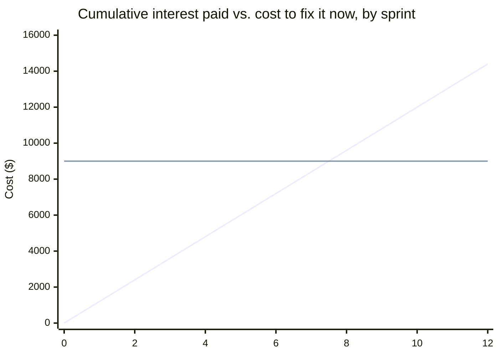

import Scenario from "../../../components/Scenario.astro";
import LevelIntro from "../../../components/LevelIntro.astro";
import Checkpoint from "../../../components/Checkpoint.astro";

L2 gave the quadrant and the two numbers that matter — interest per cycle,
principal to repay. This level runs Nadia's actual decision end to end:
the shortcut code next to the proper version, the real cost calculation
behind "acceptable," the debt log that makes the trade-off visible, and
where this kind of reasoning quietly breaks down in practice. Everything
below is plain, zero-dependency Node.js — paste it into a file, run it with
`node`, and the numbers are exactly the ones in the prose, not rounded
approximations.

<Scenario label="The two versions of Lumeo's data layer, and the numbers behind the choice">
  <Fragment slot="facts">
    <div class="not-prose flex flex-col gap-2 text-sm text-slate-700 dark:text-slate-300">
      <div class="flex items-center gap-1.5">
        <span>🏗️</span> <strong>Principal</strong> — ~15 engineer-days to
        retrofit tenant scoping properly, ≈ $9,000 at $600/day loaded cost
      </div>
      <div class="flex items-center gap-1.5">
        <span>🔁</span> <strong>Interest</strong> — ≈ $1,200 of extra
        friction absorbed every 2-week sprint the shortcut stays
      </div>
      <div class="flex items-center gap-1.5">
        <span>⚖️</span> <strong>Break-even</strong> — interest paid catches
        up to the principal around sprint 7–8
      </div>
      <div class="flex items-center gap-1.5">
        <span>📌</span> <strong>Forced deadline</strong> — multi-tenancy is
        required by sprint ~13, when the next two contracts close
      </div>
    </div>
  </Fragment>

Nadia's shortcut isn't hypothetical — it's two real, small modules that a
reviewer would actually see in a pull request: one that assumes a single
customer, and one that doesn't. The gap between them is the principal. How
fast that gap gets expensive to leave unpaid is the interest.

</Scenario>

<LevelIntro
  items={[
    "The shortcut vs. the proper data layer, as real diffs",
    "The interest-cost calculator and where the break-even sprint actually falls",
    "A real debt log, plus the ways this reasoning fails in practice",
  ]}
/>

## The shortcut, and what "doing it right" actually costs

Here's what Nadia ships in week one — `data.js`, single-tenant, no scoping
anywhere:

```js
// data.js — the shortcut version, shipped for Anchorline's launch
const db = new Map(); // projectId -> project

function createProject(name) {
  const id = crypto.randomUUID();
  const project = { id, name, tasks: [] };
  db.set(id, project);
  return project;
}

function getProject(id) {
  return db.get(id) ?? null;
}

function addTask(projectId, title) {
  const project = getProject(projectId);
  if (!project) throw new Error("project not found");
  const task = { id: crypto.randomUUID(), title, done: false };
  project.tasks.push(task);
  return task;
}

module.exports = { createProject, getProject, addTask };
```

Nothing here is wrong for one customer. It's fast, it's tested, it ships.
The debt is entirely in what it doesn't do: nothing stops a second
customer's data from landing in the same map as the first.

Here's the version Nadia would have shipped with three weeks instead of
three days — the diff that principal actually pays for:

```diff
--- a/data.js (shortcut)
+++ b/data.js (proper, tenant-scoped)
-const db = new Map(); // projectId -> project
+const db = new Map(); // `${tenantId}:${projectId}` -> project

-function createProject(name) {
+function createProject(tenantId, name) {
+  if (!tenantId) throw new Error("tenantId is required");
   const id = crypto.randomUUID();
-  const project = { id, name, tasks: [] };
-  db.set(id, project);
+  const project = { id, tenantId, name, tasks: [] };
+  db.set(`${tenantId}:${id}`, project);
   return project;
 }

-function getProject(id) {
-  return db.get(id) ?? null;
+function getProject(tenantId, id) {
+  return db.get(`${tenantId}:${id}`) ?? null;
 }

-function addTask(projectId, title) {
-  const project = getProject(projectId);
+function addTask(tenantId, projectId, title) {
+  const project = getProject(tenantId, projectId);
   if (!project) throw new Error("project not found");
   const task = { id: crypto.randomUUID(), title, done: false };
   project.tasks.push(task);
   return task;
 }
```

That diff looks small in isolation — but every _caller_ of `createProject`,
`getProject`, and `addTask` across the codebase also has to change to pass
a `tenantId` through, plus the auth layer has to start attaching one to
every request. That fan-out across callers, not the module itself, is where
the fifteen days actually goes.

## Sizing it: the calculator behind "acceptable"

`debt-interest.js` — the same arithmetic behind every number in this unit,
not hand-waved:

```js
// debt-interest.js
function projectedInterest(interestPerSprintUsd, sprints) {
  return interestPerSprintUsd * sprints;
}

function breakEvenSprint(principalUsd, interestPerSprintUsd) {
  return principalUsd / interestPerSprintUsd;
}

const principalUsd = 9000; // ~15 engineer-days @ $600/day, loaded cost
const interestPerSprintUsd = 1200; // friction absorbed per 2-week sprint

console.log(
  "break-even sprint:",
  breakEvenSprint(principalUsd, interestPerSprintUsd),
);
// break-even sprint: 7.5

for (let sprint = 0; sprint <= 12; sprint += 2) {
  const interest = projectedInterest(interestPerSprintUsd, sprint);
  console.log(
    `sprint ${sprint}: interest paid so far = $${interest}` +
      (interest < principalUsd
        ? " (still cheaper than fixing it now)"
        : " (already cost more than fixing it up front)"),
  );
}
```

Running it prints the break-even at sprint 7.5 — meaning if Nadia's team
lets the shortcut ride all the way to the two-quarter mark (sprint ~13, when
multi-tenancy becomes mandatory), they'll have paid roughly $15,600 in
accumulated friction for a fix that would have cost $9,000 to do up front:



The interest line starts at zero and climbs every sprint; the principal
line stays flat because it's the same $9,000 job whether it's done in
sprint 1 or sprint 10. Where they cross — sprint 7–8 — is the actual answer
to "how much debt is acceptable here": **up to about seven sprints, and not
a day past it without a plan to pay it down**, because every sprint after
that the debt costs strictly more than the thing everyone was avoiding.

<Checkpoint question="Nadia's manager suggests waiting until sprint 13 to retrofit multi-tenancy, since that's the actual contractual deadline and 'no reason to do it early.' Using the numbers above, what's wrong with that plan?">

Sprint 13 is when multi-tenancy becomes _mandatory_, not when it becomes
_cheapest_. By sprint 13 the team will have absorbed roughly $15,600 in
accumulated interest (13 × $1,200) for a fix that costs $9,000 whenever it
happens. Waiting for the forced deadline instead of the break-even point
means deliberately paying about $6,600 more than necessary — the same
mistake as a person who could pay off a loan at month 8 but waits until
month 13 because that's merely when the bank finally calls. The forced
deadline and the economically rational repayment date are two different
numbers, and only one of them is the one worth planning around.

</Checkpoint>

## Making it visible: the debt log

None of the arithmetic above helps if it lives only in Nadia's head. A debt
log turns "we know" into something the team actually revisits:

| ID       | Description                                     | Taken on | Reason                         | Principal | Interest/sprint | Repay by | Owner | Status |
| -------- | ----------------------------------------------- | -------- | ------------------------------ | --------- | --------------- | -------- | ----- | ------ |
| DEBT-001 | Single-tenant data model, no `tenantId` scoping | Sprint 1 | Hit Anchorline's 3-week launch | $9,000    | $1,200          | Sprint 8 | Nadia | Open   |

A row in a shared, reviewed log does three things a Slack message from
launch week never does: it survives Nadia going on vacation or changing
teams, it puts a number in front of planning so "Sprint 8: retrofit tenant
scoping" competes for priority against other work instead of getting
silently bumped, and it gives anyone reading the code later a reason for
why it looks the way it does instead of a mystery to reverse-engineer.

<Checkpoint question="Six sprints in, the debt log still shows DEBT-001 as 'Open, repay by sprint 8' — but the team has shipped four new features that all quietly assume single-tenant, the same way the original code did. Has the debt log done its job?">

Partly. It's done the visibility half — nobody can claim later they didn't
know the shortcut existed or when it was supposed to be repaid. But a debt
log that's read once at launch and never revisited during planning is only
marginally better than no log at all: the interest kept accruing (now on a
wider surface, since four more features depend on the same assumption,
which likely raises the real principal past the original $9,000 estimate),
and nothing about writing the row down actually forced sprint 8 to be
protected for repayment. A debt log is necessary for a shortcut to count as
deliberate and prudent rather than reckless — but it's not sufficient on
its own; it still has to be read and acted on at planning time, not just
written once and archived.

</Checkpoint>

## Where this reasoning breaks down in practice

The interest/principal math above assumes a team that's already doing three
things right. Each one is a real, common failure mode when it's missing:

- **Debt that's real but never made visible.** The exact scenario the
  earlier checkpoint describes at a smaller scale: a shortcut chosen for
  good reasons, with a plan in someone's head, that never makes it into a
  log or a ticket. It gets repaid only by accident, if someone happens to
  touch that code again for an unrelated reason. From the outside, this is
  indistinguishable from debt nobody ever decided to take on at all — see
  L2's quadrant, bottom row either way.
- **Debt taken on without leadership or planning buy-in.** Nadia and her
  two teammates can decide to take the shortcut, but if the repayment sprint
  isn't protected in planning, "Sprint 8: retrofit tenant scoping" quietly
  loses every prioritization fight to whatever's on fire that week — not
  because it stopped mattering, but because nobody outside the three
  engineers ever agreed it was owed.
- **Calling ordinary poor quality "debt."** If a shortcut wasn't taken
  under any real pressure and bought nothing — no deadline met, no market
  window hit, no experiment de-risked — it isn't a loan, it's just work
  done carelessly. Labeling it "technical debt" borrows the metaphor's
  built-in excuse ("every codebase has some") without the metaphor's
  built-in obligation (a plan to repay). The tell: a real debt has a benefit
  you can name on the other side of the trade. If you can't name one, don't
  file it in the debt log — just fix it.
- **Principal that grows while interest is being tracked.** The model above
  treats principal as flat at $9,000 for simplicity, but the second
  Checkpoint's scenario is the realistic case: every feature built on top of
  a single-tenant assumption makes the eventual retrofit touch more surface
  area. A debt log that tracks interest paid but never re-estimates
  principal will systematically underestimate how urgent repayment actually
  is.

What would change about this whole calculation if Lumeo's very next
contract, instead of a third domestic customer, were a customer that
contractually required its data to never be stored in the same table as
anyone else's from day one — does the shortcut still clear the bar as
"prudent," or does that one new fact change which quadrant it belongs in?
This chapter worked one specific, numeric case; the reasoning — name the
principal, name the interest, name the repayment point, write it down — is
the part meant to generalize, not the exact dollar figures.
