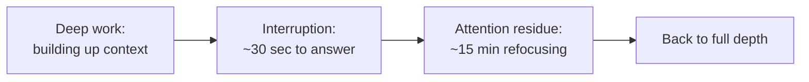

## The hidden cost of "just a quick question"

**A Slack message takes 30 seconds to read and answer. If that's all
it costs, how could 22 of them eat seven hours?** Because the 30
seconds of reading and typing is only the visible part — after
answering, part of your attention stays on the interrupting thing (did
I answer it right? did I forget something?) while the rest tries to
rebuild the mental state you'd built up on the hard task before the
ping arrived. That rebuilding is real work, it takes real time, and it
happens before you're back to the depth and speed you were at right
before the interruption.

**So the true cost of one interruption isn't 30 seconds — what is
it?** Roughly 30 seconds of direct handling, plus however long it
takes to fully refocus afterward. Research on attention residue
consistently finds that refocusing time is the larger of the two
costs, not the smaller one — which is exactly what makes interruptions
feel individually cheap while being collectively expensive.

## Why frequency matters more than length

**If refocusing takes a while, does it matter whether interruptions
are spaced far apart or close together?** Enormously. An interruption
that arrives after you've already spent 20 minutes rebuilding depth
costs you that depth. An interruption that arrives every 15–20 minutes
means the task rarely gets past the "still rebuilding" phase at all —
there's a real difference between occasionally losing a few minutes of
depth and never reaching depth in the first place.

|                          | Rare interruptions                           | Frequent interruptions                             |
| ------------------------ | -------------------------------------------- | -------------------------------------------------- |
| Time between pings       | Long enough to reach full depth between them | Shorter than the time it takes to reach full depth |
| Time spent at full depth | Most of the working time                     | Little to none — always mid-refocus                |
| What gets done           | The hard task, slowly but steadily           | Everything except the hard task                    |

## Protecting a block versus reacting all day

**Is the fix "ignore all messages forever"?** No — some of the day
genuinely needs to go to shallow work like answering teammates and
staying unblocked. The fix is separating _when_ each kind of work
happens: a protected block with notifications off, followed by a
dedicated window for catching up on messages, rather than interleaving
both all day long. The total time spent on shallow work doesn't have
to shrink — what changes is that it stops happening _inside_ the
windows meant for deep work.

## The generalizable lesson

**Does this only apply to Slack messages specifically?** No — the same
mechanics apply to any interruption source: a coworker stopping by a
desk, a phone notification, even self-interruption from checking email
"just in case." What matters isn't the interruption's source, it's
whether it arrives inside a block that was supposed to be protected.
Any day can be reorganized around the same idea: decide in advance
which stretches of time are for depth and which are for everything
else, instead of letting whatever arrives first decide it.
