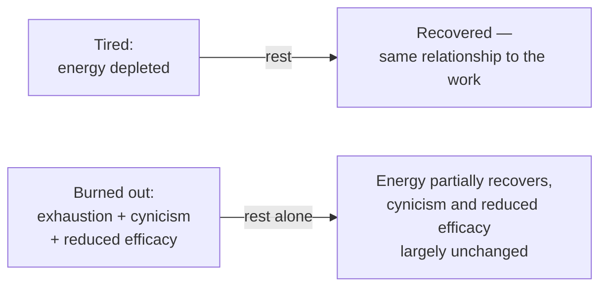
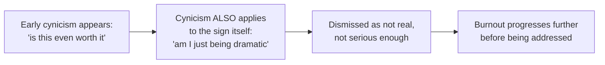

## Two different states, not two points on one scale

The distinguishing test isn't severity ("how tired am I, on a scale of 1-10") — it's whether rest actually resolves it. Someone who's simply tired, however exhausted, comes back from a real break with roughly their prior relationship to the work intact. Someone burned out can take the same break, feel physically rested, and still find the cynicism and sense of futile effort largely unchanged — because those two components were never actually about energy in the first place.

## The three components, with early- and late-stage examples

| Component                    | Early sign                                                         | Late sign                                                                               |
| ---------------------------- | ------------------------------------------------------------------ | --------------------------------------------------------------------------------------- |
| Exhaustion                   | Needing more effort than before for routine tasks                  | Physically depleted even after adequate sleep, persistently                             |
| Cynicism / depersonalization | Occasional sarcastic detachment ("sure, THIS will matter")         | Consistent, default assumption that effort is pointless before even trying              |
| Reduced efficacy             | A vague, occasional sense that recent work hasn't amounted to much | A settled belief that your work doesn't and won't matter, regardless of actual outcomes |

Burnout specifically requires cynicism and reduced efficacy alongside exhaustion — exhaustion alone, without the other two, is a strong signal of ordinary overwork or poor sleep, not burnout in the fuller sense this unit is about. All three tend to develop gradually, which is exactly why the early-sign column is worth checking against deliberately rather than waiting for the late-sign column to become undeniable.

## The self-referential trap: cynicism undermines its own detection

This is the mechanism that makes self-recognition specifically hard for this condition, more than for most other health-adjacent issues: the cynicism component doesn't just color how someone feels about work, it also colors how seriously they take their own early warning signs, since cynical self-doubt is part of the same pattern. This is exactly why having _specific, named_ signs to check against (the table above) is more reliable than trusting a general "would I know if I were burning out" instinct — the instinct itself is compromised by the condition it's supposed to detect.

## The connection to the negative-returns curve

`sustainable-performance/myth-linear-output` showed that net output can decline even as raw hours worked increase, driven by fatigue-induced errors compounding into future rework cost. Burnout is a plausible real mechanism behind exactly that curve at a longer time horizon: exhaustion degrades focus (raising the error rate directly), cynicism degrades the care put into catching and preventing those errors, and reduced efficacy removes the motivation to course-correct even once a problem is visible — three separate, compounding contributors to the same downward-bending shape, operating over months rather than within a single week.
